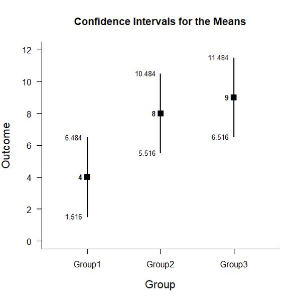
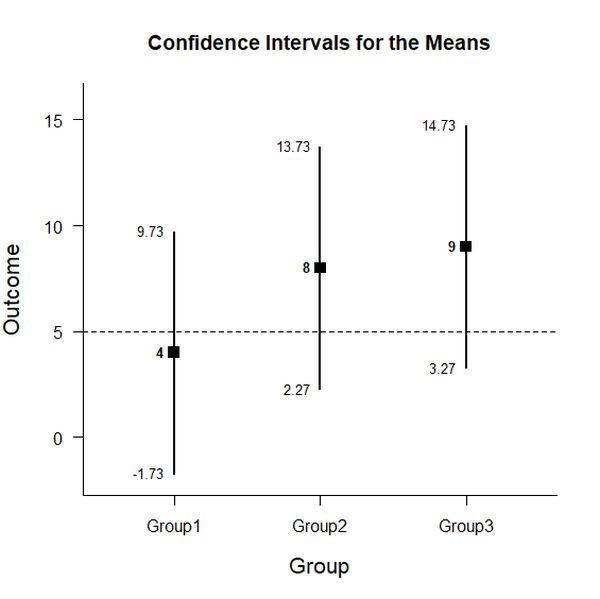

# Estimation Approach to Statistical Inference (EASI)

[**Home**](https://github.com/cwendorf/EASI/) | 
[**Functions**](https://github.com/cwendorf/EASI/tree/master/A-Functions) | 
[**Basic Examples**](https://github.com/cwendorf/EASI/tree/master/B-BasicExamples) | 
[**ITNS Examples**](https://github.com/cwendorf/EASI/tree/master/C-ITNSExamples) | 
[**Extensions**](https://github.com/cwendorf/EASI/tree/master/D-Extensions) | 
[**Extension Examples**](https://github.com/cwendorf/EASI/tree/master/E-ExtensionExamples) 

---

## Basic Between-Subjects Data Example

### Three Group Example Data

This code inputs the variable names and creates a viewable data frame.
```r
Group <- c(rep("Group1",3),rep("Group2",3),rep("Group3",3))
Outcome <- c(3,4,5,7,8,9,8,9,10)
Group <- factor(Group)

mydata <- data.frame(Group,Outcome)
mydata
```
```
   Group Outcome
1 Group1       3
2 Group1       4
3 Group1       5
4 Group2       7
5 Group2       8
6 Group2       9
7 Group3       8
8 Group3       9
9 Group3      10
```

### Analyses of Multiple Groups

This section produces analyses that are equivalent to one-sample analyses separately for each level of a factor.

#### Confidence Intervals for the Means

This code will provide a table of descriptive statistics and confidence intervals for each level of the factor.
```r
estimateLevels(Outcome~Group)
```
```
CONFIDENCE INTERVALS FOR THE LEVELS

       N M SD    SE    LL     UL
Group1 3 4  1 0.577 1.516  6.484
Group2 3 8  1 0.577 5.516 10.484
Group3 3 9  1 0.577 6.516 11.484
```

The code defaults to 95% confidence intervals. This can be changed if desired.
```r
estimateLevels(Outcome~Group,conf.level=.99)
```

#### Plots of the Confidence Intervals for the Means

This code will produce a graph of the confidence intervals for each level of the factor.
```r
plotLevels(Outcome~Group)
```
<kbd></kbd>

Of course, it is possible to change from the default confidence level. Additionally, it is possible to add a comparison line to represent a population (or test) value.
```r
plotLevels(Outcome~Group,conf.level=.99,mu=5)
```
<kbd></kbd>


#### Significance Tests for the Means

This code will produce a table of NHST separately for each level of the factor. In this case, all the means are tested against a value of zero.
```r
testLevels(Outcome~Group)
```
```
HYPOTHESIS TESTS FOR THE LEVELS

       Diff    SE      t df     p
Group1    4 0.577  6.928  2 0.020
Group2    8 0.577 13.856  2 0.005
Group3    9 0.577 15.588  2 0.004
```

Often, the default test value of zero is not meaningful or plausible. This too can be altered (often in conjunction with what is presented in the plot).
```r
testLevels(Outcome~Group,mu=5)
```

#### Effect Sizes for the Means

This code will produce a table of standardized mean differences separately for each level of the factor. In this case, the mean is compared to zero to form the effect size.
```r
effectLevels(Outcome~Group)
```
```
STANDARDIZED MEAN DIFFERENCES FOR THE LEVELS

            d      g     LL     UL
Group1  4.000  2.257  0.913 14.618
Group2  8.000  4.514  2.225 28.586
Group3  9.000  5.078  2.533 32.107
```

Here too it is possible to alter the width of the confidence intervals and to establish a more plausible comparison value for the effect size.
```
effectLevels(Outcome~Group,mu=5,conf.level=.99)
```
 
### Analyses of a Group Comparison

This section produces analyses that are equivalent to analyses for two levels of a factor.

#### Confidence Interval for a Mean Difference

This code creates a new factor that identifies the two levels for comparison and estimates the confidence interval of the difference.
```r
Comparison=factor(Group,c("Group1","Group2"))
estimateDifference(Outcome~Comparison)
```
```
CONFIDENCE INTERVAL FOR THE COMPARISON

  Diff     SE     df     LL     UL 
-4.000  0.816  4.000 -6.267 -1.733 
```

Of course, you can change the confidence level from the default 95% if desired.
```r
estimateDifference(Outcome~Comparison,conf.level=.99)
```

It is also possible to alter the comparison by changing (or even reversing the order) of the groups.
```r
Comparison=factor(Group,c("Group3","Group1"))
estimateDifference(Outcome~Comparison)
```

#### Plot of the Confidence Interval for a Mean Difference

This code obtains and plots the confidence intervals for the groups and the mean difference in the identified comparison.
```r
plotDifference(Outcome~Comparison)
```
<kbd></kbd>

Once again, the confidence levels can be changed away from the default if desired.
```r
plotDifference(Outcome~Comparison,conf.level=.99)
```

#### Significance Test for a Mean Difference

This code produces NHST for the identified comparison (using a default test value of zero).
```r
testDifference(Outcome~Comparison)
```
```
HYPOTHESIS TEST FOR THE COMPARISON

  Diff     SE      t     df      p 
-4.000  0.816 -4.899  4.000  0.008 
```

If the default value of zero is not plausible, it too can be changed.
```r
testDifference(Outcome~Comparison,mu=2)
```

#### Effect Size for the Mean Difference

This code calculates a standardized mean difference for the comparison and its confidence interval.
```r
effectDifference(Outcome~Comparison)
```
```
STANDARDIZED MEAN DIFFERENCE FOR THE COMPARISON

     d      g     LL     UL 
-4.000 -3.192 -9.861 -1.398 
```

The width of the confidence interval for the effect size can be altered if desired.
```r
effectDifference(Outcome~Comparison,conf.level=.99)
```

### Analyses of a Group Contrast

This section produces analyses that are equivalent to analyses involving multiple levels of a factor.

#### Confidence Interval for Combined Levels

This code creates combinations of groups and produces a confidence interval for those pooled groups.
```r
G1 <- c(1,0,0)
estimateContrast(Outcome~Group,contrast=G1)
```
```
CONFIDENCE INTERVAL FOR THE CONTRAST

         Est    SE df    LL    UL
Contrast   4 0.577  2 1.516 6.484
```
```r
G2nG3 <- c(0,.5,.5)
estimateContrast(Outcome~Group,contrast=G2nG3)
```
```
CONFIDENCE INTERVAL FOR THE CONTRAST

         Est    SE df    LL    UL
Contrast 8.5 0.408  4 7.367 9.633
```

#### Confidence Interval for a Contrast

This code identifies a contrast among the groups and produces a confidence interval for that contrast.
```r
G1vsOthers <- c(-1,.5,.5)
estimateContrast(Outcome~Group,contrast=G1vsOthers)
```
```
CONFIDENCE INTERVAL FOR THE CONTRAST

         Est    SE df    LL    UL
Contrast 4.5 0.707  4 2.537 6.463
```

As in all other cases, the default value of the confidence interval can be changed.
```r
estimateContrast(Outcome~Group,contrast=G1vsOthers,conf.level=.99)
```

#### Plots of Confidence Intervals for a Contrast

This code obtains and plots the confidence intervals for the groups and the mean difference in the identified contrast.
```r
plotContrast(Outcome~Group,contrast=G1vsOthers)
````
<kbd></kbd>

The width of the confidence interval for the contrast can be altered if desired.
```r
plotContrast(Outcome~Group,contrast=G1vsOthers,conf.level=.99)
```

#### Significance Test for a Contrast

This code produces a NHST for the identified contrast. It tests the contrast against a value of zero by default.
```r
testContrast(Outcome~Group,contrast=G1vsOthers)
```
```
HYPOTHESIS TEST FOR THE CONTRAST

         Est    SE     t df     p
Contrast 4.5 0.707 6.364  4 0.003
```

If desired, the contrast can be tested against other values if needed.
```r
testContrast(Outcome~Group,contrast=G1vsOthers,mu=4)
```

### Different Methods for Comparing Two Groups

This section demonstrates the equivalence of Difference/Comparison and Contrast approaches from above.

#### The Difference/Comparison Approach (Copied from Above)

```r
Comparison=factor(Group,c("Group2","Group1"))
estimateDifference(Outcome~Comparison)
```
```
CONFIDENCE INTERVAL FOR THE COMPARISON

           Diff    SE df    LL    UL
Comparison    4 0.816  4 1.733 6.267
```
```r
testDifference(Outcome~Comparison)
```
```
HYPOTHESIS TEST FOR THE COMPARISON

           Diff    SE     t df     p
Comparison    4 0.816 4.899  4 0.008
```

#### The Contrast Approach (Adapted from Above)

```r
G1vsG2 <- c(-1,1,0)
estimateContrast(Outcome~Group,contrast=G1vsG2)
```
```
CONFIDENCE INTERVAL FOR THE CONTRAST

         Est    SE df    LL    UL
Contrast   4 0.816  4 1.733 6.267
```
```r
testContrast(Outcome~Group,contrast=G1vsG2)
```
```
HYPOTHESIS TEST FOR THE CONTRAST

         Est    SE     t df     p
Contrast   4 0.816 4.899  4 0.008
```