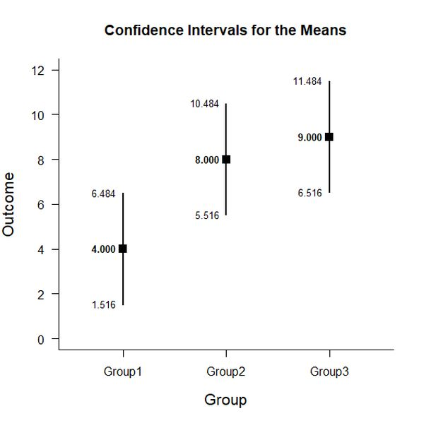
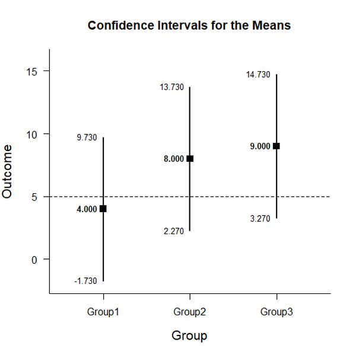
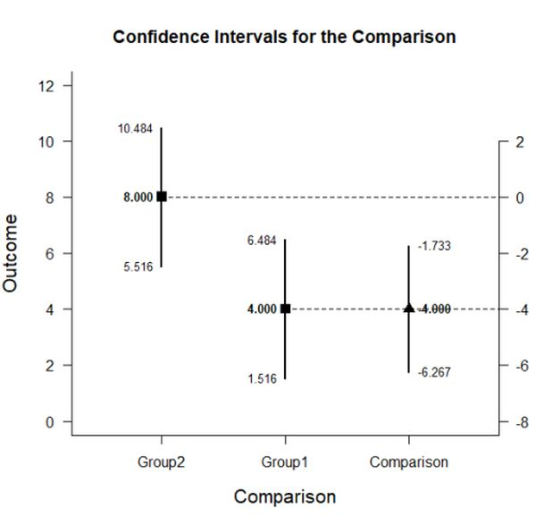
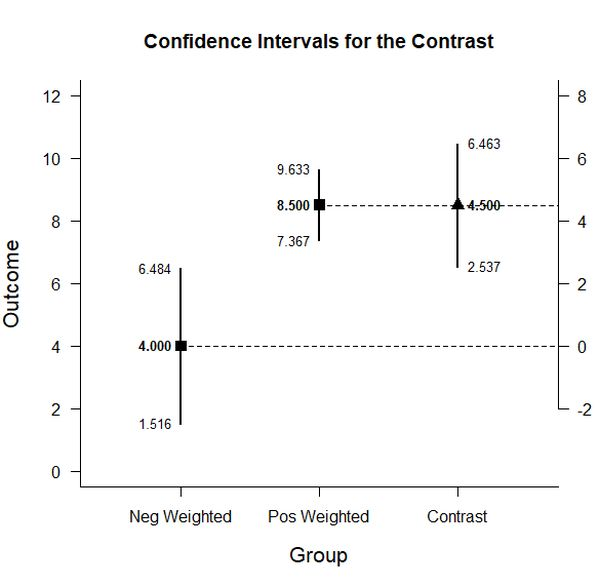

# Estimation Approach to Statistical Inference (EASI)

[**Home**](https://github.com/cwendorf/EASI/) | 
[**Functions**](https://github.com/cwendorf/EASI/tree/master/A-Functions) | 
[**Basic Examples**](https://github.com/cwendorf/EASI/tree/master/B-BasicExamples) | 
[**ITNS Examples**](https://github.com/cwendorf/EASI/tree/master/C-ITNSExamples) | 
[**Extensions**](https://github.com/cwendorf/EASI/tree/master/D-Extensions) | 
[**Extension Examples**](https://github.com/cwendorf/EASI/tree/master/E-ExtensionExamples) 

---

## Basic Between-Subjects Summary Statistics Example

### Source the EASI Functions

```r
source("http://raw.githubusercontent.com/cwendorf/EASI/master/A-Functions/ALL-EASI-FUNCTIONS.R")
```

### Three Group Example Summary Statistics

This code inputs the variable summaries and creates a single summary table.
```r
Group1 <- c(N=3,M=4,SD=1)
Group2 <- c(N=3,M=8,SD=1)
Group3 <- c(N=3,M=9,SD=1)
sumstats <- rbind(Group1,Group2,Group3)
class(sumstats) <- "bss"
sumstats
```
```
       N M SD
Group1 3 4  1
Group2 3 8  1
Group3 3 9  1
attr(,"class")
[1] "bss"
```

### Analyses of Multiple Groups

This section produces analyses that are equivalent to one-sample analyses separately for each level of a factor.

#### Confidence Intervals for the Means

This code will provide a table of descriptive statistics and confidence intervals for each level of the factor.
```r
estimateMeans(sumstats)
```
```
CONFIDENCE INTERVALS FOR THE MEANS

           N     M    SD    SE    LL     UL
Group1 3.000 4.000 1.000 0.577 1.516  6.484
Group2 3.000 8.000 1.000 0.577 5.516 10.484
Group3 3.000 9.000 1.000 0.577 6.516 11.484
```

The code defaults to 95% confidence intervals. This can be changed if desired.
```r
estimateMeans(sumstats,conf.level=.99)
```

#### Plots of the Confidence Intervals for the Means

This code will produce a graph of the confidence intervals for each level of the factor.
```r
plotMeans(sumstats)
```
<kbd></kbd>

Of course, it is possible to change from the default confidence level. Additionally, it is possible to add a comparison line to represent a population (or test) value.
```r
plotMeans(sumstats,conf.level=.99,mu=5)
```
<kbd></kbd>


#### Significance Tests for the Means

This code will produce a table of NHST separately for each level of the factor. In this case, all the means are tested against a value of zero.
```r
testMeans(sumstats)
```
```
HYPOTHESIS TESTS FOR THE MEANS

        Diff    SE      t    df     p
Group1 4.000 0.577  6.928 2.000 0.020
Group2 8.000 0.577 13.856 2.000 0.005
Group3 9.000 0.577 15.588 2.000 0.004
```

Often, the default test value of zero is not meaningful or plausible. This too can be altered (often in conjunction with what is presented in the plot).
```r
testMeans(sumstats,mu=5)
```

#### Effect Sizes for the Means

This code will produce a table of standardized mean differences separately for each level of the factor. In this case, the mean is compared to zero to form the effect size.
```r
standardizeMeans(sumstats)
```
```
CONFIDENCE INTERVALS FOR THE STANDARDIZED MEANS

           d d(unb)    SE    LL     UL
Group1 4.000  2.286 1.563 0.268  7.826
Group2 8.000  4.571 2.906 0.871 15.456
Group3 9.000  5.143 3.251 1.007 17.373
```

Here too it is possible to alter the width of the confidence intervals and to establish a more plausible comparison value for the effect size.
```r
standardizeMeans(sumstats,mu=5,conf.level=.99)
```
 
### Analyses of a Group Comparison

This section produces analyses that are equivalent to analyses for two levels of a factor.

#### Confidence Interval for a Mean Difference

This code creates a new table that identifies the two levels for comparison and estimates the confidence interval of the difference.
```r
compstats <- sumstats[c("Group1","Group2"),]
class(compstats) <- "bss"
estimateDifference(compstats)
```
```
CONFIDENCE INTERVAL FOR THE COMPARISON

             Diff    SE    df     LL     UL
Comparison -4.000 0.816 4.000 -6.267 -1.733
```

Of course, you can change the confidence level from the default 95% if desired.
```r
estimateDifference(compstats,conf.level=.99)
```

It is also possible to alter the comparison by changing (or even reversing the order) of the groups.
```r
compstats <- sumstats[c("Group3","Group1"),]
class(compstats) <- "bss"
estimateDifference(compstats)
```

#### Plot of the Confidence Interval for a Mean Difference

This code obtains and plots the confidence intervals for the groups and the mean difference in the identified comparison.
```r
plotDifference(compstats)
```
<kbd></kbd>

Once again, the confidence levels can be changed away from the default if desired.
```r
plotDifference(compstats,conf.level=.99)
```

#### Significance Test for a Mean Difference

This code produces NHST for the identified comparison (using a default test value of zero).
```r
testDifference(compstats)
```
```
HYPOTHESIS TEST FOR THE COMPARISON

             Diff    SE      t    df     p
Comparison -4.000 0.816 -4.899 4.000 0.008
```

If the default value of zero is not plausible, it too can be changed.
```r
testDifference(compstats,mu=2)
```

#### Effect Size for the Mean Difference

This code calculates a standardized mean difference for the comparison and its confidence interval.
```r
standardizeDifference(compstats)
```
```
CONFIDENCE INTERVAL FOR THE STANDARDIZED COMPARISON

              Est    SE     LL     UL
Comparison -4.000 1.732 -7.395 -0.605
```

The width of the confidence interval for the effect size can be altered if desired.
```r
standardizeDifference(compstats,conf.level=.99)
```

### Analyses of a Group Contrast

This section produces analyses that are equivalent to analyses involving multiple levels of a factor.

#### Confidence Interval for Combined Levels

This code creates combinations of groups and produces a confidence interval for those pooled groups.
```r
G1 <- c(1,0,0)
estimateContrast(sumstats,contrast=G1)
```
```
CONFIDENCE INTERVAL FOR THE CONTRAST

           Est    SE    df    LL    UL
Contrast 4.000 0.577 2.000 1.516 6.484
```
```r
G2nG3 <- c(0,.5,.5)
estimateContrast(sumstats,contrast=G2nG3)
```
```
CONFIDENCE INTERVAL FOR THE CONTRAST

           Est    SE    df    LL    UL
Contrast 8.500 0.408 4.000 7.367 9.633
```

#### Confidence Interval for a Contrast

This code identifies a contrast among the groups and produces a confidence interval for that contrast.
```r
G1vsOthers <- c(-1,.5,.5)
estimateContrast(sumstats,contrast=G1vsOthers)
```
```
CONFIDENCE INTERVAL FOR THE CONTRAST

           Est    SE    df    LL    UL
Contrast 4.500 0.707 4.000 2.537 6.463
```

As in all other cases, the default value of the confidence interval can be changed.
```r
estimateContrast(sumstats,contrast=G1vsOthers,conf.level=.99)
```

#### Plots of Confidence Intervals for a Contrast

This code obtains and plots the confidence intervals for the groups and the mean difference in the identified contrast.
```r
G1vsOthers <- c(-1,.5,.5)
plotContrast(sumstats,contrast=G1vsOthers)
````
<kbd></kbd>

The width of the confidence interval for the contrast can be altered if desired.
```r
plotContrast(sumstats,contrast=G1vsOthers,conf.level=.99)
```

#### Significance Test for a Contrast

This code produces a NHST for the identified contrast. It tests the contrast against a value of zero by default.
```r
testContrast(sumstats,contrast=G1vsOthers)
```
```
HYPOTHESIS TEST FOR THE CONTRAST

           Est    SE     t    df     p
Contrast 4.500 0.707 6.364 4.000 0.003
```

If desired, the contrast can be tested against other values if needed.
```r
testContrast(sumstats,contrast=G1vsOthers,mu=4)
```

#### Effect Size for a Contrast

This code calculates a standardized contrast and its confidence interval.
```r
standardizeContrast(sumstats,contrast=G1vsOthers)
```
```
CONFIDENCE INTERVAL FOR THE STANDARDIZED CONTRAST

           Est    SE    LL    UL
Contrast 4.500 1.561 1.440 7.560
```

The width of the confidence interval for the effect size can be altered if desired.
```r
standardizeContrast(sumstats,contrast=G1vsOthers,conf.level=.99)
```
