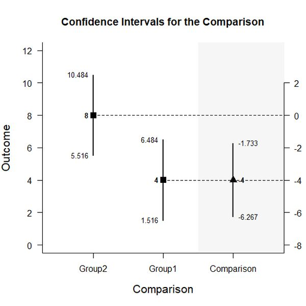
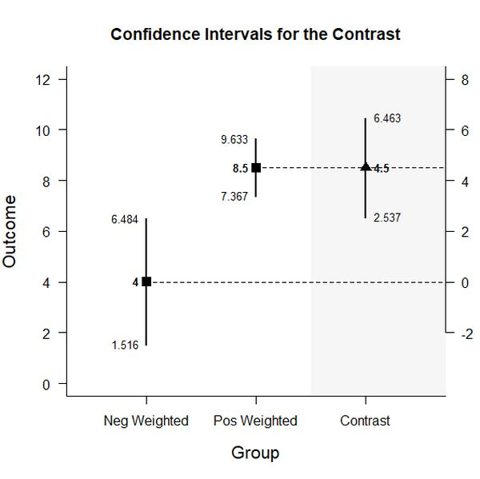

<kbd></kbd>


# ESTIMATION APPROACH TO STATISTICAL INFERENCE (EASI)
## BASIC BETWEEN-SUBJECTS EXAMPLES

### Three Group Example Data

Entering this code:
```r
Group <- c(rep("Group1",3),rep("Group2",3),rep("Group3",3))
Outcome <- c(3,4,5,7,8,9,8,9,10)
Group <- factor(Group)

mydata <- data.frame(Group,Outcome)
mydata
```
~~~
   Group Outcome
1 Group1       3
2 Group1       4
3 Group1       5
4 Group2       7
5 Group2       8
6 Group2       9
7 Group3       8
8 Group3       9
9 Group3      10
~~~


### Analyses of Multiple Groups

This section produces output that is equivalent to one-sample analyses for each level of a factor.

Entering this code:
```
estimateLevels(Outcome~Group)
```

Displays this output:
```
CONFIDENCE INTERVALS FOR THE LEVELS

       N M SD    SE    LL     UL
Group1 3 4  1 0.577 1.516  6.484
Group2 3 8  1 0.577 5.516 10.484
Group3 3 9  1 0.577 6.516 11.484
```

Entering this code:
```
plotLevels(Outcome~Group)
```

Displays this output:


Entering this code:
```
testLevels(Outcome~Group)
```

Displays this output:
```
HYPOTHESIS TESTS FOR THE LEVELS

       Diff    SE      t df     p
Group1    4 0.577  6.928  2 0.020
Group2    8 0.577 13.856  2 0.005
Group3    9 0.577 15.588  2 0.004
```

Entering this code:
```
effectLevels(Outcome~Group)
```

Displays this output:
```
STANDARDIZED MEAN DIFFERENCES FOR THE LEVELS

            d      g     LL     UL
Group1  4.000  2.257  0.913 14.618
Group2  8.000  4.514  2.225 28.586
Group3  9.000  5.078  2.533 32.107
```

Entering this code:
```
estimateLevels(Outcome~Group,conf.level=.99)
```

Displays this output:
```
CONFIDENCE INTERVALS FOR THE LEVELS

       N M SD    SE    LL    UL
Group1 3 4  1 0.577 -1.73  9.73
Group2 3 8  1 0.577  2.27 13.73
Group3 3 9  1 0.577  3.27 14.73
```

Entering this code:
```
plotLevels(Outcome~Group,conf.level=.99,mu=5)
```

Displays this output:


Entering this code:
```
testLevels(Outcome~Group,mu=5)
```

Displays this output:
```
HYPOTHESIS TESTS FOR THE LEVELS

       Diff    SE      t df     p
Group1   -1 0.577 -1.732  2 0.225
Group2    3 0.577  5.196  2 0.035
Group3    4 0.577  6.928  2 0.020
```

Entering this code:
```
effectLevels(Outcome~Group,mu=5,conf.level=.99)
```

Displays this output:
```
STANDARDIZED MEAN DIFFERENCES FOR THE LEVELS

             d       g      LL      UL
Group1  -1.000  -0.564 -11.145   2.232
Group2   3.000   1.693   0.207  25.246
Group3   4.000   2.257   0.627  32.892
```


### Analyses of a Group Comparison
#### (equivalent to analyses for two levels of a factor)

Entering this code:
```
Comparison=factor(Group,c("Group1","Group2"))
estimateLevels(Outcome~Comparison)
```

Displays this output:
```
CONFIDENCE INTERVALS FOR THE LEVELS

       N M SD    SE    LL     UL
Group1 3 4  1 0.577 1.516  6.484
Group2 3 8  1 0.577 5.516 10.484
```

Entering this code:
```
estimateDifference(Outcome~Comparison)
```

Displays this output:
```
CONFIDENCE INTERVAL FOR THE COMPARISON

  Diff     SE     df     LL     UL 
-4.000  0.816  4.000 -6.267 -1.733 
```

Entering this code:
```
testDifference(Outcome~Comparison)
```

Displays this output:
```
HYPOTHESIS TEST FOR THE COMPARISON

  Diff     SE      t     df      p 
-4.000  0.816 -4.899  4.000  0.008 
```

Entering this code:
```
plotDifference(Outcome~Comparison)
```

Displays this output:




Entering this code:
```
effectDifference(Outcome~Comparison)
```

Displays this output:
```
STANDARDIZED MEAN DIFFERENCE FOR THE COMPARISON

     d      g     LL     UL 
-4.000 -3.192 -9.861 -1.398 
```

Entering this code:
```
Comparison=factor(Group,c("Group1","Group2"))
estimateLevels(Outcome~Comparison,conf.level=.99)
```

Displays this output:
```
CONFIDENCE INTERVALS FOR THE LEVELS

       N M SD    SE    LL    UL
Group1 3 4  1 0.577 -1.73  9.73
Group2 3 8  1 0.577  2.27 13.73
```

Entering this code:
```
estimateDifference(Outcome~Comparison,conf.level=.99)
```

Displays this output:
```
CONFIDENCE INTERVAL FOR THE COMPARISON

  Diff     SE     df     LL     UL 
-4.000  0.816  4.000 -7.759 -0.241 
```

Entering this code:
```
plotDifference(Outcome~Comparison,conf.level=.99)
```

Displays this output:




Entering this code:
```
testDifference(Outcome~Comparison,var.equal=T)
```

Displays this output:
```
HYPOTHESIS TEST FOR THE COMPARISON

  Diff     SE      t     df      p 
-4.000  0.816 -4.899  4.000  0.008 
```

Entering this code:
```
testDifference(Outcome~Comparison,mu=2)
```

Displays this output:
```
HYPOTHESIS TEST FOR THE COMPARISON

  Diff     SE      t     df      p 
-6.000  0.816 -7.348  4.000  0.002 
```

Entering this code:
```
testDifference(Outcome~Comparison,var.equal=T,mu=2)
```
Displays this output:
```
HYPOTHESIS TEST FOR THE COMPARISON

  Diff     SE      t     df      p 
-6.000  0.816 -7.348  4.000  0.002 
```

Entering this code:
```
effectDifference(Outcome~Comparison,conf.level=.99)
```

Displays this output:
```
STANDARDIZED MEAN DIFFERENCE FOR THE COMPARISON

      d       g      LL      UL 
 -4.000  -3.192 -15.195  -0.964 
```

Entering this code:
```
Comparison=factor(Group,c("Group2","Group1"))
estimateLevels(Outcome~Comparison)
```

Displays this output:
```
CONFIDENCE INTERVALS FOR THE LEVELS

       N M SD    SE    LL     UL
Group2 3 8  1 0.577 5.516 10.484
Group1 3 4  1 0.577 1.516  6.484
```

Entering this code:
```
estimateDifference(Outcome~Comparison)
```

Displays this output:
```
CONFIDENCE INTERVAL FOR THE COMPARISON

 Diff    SE    df    LL    UL 
4.000 0.816 4.000 1.733 6.267 
```

Entering this code:
```
plotDifference(Outcome~Comparison)
```

Displays this output:


Entering this code:
```
testDifference(Outcome~Comparison)
```

Displays this output:
```
HYPOTHESIS TEST FOR THE COMPARISON

 Diff    SE     t    df     p 
4.000 0.816 4.899 4.000 0.008 
```

Entering this code:
```
effectDifference(Outcome~Comparison)
```

Displays this output:
```
STANDARDIZED MEAN DIFFERENCE FOR THE COMPARISON

    d     g    LL    UL 
4.000 3.192 1.398 9.861 
```

Entering this code:
```
Comparison=factor(Group,c("Group1","Group3"))
estimateLevels(Outcome~Comparison)
```

Displays this output:
```
CONFIDENCE INTERVALS FOR THE LEVELS

       N M SD    SE    LL     UL
Group1 3 4  1 0.577 1.516  6.484
Group3 3 9  1 0.577 6.516 11.484
```

Entering this code:
```
estimateDifference(Outcome~Comparison)
```

Displays this output:
```
CONFIDENCE INTERVAL FOR THE COMPARISON

  Diff     SE     df     LL     UL 
-5.000  0.816  4.000 -7.267 -2.733 
```

Entering this code:
```
plotDifference(Outcome~Comparison)
```

Displays this output:


Entering this code:
```
testDifference(Outcome~Comparison)
```

Displays this output:
```
HYPOTHESIS TEST FOR THE COMPARISON

  Diff     SE      t     df      p 
-5.000  0.816 -6.124  4.000  0.004 
```

Entering this code:
```
effectDifference(Outcome~Comparison)
```

Displays this output:
```
STANDARDIZED MEAN DIFFERENCE FOR THE COMPARISON

      d       g      LL      UL 
 -5.000  -3.989 -12.033  -1.979 
```

Entering this code:
```
Comparison=factor(Group)
levels(Comparison)=c("Group1","Group2",NA)
estimateLevels(Outcome~Comparison)
```

Displays this output:
```
CONFIDENCE INTERVALS FOR THE LEVELS

       N M SD    SE    LL     UL
Group1 3 4  1 0.577 1.516  6.484
Group2 3 8  1 0.577 5.516 10.484
Displays this output:
```

Entering this code:
```
estimateDifference(Outcome~Comparison)
```

Displays this output:
```
CONFIDENCE INTERVAL FOR THE COMPARISON

  Diff     SE     df     LL     UL 
-4.000  0.816  4.000 -6.267 -1.733 
```

Entering this code:
```
plotDifference(Outcome~Comparison)
```

Displays this output:


Entering this code:
```
testDifference(Outcome~Comparison)
```

Displays this output:
```
HYPOTHESIS TEST FOR THE COMPARISON

  Diff     SE      t     df      p 
-4.000  0.816 -4.899  4.000  0.008 
```

Entering this code:
```
effectDifference(Outcome~Comparison)
```

Displays this output:
```
STANDARDIZED MEAN DIFFERENCE FOR THE COMPARISON

     d      g     LL     UL 
-4.000 -3.192 -9.861 -1.398 
```

### Analyses of a Group Contrast
#### (equivalent to analyses for multiple levels of a factor)

Entering this code:
```
G1vsOthers <- c(-1,.5,.5)
estimateContrast(Outcome~Group,contrast=G1vsOthers)
```

Displays this output:
```
CONFIDENCE INTERVAL FOR THE CONTRAST

         Est    SE df    LL    UL
Contrast 4.5 0.707  4 2.537 6.463
```

Entering this code:
```
testContrast(Outcome~Group,contrast=G1vsOthers)
```

Displays this output:
```
HYPOTHESIS TEST FOR THE CONTRAST

         Est    SE     t df     p
Contrast 4.5 0.707 6.364  4 0.003
```

Entering this code:
```
G1vsOthers <- c(-1,.5,.5)
estimateContrast(Outcome~Group,contrast=G1vsOthers,conf.level=.99)
```

Displays this output:
```
CONFIDENCE INTERVAL FOR THE CONTRAST

         Est    SE df    LL    UL
Contrast 4.5 0.707  4 1.244 7.756
```

Entering this code:
```
testContrast(Outcome~Group,contrast=G1vsOthers,mu=4)
```

Displays this output:
```
HYPOTHESIS TEST FOR THE CONTRAST

         Est    SE     t df     p
Contrast 0.5 0.707 0.707  4 0.519
```
