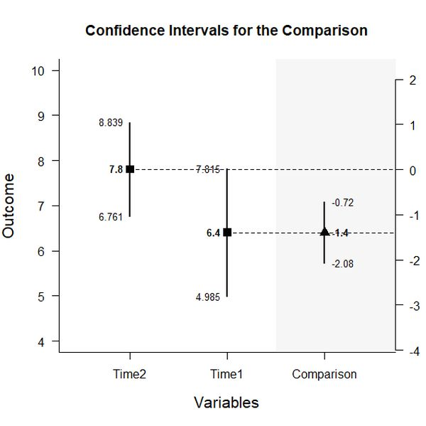
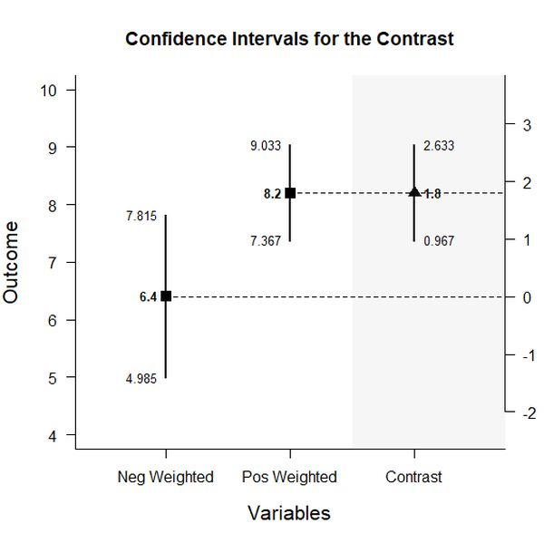

# Estimation Approach to Statistical Inference (EASI)

## Basic Within-Subjects Example

#### Three Time Period Example Data

This code inputs the variable names and creates a viewable data frame.
```r
Time1 <- c(5,6,6,7,8)
Time2 <- c(7,7,8,8,9)
Time3 <- c(8,8,9,9,9)

mydata <- data.frame(Time1,Time2,Time3)
mydata
```
```
  Time1 Time2 Time3
1     5     7     8
2     6     7     8
3     6     8     9
4     7     8     9
5     8     9     9
```
 
### Analyses of Multiple Variables

This section produces analyses that are equivalent to one-sample analyses separately for each level of a factor.

#### Confidence Intervals for the Means

This code will provide a table of descriptive statistics and confidence intervals for each level of the factor.
```r
estimateLevels(Time1,Time2,Time3)
```
```
CONFIDENCE INTERVALS FOR THE LEVELS

      N   M    SD    SE    LL    UL
Time1 5 6.4 1.140 0.510 4.984 7.816
Time2 5 7.8 0.837 0.374 6.761 8.839
Time3 5 8.6 0.548 0.245 7.920 9.280
```

The code defaults to 95% confidence intervals. This can be changed if desired.
```r
estimateLevels(Time1,Time2,Time3,conf.level=.99)
```

#### Plots of Confidence Intervals for the Means

This code will produce a graph of the confidence intervals for each level of the factor.
```r
plotLevels(Time1,Time2,Time3)
```
<kbd></kbd>

Of course, it is possible to change from the default confidence level. Additionally, it is possible to add a comparison line to represent a population (or test) value.
```r
plotLevels(Time1,Time2,Time3,conf.level=.99,mu=6)
```
<kbd></kbd>

#### Significance Tests for the Means

This code will produce a table of NHST separately for each level of the factor. In this case, all the means are tested against a value of zero.
```r
testLevels(Time1,Time2,Time3)
```
```
HYPOTHESIS TESTS FOR THE LEVELS

      Diff    SE      t df p
Time1  6.4 0.510 12.551  4 0
Time2  7.8 0.374 20.846  4 0
Time3  8.6 0.245 35.109  4 0
```

Often, the default test value of zero is not meaningful or plausible. This too can be altered (often in conjunction with what is presented in the plot).
```r
testLevels(Time1,Time2,Time3,mu=6)
```

#### Effect Sizes for the Means

This code will produce a table of standardized mean differences separately for each level of the factor. In this case, the mean is compared to zero to form the effect size.
```r
effectLevels(Time1,Time2,Time3)
```
```
STANDARDIZED MEAN DIFFERENCES FOR THE LEVELS

       d      g    LL     UL
Time1  5.614  4.479 2.574 13.031
Time2  9.319  7.435 4.389 21.463
Time3 15.693 12.522 7.463 36.039
```

Here too it is possible to alter the width of the confidence intervals and to establish a more plausible comparison value for the effect size.
```
effectLevels(Time1,Time2,Time3,mu=6,conf.level=.99)
```

### Analyses of a Variable Comparison

This section produces analyses that are equivalent to analyses for two levels of a factor.

#### Confidence Interval for the Mean Difference

This code identifies the two levels for comparison and estimates the confidence interval of the difference.
```r
estimateDifference(Time1,Time2)
```
```
CONFIDENCE INTERVAL FOR THE COMPARISON

  Diff     SE     df     LL     UL 
-1.400  0.245  4.000 -2.080 -0.720 
```

Of course, you can change the confidence level from the default 95% if desired.
```r
estimateDifference(Time1,Time2,conf.level=.99)
```

It is also possible to alter the comparison by changing (or even reversing the order) of the levels.
```r
estimateDifference(Time3,Time1)
```

#### Plots of Confidence Intervals for the Mean Difference

This code obtains and plots the confidence intervals for the levels and the mean difference in the identified comparison.
```r
plotDifference(Time1,Time2)
```
<kbd></kbd>

Once again, the confidence levels can be changed away from the default if desired.
```r
plotDifference(Time1,Time2,conf.level=.99)
```

#### Significance Test for the Mean Difference

This code produces NHST for the identified comparison (using a default test value of zero).
```r
testDifference(Time1,Time2)
```
```
HYPOTHESIS TEST FOR THE COMPARISON

  Diff     SE      t     df      p 
-1.400  0.245 -5.715  4.000  0.005 
```

If the default value of zero is not plausible, it too can be changed.
```r
testDifference(Time1,Time2,mu=-2)
```

#### Effect Size for the Mean Difference

This code calculates a standardized mean difference for the comparison and its confidence interval.
```r
effectDifference(Time1,Time2)
```
```
STANDARDIZED MEAN DIFFERENCE FOR THE COMPARISON

     d      g     LL     UL 
-1.400 -1.264 -2.566 -0.735 
```

The width of the confidence interval for the effect size can be altered if desired.
```r
effectDifference(Time1,Time2,conf.level=.99)
```

### Analyses of a Variable Contrast

This section produces analyses that are equivalent to analyses involving multiple levels of a factor.

#### Confidence Interval for Combined Levels

This code creates combinations of variables and produces a confidence interval for those pooled variables.
```r
T1 <- c(1,0,0)
estimateContrast(Time1,Time2,Time3,contrast=T1)
```
```
CONFIDENCE INTERVAL FOR THE CONTRAST

         Est   SE df    LL    UL
Contrast 6.4 0.51  4 4.984 7.816
```
```r
T2nT3 <- c(0,.5,.5)
estimateContrast(Time1,Time2,Time3,contrast=T2nT3)
```
```
CONFIDENCE INTERVAL FOR THE CONTRAST

         Est  SE df    LL    UL
Contrast 8.2 0.3  4 7.367 9.033
```

#### Confidence Interval for the Contrast

This code identifies a contrast among the levels and produces a confidence interval for that contrast.
```r
T1vsT2 <- c(1,-1,0)
estimateContrast(Time1,Time2,Time3,contrast=T1vsT2)
```
```
CONFIDENCE INTERVAL FOR THE CONTRAST

          Est    SE df    LL    UL
Contrast -1.4 0.245  4 -2.08 -0.72
```

As in all other cases, the default value of the confidence interval can be changed.
```r
estimateContrast(Time1,Time2,Time3,contrast=T1vsT2,conf.level=.99)
```

#### Plots of Confidence Intervals for a Contrast

This code obtains and plots the confidence intervals for the groups and the mean difference in the identified contrast.
```r
plotContrast(Time1,Time2,Time3,contrast=T1vsOthers)
````
<kbd></kbd>

The width of the confidence interval for the contrast can be altered if desired.
```r
plotContrast(Time1,Time2,Time3,contrast=G1vsOthers,conf.level=.99)
```

#### Significance Test for the Contrast

This code produces a NHST for the identified contrast. It tests the contrast against a value of zero by default.
```r
testContrast(Time1,Time2,Time3,contrast=T1vsT2)
```
```
HYPOTHESIS TEST FOR THE CONTRAST

          Est    SE      t df     p
Contrast -1.4 0.245 -5.715  4 0.005
```

If desired, the contrast can be tested against other values if needed.
```r
testContrast(Time1,Time2,Time3,contrast=T1vsT2,mu=-1)
```

### Different Methods for Comparing Two Levels

This section demonstrates the equivalence of Difference/Comparison and Contrast approaches from above.

#### The Difference/Comparison Approach (Copied from Above)

```r
estimateDifference(Time2,Time1)
```
```
CONFIDENCE INTERVAL FOR THE COMPARISON

           Diff    SE df   LL   UL
Comparison  1.4 0.245  4 0.72 2.08
```
```r
testDifference(Time2,Time1)
```
```
HYPOTHESIS TEST FOR THE COMPARISON

           Diff    SE     t df     p
Comparison  1.4 0.245 5.715  4 0.005
```

#### The Contrast Approach (Adapted from Above)

```r
T1vsT2 <- c(-1,1,0)
estimateContrast(Time1,Time2,Time3,contrast=T1vsT2)
```
```
CONFIDENCE INTERVAL FOR THE CONTRAST

         Est    SE df   LL   UL
Contrast 1.4 0.245  4 0.72 2.08
```
```r
testContrast(Time1,Time2,Time3,contrast=T1vsT2)
```
```
HYPOTHESIS TEST FOR THE CONTRAST

         Est    SE     t df     p
Contrast 1.4 0.245 5.715  4 0.005
```
