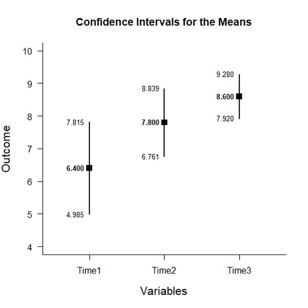
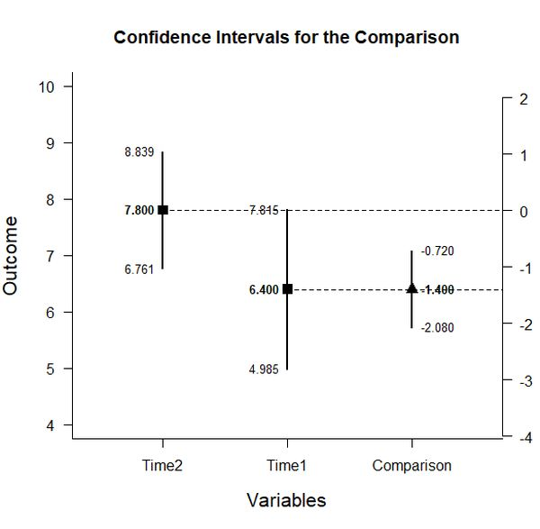

# Estimation Approach to Statistical Inference (EASI)

[**Home**](https://github.com/cwendorf/EASI/) | 
[**Functions**](https://github.com/cwendorf/EASI/tree/master/A-Functions) | 
[**Basic Examples**](https://github.com/cwendorf/EASI/tree/master/B-BasicExamples) | 
[**ITNS Examples**](https://github.com/cwendorf/EASI/tree/master/C-ITNSExamples) | 
[**Extensions**](https://github.com/cwendorf/EASI/tree/master/D-Extensions) | 
[**Extension Examples**](https://github.com/cwendorf/EASI/tree/master/E-ExtensionExamples) 

---

## Basic Within-Subjects Data Example

### Source the EASI Functions

```r
source("http://raw.githubusercontent.com/cwendorf/EASI/master/A-Functions/ALL_EASI_FUNCTIONS.R")
```

### Three Time Period Example Summary Statistics

This code inputs the variable summaries and creates a summary table.
```r
Time1 <- c(N=5,M=6.4,SD=1.14)
Time2 <- c(N=5,M=7.8,SD=.837)
Time3 <- c(N=5,M=8.6,SD=.548)
sumstats <- rbind(Time1,Time2,Time3)
class(sumstats) <- "wss"
sumstats
```
```
      N   M    SD
Time1 5 6.4 1.140
Time2 5 7.8 0.837
Time3 5 8.6 0.548
attr(,"class")
[1] "wss"
```
This code creates a correlation matrix, enters just the top triangle, and then uses a function to fill in the whole matrix.
```r
corrstats <- declareCorrMatrix("Time1","Time2","Time3")
corrstats["Time1","Time2"] <- .891
corrstats["Time1","Time3"] <- .721
corrstats["Time2","Time3"] <- .873
corrstats <- fillCorrMatrix(corrstats)
corrstats
```
```
      Time1 Time2 Time3
Time1 1.000 0.891 0.721
Time2 0.891 1.000 0.873
Time3 0.721 0.873 1.000
```
 
### Analyses of Multiple Variables

This section produces analyses that are equivalent to one-sample analyses separately for each level of a factor.

#### Confidence Intervals for the Means

This code will provide a table of descriptive statistics and confidence intervals for each level of the factor.
```r
estimateMeans(sumstats)
```
```
CONFIDENCE INTERVALS FOR THE MEANS

      N   M    SD    SE    LL    UL
Time1 5 6.4 1.140 0.510 4.984 7.816
Time2 5 7.8 0.837 0.374 6.761 8.839
Time3 5 8.6 0.548 0.245 7.920 9.280
```

The code defaults to 95% confidence intervals. This can be changed if desired.
```r
estimateMeans(sumstats,conf.level=.99)
```

#### Plots of Confidence Intervals for the Means

This code will produce a graph of the confidence intervals for each level of the factor.
```r
plotMeans(sumstats)
```
<kbd></kbd>

Of course, it is possible to change from the default confidence level. Additionally, it is possible to add a comparison line to represent a population (or test) value.
```r
plotMeans(sumstats,conf.level=.99,mu=6)
```
<kbd></kbd>

#### Significance Tests for the Means

This code will produce a table of NHST separately for each level of the factor. In this case, all the means are tested against a value of zero.
```r
testMeans(sumstats)
```
```
HYPOTHESIS TESTS FOR THE MEANS

      Diff    SE      t df p
Time1  6.4 0.510 12.551  4 0
Time2  7.8 0.374 20.846  4 0
Time3  8.6 0.245 35.109  4 0
```

Often, the default test value of zero is not meaningful or plausible. This too can be altered (often in conjunction with what is presented in the plot).
```r
testMeans(sumstats,mu=6)
```

### Analyses of a Variable Comparison

This section produces analyses that are equivalent to analyses for two levels of a factor.

#### Confidence Interval for the Mean Difference

This code creates a new table that identifies the two levels for comparison and estimates the confidence interval of the difference.
```r
compstats <- sumstats[c("Time1","Time2"),]
class(compstats) <- "wss"
estimateDifference(compstats,corrstats)
```
```
CONFIDENCE INTERVAL FOR THE COMPARISON

           Diff    SE df    LL    UL
Comparison -1.4 0.245  4 -2.08 -0.72
```

Of course, you can change the confidence level from the default 95% if desired.
```r
estimateDifference(compstats,corrstats,conf.level=.99)
```

It is also possible to alter the comparison by changing (or even reversing the order) of the levels.
```r
compstats <- sumstats[c("Time3","Time1"),]
class(compstats) <- "wss"
estimateDifference(compstats,corrstats)
```

#### Plots of Confidence Intervals for the Mean Difference

This code obtains and plots the confidence intervals for the levels and the mean difference in the identified comparison.
```r
plotDifference(compstats,corrstats)
```
<kbd></kbd>

Once again, the confidence levels can be changed away from the default if desired.
```r
plotDifference(compstats,corrstats,conf.level=.99)
```

#### Significance Test for the Mean Difference

This code produces NHST for the identified comparison (using a default test value of zero).
```r
testDifference(compstats,corrstats)
```
```
HYPOTHESIS TEST FOR THE COMPARISON

           Diff    SE      t df     p
Comparison -1.4 0.245 -5.717  4 0.005
```

If the default value of zero is not plausible, it too can be changed.
```r
testDifference(compstats,corrstats,mu=-2)
```

#### Effect Size for the Mean Difference

This code calculates a standardized mean difference for the comparison and its confidence interval.
```r
standardizeDifference(compstats,corrstats)
```
```
CONFIDENCE INTERVAL FOR THE STANDARDIZED COMPARISON

          Est    SE     LL     UL
Comparison -1.4 0.545 -2.468 -0.332
```

The width of the confidence interval for the effect size can be altered if desired.
```r
standardizeDifference(compstats,corrstats,conf.level=.99)
```

### Analyses of a Variable Contrast

This section produces analyses that are equivalent to analyses involving multiple levels of a factor.

#### Confidence Interval for Combined Levels

This code creates combinations of variables and produces a confidence interval for those pooled variables.
```r
T1 <- c(1,0,0)
estimateContrast(sumstats,corrstats,contrast=T1)
```
```
CONFIDENCE INTERVAL FOR THE CONTRAST

         Est   SE df    LL    UL
Contrast 6.4 0.51  4 4.984 7.816
```
```r
T2nT3 <- c(0,.5,.5)
estimateContrast(sumstats,corrstats,contrast=T2nT3)
```
```
CONFIDENCE INTERVAL FOR THE CONTRAST

         Est  SE df    LL    UL
Contrast 8.2 0.3  4 7.367 9.033
```

#### Confidence Interval for the Contrast

This code identifies a contrast among the levels and produces a confidence interval for that contrast.
```r
T1vsOthers <- c(-1,.5,.5)
estimateContrast(sumstats,corrstats,contrast=T1vsOthers)
```
```
CONFIDENCE INTERVAL FOR THE CONTRAST

          Est    SE df    LL    UL
Contrast -1.4 0.245  4 -2.08 -0.72
```

As in all other cases, the default value of the confidence interval can be changed.
```r
estimateContrast(sumstats,corrstats,contrast=T1vsOthers,conf.level=.99)
```

#### Plots of Confidence Intervals for a Contrast

This code obtains and plots the confidence intervals for the groups and the mean difference in the identified contrast.
```r
plotContrast(sumstats,corrstats,contrast=T1vsOthers)
````
<kbd></kbd>

The width of the confidence interval for the contrast can be altered if desired.
```r
plotContrast(sumstats,corrstats,contrast=G1vsOthers,conf.level=.99)
```

#### Significance Test for the Contrast

This code produces a NHST for the identified contrast. It tests the contrast against a value of zero by default.
```r
testContrast(sumstats,corrstats,contrast=T1vsOthers)
```
```
HYPOTHESIS TEST FOR THE CONTRAST

          Est    SE      t df     p
Contrast -1.4 0.245 -5.715  4 0.005
```

If desired, the contrast can be tested against other values if needed.
```r
testContrast(sumstats,corrstats,contrast=T1vsOthers,mu=-1)
```

#### Effect Size for a Contrast

This code calculates a standardized contrast and its confidence interval.
```r
standardizeContrast(sumstats,corrstats,contrast=T1vsOthers)
```
```
CONFIDENCE INTERVAL FOR THE STANDARDIZED CONTRAST

           Est    SE    LL    UL
Contrast 2.056 0.685 0.714 3.397 
```

The width of the confidence interval for the effect size can be altered if desired.
```r
standardizeContrast(sumstats,corrstats,contrast=T1vsOthers,conf.level=.99)
```
