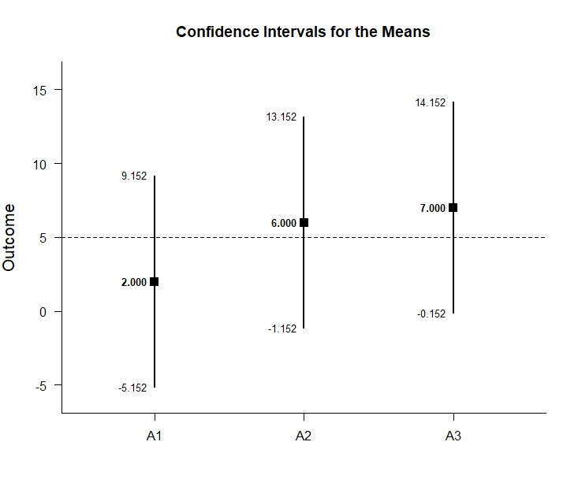
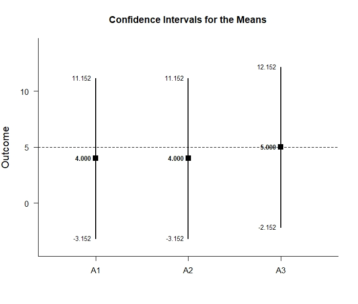

# Estimation Approach to Statistical Inference (EASI)
## Factorial (Bewteen-Subjects) Tutorial with Data

### Source the EASI Functions

```r
source("http://raw.githubusercontent.com/cwendorf/EASI/master/A-Functions/ALL-EASI-FUNCTIONS.R")
```

### Enter Data

```r
FactorA <- c(1,1,1,1,2,2,2,2,3,3,3,3,1,1,1,1,2,2,2,2,3,3,3,3)
FactorB <- c(1,1,1,1,1,1,1,1,1,1,1,1,2,2,2,2,2,2,2,2,2,2,2,2)
Outcome <- c(0,0,3,5,4,7,4,9,4,9,6,9,3,1,6,6,2,2,5,7,2,4,7,7)
FactorA <- factor(FactorA,levels=c(1,2,3),labels=c("A1","A2","A3"))
FactorB <- factor(FactorB,levels=c(1,2),labels=c("B1","B2"))
FactorialData <- data.frame(FactorA,FactorB,Outcome)
FactorialData
```
```
   FactorA FactorB Outcome
1       A1      B1       0
2       A1      B1       0
3       A1      B1       3
4       A1      B1       5
5       A2      B1       4
6       A2      B1       7
7       A2      B1       4
8       A2      B1       9
9       A3      B1       4
10      A3      B1       9
11      A3      B1       6
12      A3      B1       9
13      A1      B2       3
14      A1      B2       1
15      A1      B2       6
16      A1      B2       6
17      A2      B2       2
18      A2      B2       2
19      A2      B2       5
20      A2      B2       7
21      A3      B2       2
22      A3      B2       4
23      A3      B2       7
24      A3      B2       7
```
```r
DataSubsetB1 <- subset(FactorialData,FactorB=="B1")
DataSubsetB2 <- subset(FactorialData,FactorB=="B2")
```

### Analyses of Multiple Groups
### (equivalent to one-sample analyses for each level of a factor)

#### Confidence Intervals for the Means

```r
with(DataSubsetB1,estimateMeans(Outcome~FactorA))
```
```
CONFIDENCE INTERVALS FOR THE MEANS

       N     M    SD    SE     LL     UL
A1 4.000 2.000 2.449 1.224 -1.897  5.897
A2 4.000 6.000 2.449 1.224  2.103  9.897
A3 4.000 7.000 2.449 1.224  3.103 10.897
```
```r
with(DataSubsetB2,estimateMeans(Outcome~FactorA))
```
```
CONFIDENCE INTERVALS FOR THE MEANS

       N     M    SD    SE    LL    UL
A1 4.000 4.000 2.449 1.224 0.103 7.897
A2 4.000 4.000 2.449 1.224 0.103 7.897
A3 4.000 5.000 2.449 1.224 1.103 8.897
```
```r
with(DataSubsetB1,estimateMeans(Outcome~FactorA,conf.level=.99))
```
CONFIDENCE INTERVALS FOR THE MEANS

       N     M    SD    SE     LL     UL
A1 4.000 2.000 2.449 1.224 -5.152  9.152
A2 4.000 6.000 2.449 1.224 -1.152 13.152
A3 4.000 7.000 2.449 1.224 -0.152 14.152
```
```r
with(DataSubsetB2,estimateMeans(Outcome~FactorA,conf.level=.99))
```
```
CONFIDENCE INTERVALS FOR THE MEANS

       N     M    SD    SE     LL     UL
A1 4.000 4.000 2.449 1.224 -3.152 11.152
A2 4.000 4.000 2.449 1.224 -3.152 11.152
A3 4.000 5.000 2.449 1.224 -2.152 12.152
```

#### Plot of the Confidence Intervals for the Means

```r
with(DataSubsetB1,plotMeans(Outcome~FactorA)) # Factorial-Figure1.jpeg
```
<kbd></kbd>
```r
with(DataSubsetB2,plotMeans(Outcome~FactorA)) # Factorial-Figure2.jpeg
```
<kbd></kbd>
```r
with(DataSubsetB1,plotMeans(Outcome~FactorA,conf.level=.99,mu=5)) # Factorial-Figure3.jpeg
```
<kbd></kbd>
```r
with(DataSubsetB2,plotMeans(Outcome~FactorA,conf.level=.99,mu=5)) # Factorial-Figure4.jpeg
```
<kbd></kbd>


#### Significance Tests for the Means

```r
with(DataSubsetB1,testMeans(Outcome~FactorA))
```
```
HYPOTHESIS TESTS FOR THE MEANS

    Diff    SE     t    df     p
A1 2.000 1.224 1.633 3.000 0.201
A2 6.000 1.224 4.900 3.000 0.016
A3 7.000 1.224 5.717 3.000 0.011
```
```r
with(DataSubsetB2,testMeans(Outcome~FactorA))
```
```
HYPOTHESIS TESTS FOR THE MEANS

    Diff    SE     t    df     p
A1 4.000 1.224 3.267 3.000 0.047
A2 4.000 1.224 3.267 3.000 0.047
A3 5.000 1.224 4.083 3.000 0.027
```
```r
with(DataSubsetB1,testMeans(Outcome~FactorA,mu=5))
```
```
HYPOTHESIS TESTS FOR THE MEANS

     Diff    SE      t    df     p
A1 -3.000 1.224 -2.450 3.000 0.092
A2  1.000 1.224  0.817 3.000 0.474
A3  2.000 1.224  1.633 3.000 0.201
```
```r
with(DataSubsetB2,testMeans(Outcome~FactorA,mu=5))
```
```
HYPOTHESIS TESTS FOR THE MEANS

     Diff    SE      t    df     p
A1 -1.000 1.224 -0.817 3.000 0.474
A2 -1.000 1.224 -0.817 3.000 0.474
A3  0.000 1.224  0.000 3.000 1.000
```

#### Effect Size for the Means

```r
with(DataSubsetB1,standardizeMeans(Outcome~FactorA))
```
```
CONFIDENCE INTERVALS FOR THE STANDARDIZED MEANS

       d d(unb)    SE     LL    UL
A1 0.817  0.594 0.616 -0.387 1.934
A2 2.450  1.782 0.955  0.325 4.532
A3 2.858  2.079 1.063  0.464 5.227
```
```r
with(DataSubsetB2,standardizeMeans(Outcome~FactorA))
```
```
CONFIDENCE INTERVALS FOR THE STANDARDIZED MEANS

       d d(unb)    SE    LL    UL
A1 1.633  1.188 0.761 0.013 3.177
A2 1.633  1.188 0.761 0.013 3.177
A3 2.042  1.485 0.854 0.176 3.847
```
```r
with(DataSubsetB1,standardizeMeans(Outcome~FactorA,mu=5,conf.level=.99))
```
```
CONFIDENCE INTERVALS FOR THE STANDARDIZED MEANS

        d d(unb)    SE     LL    UL
A1 -1.225 -0.891 0.680 -3.011 0.547
A2  0.408  0.297 0.574 -0.968 1.734
A3  0.817  0.594 0.616 -0.732 2.320
```
```r
with(DataSubsetB1,standardizeMeans(Outcome~FactorA,mu=5,conf.level=.99))
```
```
CONFIDENCE INTERVALS FOR THE STANDARDIZED MEANS

        d d(unb)    SE     LL    UL
A1 -1.225 -0.891 0.680 -3.011 0.547
A2  0.408  0.297 0.574 -0.968 1.734
A3  0.817  0.594 0.616 -0.732 2.320
```

### Analyses of a Group Comparison
### (equivalent to analyses for two levels of a factor)

```r
Comparison <- with(DataSubsetB1,factor(FactorA,c("A1","A2")))
Comparison <- with(DataSubsetB2,factor(FactorA,c("A1","A2")))
```

#### Confidence Interval for a Mean Difference

```r
with(DataSubsetB1,estimateMeans(Outcome~Comparison))
```
```
CONFIDENCE INTERVALS FOR THE MEANS

       N     M    SD    SE     LL    UL
A1 4.000 2.000 2.449 1.224 -1.897 5.897
A2 4.000 6.000 2.449 1.224  2.103 9.897
```
```r
with(DataSubsetB2,estimateMeans(Outcome~Comparison))
```
```
CONFIDENCE INTERVALS FOR THE MEANS

       N     M    SD    SE    LL    UL
A1 4.000 4.000 2.449 1.224 0.103 7.897
A2 4.000 4.000 2.449 1.224 0.103 7.897
```
```r
with(DataSubsetB1,estimateDifference(Outcome~Comparison,conf.level=.99))
```
```
CONFIDENCE INTERVAL FOR THE COMPARISON

             Diff    SE    df      LL    UL
Comparison -4.000 1.732 6.000 -10.420 2.420
```
```r
with(DataSubsetB2,estimateDifference(Outcome~Comparison,conf.level=.99))
```
```
CONFIDENCE INTERVAL FOR THE COMPARISON

            Diff    SE    df     LL    UL
Comparison 0.000 1.732 6.000 -6.420 6.420
```

#### Plot of the Confidence Interval for the Mean Difference

```r
with(DataSubsetB1,plotDifference(Outcome~Comparison)) # Factorial-Figure5.jpeg
```
<kbd></kbd>
```r
with(DataSubsetB2,plotDifference(Outcome~Comparison)) # Factorial-Figure6.jpeg
```
<kbd></kbd>
```r
with(DataSubsetB1,plotDifference(Outcome~Comparison,conf.level=.99)) # Factorial-Figure7.jpeg
```
<kbd></kbd>
```r
with(DataSubsetB2,plotDifference(Outcome~Comparison,conf.level=.99)) # Factorial-Figure8.jpeg
```
<kbd></kbd>

#### Significance Test for the Mean Difference

```r
with(DataSubsetB1,testDifference(Outcome~Comparison))
```
```
HYPOTHESIS TEST FOR THE COMPARISON

             Diff    SE      t    df     p
Comparison -4.000 1.732 -2.310 6.000 0.060
```
```r
with(DataSubsetB2,testDifference(Outcome~Comparison))
```
```
HYPOTHESIS TEST FOR THE COMPARISON

            Diff    SE     t    df     p
Comparison 0.000 1.732 0.000 6.000 1.000
```
```r
with(DataSubsetB1,testDifference(Outcome~Comparison,mu=-2))
```
```
HYPOTHESIS TEST FOR THE COMPARISON

             Diff    SE      t    df     p
Comparison -2.000 1.732 -1.155 6.000 0.292
```
```r
with(DataSubsetB2,testDifference(Outcome~Comparison,mu=-2))
```
```
HYPOTHESIS TEST FOR THE COMPARISON

            Diff    SE     t    df     p
Comparison 2.000 1.732 1.155 6.000 0.292
```

#### Effect Size for the Mean Difference

```r
with(DataSubsetB1,standardizeDifference(Outcome~Comparison))
```
```
CONFIDENCE INTERVAL FOR THE STANDARDIZED COMPARISON

              Est    SE     LL    UL
Comparison -1.633 0.943 -3.481 0.215
```
```r
with(DataSubsetB2,standardizeDifference(Outcome~Comparison))
```
```
CONFIDENCE INTERVAL FOR THE STANDARDIZED COMPARISON

             Est    SE     LL    UL
Comparison 0.000 0.816 -1.600 1.600
```
```r
with(DataSubsetB1,standardizeDifference(Outcome~Comparison,conf.level=.99))
```
```
CONFIDENCE INTERVAL FOR THE STANDARDIZED COMPARISON

              Est    SE     LL    UL
Comparison -1.633 0.943 -4.062 0.795
```
```r
with(DataSubsetB2,standardizeDifference(Outcome~Comparison,conf.level=.99))
```
```
CONFIDENCE INTERVAL FOR THE STANDARDIZED COMPARISON

             Est    SE     LL    UL
Comparison 0.000 0.816 -2.103 2.103
```

### Analyses of a Group Contrast
### (equivalent to analyses for multiple levels of a factor)

```r
A1vsOthers <- c(-1,.5,.5)
```

#### Confidence Interval for a Contrast
```r
with(DataSubsetB1,estimateContrast(Outcome~FactorA,contrast=A1vsOthers))
```
```
CONFIDENCE INTERVAL FOR THE CONTRAST

           Est    SE    df    LL    UL
Contrast 4.500 1.500 6.000 0.830 8.170
```
```r
with(DataSubsetB2,estimateContrast(Outcome~FactorA,contrast=A1vsOthers))
```
```
CONFIDENCE INTERVAL FOR THE CONTRAST

           Est    SE    df     LL    UL
Contrast 0.500 1.500 6.000 -3.170 4.170
```
```r
with(DataSubsetB1,estimateContrast(Outcome~FactorA,contrast=A1vsOthers,conf.level=.99))
```
```
CONFIDENCE INTERVAL FOR THE CONTRAST

           Est    SE    df     LL     UL
Contrast 4.500 1.500 6.000 -1.060 10.060
```
```r
with(DataSubsetB2,estimateContrast(Outcome~FactorA,contrast=A1vsOthers,conf.level=.99))
```
```
CONFIDENCE INTERVAL FOR THE CONTRAST

           Est    SE    df     LL    UL
Contrast 0.500 1.500 6.000 -5.060 6.060
```

#### Plots of Confidence Intervals for a Contrast

```r
with(DataSubsetB1,plotContrast(Outcome~FactorA,contrast=A1vsOthers)) # Factorial-Figure9.jpeg
```
<kbd></kbd>
```r
with(DataSubsetB2,plotContrast(Outcome~FactorA,contrast=A1vsOthers)) # Factorial-Figure10.jpeg
```
<kbd></kbd>
```r
with(DataSubsetB1,plotContrast(Outcome~FactorA,contrast=A1vsOthers,labels=c("A1","Others"),conf.level=.99)) # Factorial-Figure11.jpeg
```
<kbd></kbd>
```r
with(DataSubsetB2,plotContrast(Outcome~FactorA,contrast=A1vsOthers,labels=c("A1","Others"),conf.level=.99)) # Factorial-Figure12.jpeg
```
<kbd></kbd>

#### Significance Test for a Contrast

```r
with(DataSubsetB1,testContrast(Outcome~FactorA,contrast=A1vsOthers))
```
```
HYPOTHESIS TEST FOR THE CONTRAST

           Est    SE     t    df     p
Contrast 4.500 1.500 3.001 6.000 0.024
```
```r
with(DataSubsetB2,testContrast(Outcome~FactorA,contrast=A1vsOthers))
```
```
HYPOTHESIS TEST FOR THE CONTRAST

           Est    SE     t    df     p
Contrast 0.500 1.500 0.333 6.000 0.750
```
```r
with(DataSubsetB1,testContrast(Outcome~FactorA,contrast=A1vsOthers,mu=4))
```
```
HYPOTHESIS TEST FOR THE CONTRAST

           Est    SE     t    df     p
Contrast 0.500 1.500 0.333 6.000 0.750
```
```r
with(DataSubsetB2,testContrast(Outcome~FactorA,contrast=A1vsOthers,mu=4))
```
```
HYPOTHESIS TEST FOR THE CONTRAST

            Est    SE      t    df     p
Contrast -3.500 1.500 -2.334 6.000 0.058
```

#### Effect Size for a Contrast

```r
with(DataSubsetB1,standardizeContrast(Outcome~FactorA,contrast=A1vsOthers))
```
```
CONFIDENCE INTERVAL FOR THE STANDARDIZED CONTRAST

           Est    SE    LL    UL
Contrast 1.837 0.829 0.212 3.463
```
```r
with(DataSubsetB2,standardizeContrast(Outcome~FactorA,contrast=A1vsOthers))
```
```
CONFIDENCE INTERVAL FOR THE STANDARDIZED CONTRAST

           Est    SE     LL    UL
Contrast 0.204 0.709 -1.185 1.593
```
```r
with(DataSubsetB1,standardizeContrast(Outcome~FactorA,contrast=A1vsOthers,conf.level=.99))
```
```
CONFIDENCE INTERVAL FOR THE STANDARDIZED CONTRAST

           Est    SE     LL    UL
Contrast 1.837 0.829 -0.298 3.973
```
```r
with(DataSubsetB2,standardizeContrast(Outcome~FactorA,contrast=A1vsOthers,conf.level=.99))
```
```
CONFIDENCE INTERVAL FOR THE STANDARDIZED CONTRAST

           Est    SE     LL    UL
Contrast 0.204 0.709 -1.621 2.030
```
