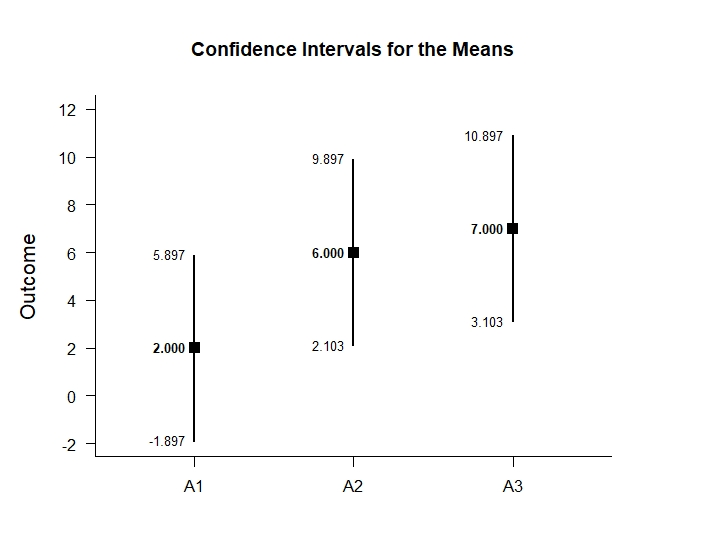
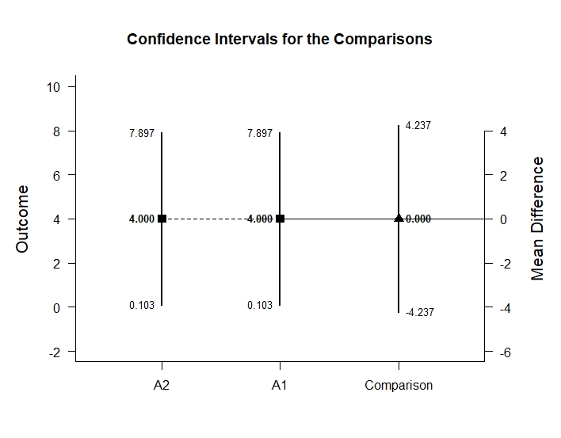
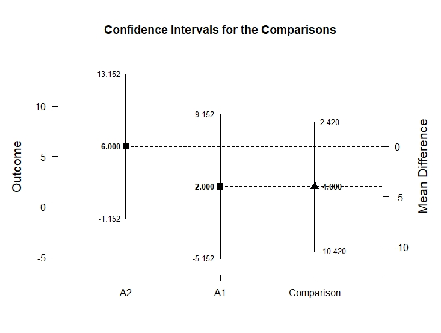
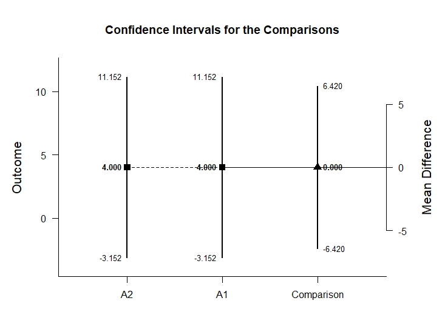

# Estimation Approach to Statistical Inference (EASI)

[**Home**](https://github.com/cwendorf/EASI/) | 
[**Functions**](https://github.com/cwendorf/EASI/tree/master/A-Functions) | 
[**Tutorial Examples**](https://github.com/cwendorf/EASI/tree/master/B-TutorialExamples) | 
[**ITNS Examples**](https://github.com/cwendorf/EASI/tree/master/C-ITNSExamples) | 
[**Extension Examples**](https://github.com/cwendorf/EASI/tree/master/D-ExtensionExamples)

---

## Factorial (Between-Subjects) Tutorial with Summary Statistics

### Source the EASI Functions

```r
source("http://raw.githubusercontent.com/cwendorf/EASI/master/A-Functions/ALL-EASI-FUNCTIONS.R")
```

### Enter Summary Statistics

This code inputs the variable summaries and creates a single summary table (for the first simple effect).
```r
A1B1 <- c(N=4,M=2.000,SD=2.449)
A2B1 <- c(N=4,M=6.000,SD=2.449)
A3B1 <- c(N=4,M=7.000,SD=2.449)
BetweenSummaryB1 <- rbind(A1B1,A2B1,A3B1)
class(BetweenSummaryB1) <- "bss"
BetweenSummaryB1
```
```
     N M    SD
A1B1 4 2 2.449
A2B1 4 6 2.449
A3B1 4 7 2.449
attr(,"class")
[1] "bss"
```
And repeat the analysis for the second subset.
```r
A1B2 <- c(N=4,M=4.000,SD=2.449)
A2B2 <- c(N=4,M=4.000,SD=2.449)
A3B2 <- c(N=4,M=5.000,SD=2.449)
BetweenSummaryB2 <- rbind(A1B2,A2B2,A3B2)
class(BetweenSummaryB2) <- "bss"
BetweenSummaryB2
```
```
     N M    SD
A1B2 4 4 2.449
A2B2 4 4 2.449
A3B2 4 5 2.449
attr(,"class")
[1] "bss"
```

### Analyses of Multiple Groups

This section produces analyses that are equivalent to one-sample analyses separately for each level of a factor.

#### Confidence Intervals for the Means

This code will provide a table of descriptive statistics and confidence intervals for each level of the factor.
```r
estimateMeans(BetweenSummaryB1)
```
```
CONFIDENCE INTERVALS FOR THE MEANS

         N     M    SD    SE     LL     UL
A1B1 4.000 2.000 2.449 1.224 -1.897  5.897
A2B1 4.000 6.000 2.449 1.224  2.103  9.897
A3B1 4.000 7.000 2.449 1.224  3.103 10.897
```

And repeat the analysis for the second subset.
```r
estimateMeans(BetweenSummaryB2)
```
```
CONFIDENCE INTERVALS FOR THE MEANS

         N     M    SD    SE    LL    UL
A1B2 4.000 4.000 2.449 1.224 0.103 7.897
A2B2 4.000 4.000 2.449 1.224 0.103 7.897
A3B2 4.000 5.000 2.449 1.224 1.103 8.897
```

The code defaults to 95% confidence intervals. This can be changed if desired.
```r
estimateMeans(BetweenSummaryB1,conf.level=.99)
```
```
CONFIDENCE INTERVALS FOR THE MEANS

         N     M    SD    SE     LL     UL
A1B1 4.000 2.000 2.449 1.224 -5.152  9.152
A2B1 4.000 6.000 2.449 1.224 -1.152 13.152
A3B1 4.000 7.000 2.449 1.224 -0.152 14.152
```

And repeat the analysis for the second subset.
```r
estimateMeans(BetweenSummaryB2,conf.level=.99)
```
```
CONFIDENCE INTERVALS FOR THE MEANS

         N     M    SD    SE     LL     UL
A1B2 4.000 4.000 2.449 1.224 -3.152 11.152
A2B2 4.000 4.000 2.449 1.224 -3.152 11.152
A3B2 4.000 5.000 2.449 1.224 -2.152 12.152
```

#### Plot of the Confidence Intervals for the Means

This code will produce a graph of the confidence intervals for each level of the factor.
```r
plotMeans(BetweenSummaryB1) # Factorial-Figure1.jpeg
```
<kbd></kbd>

And repeat the analysis for the second subset.
```r
plotMeans(BetweenSummaryB2) # Factorial-Figure2.jpeg
```
<kbd></kbd>

Of course, it is possible to change from the default confidence level. Additionally, it is possible to add a comparison line to represent a population (or test) value.
```r
plotMeans(BetweenSummaryB1,conf.level=.99,mu=5) # Factorial-Figure3.jpeg
```
<kbd></kbd>

And repeat the analysis for the second subset.
```r
plotMeans(BetweenSummaryB2,conf.level=.99,mu=5) # Factorial-Figure4.jpeg
```
<kbd></kbd>

#### Significance Tests for the Means

This code will produce a table of NHST separately for each level of the factor. In this case, all the means are tested against a value of zero.
```r
testMeans(BetweenSummaryB1)
```
```
HYPOTHESIS TESTS FOR THE MEANS

      Diff    SE     t    df     p
A1B1 2.000 1.224 1.633 3.000 0.201
A2B1 6.000 1.224 4.900 3.000 0.016
A3B1 7.000 1.224 5.717 3.000 0.011
```

And repeat the analysis for the second subset.
```r
testMeans(BetweenSummaryB2)
```
```
HYPOTHESIS TESTS FOR THE MEANS

      Diff    SE     t    df     p
A1B2 4.000 1.224 3.267 3.000 0.047
A2B2 4.000 1.224 3.267 3.000 0.047
A3B2 5.000 1.224 4.083 3.000 0.027
```

Often, the default test value of zero is not meaningful or plausible. This too can be altered (often in conjunction with what is presented in the plot).
```r
testMeans(BetweenSummaryB1,mu=5)
```
```
HYPOTHESIS TESTS FOR THE MEANS

       Diff    SE      t    df     p
A1B1 -3.000 1.224 -2.450 3.000 0.092
A2B1  1.000 1.224  0.817 3.000 0.474
A3B1  2.000 1.224  1.633 3.000 0.201
```

And repeat the analysis for the second subset.
```r
testMeans(BetweenSummaryB2,mu=5)
```
```
HYPOTHESIS TESTS FOR THE MEANS

       Diff    SE      t    df     p
A1B2 -1.000 1.224 -0.817 3.000 0.474
A2B2 -1.000 1.224 -0.817 3.000 0.474
A3B2  0.000 1.224  0.000 3.000 1.000
```

#### Effect Size for the Means

This code will produce a table of standardized mean differences separately for each level of the factor. In this case, the mean is compared to zero to form the effect size.
```r
standardizeMeans(BetweenSummaryB1)
```
```
CONFIDENCE INTERVALS FOR THE STANDARDIZED MEANS

         d d(unb)    SE     LL    UL
A1B1 0.817  0.594 0.616 -0.387 1.934
A2B1 2.450  1.782 0.955  0.325 4.532
A3B1 2.858  2.079 1.063  0.464 5.227
```

And repeat the analysis for the second subset.
```r
standardizeMeans(BetweenSummaryB2)
```
```
CONFIDENCE INTERVALS FOR THE STANDARDIZED MEANS

         d d(unb)    SE    LL    UL
A1B2 1.633  1.188 0.761 0.013 3.177
A2B2 1.633  1.188 0.761 0.013 3.177
A3B2 2.042  1.485 0.854 0.176 3.847
```

Here too it is possible to alter the width of the confidence intervals and to establish a more plausible comparison value for the effect size.
```r
standardizeMeans(BetweenSummaryB1,mu=5,conf.level=.99)
```
```
CONFIDENCE INTERVALS FOR THE STANDARDIZED MEANS

          d d(unb)    SE     LL    UL
A1B1 -1.225 -0.891 0.680 -3.011 0.547
A2B1  0.408  0.297 0.574 -0.968 1.734
A3B1  0.817  0.594 0.616 -0.732 2.320
```

And repeat the analysis for the second subset.
```r
standardizeMeans(BetweenSummaryB2,mu=5,conf.level=.99)
```
```
CONFIDENCE INTERVALS FOR THE STANDARDIZED MEANS

          d d(unb)    SE     LL    UL
A1B2 -0.408 -0.297 0.574 -1.734 0.968
A2B2 -0.408 -0.297 0.574 -1.734 0.968
A3B2  0.000  0.000 0.559 -1.288 1.288
```

### Analyses of a Group Comparison

This section produces analyses that are equivalent to comparisons of two levels of a factor.

This code creates a new factor that identifies the two levels for comparison.
```r
CompSummaryB1 <- BetweenSummaryB1[c("A1B1","A2B1"),]
class(CompSummaryB1) <- "bss"
CompSummaryB2 <- BetweenSummaryB2[c("A1B2","A2B2"),]
class(CompSummaryB2) <- "bss"
```

#### Confidence Interval for a Mean Difference

This code estimates the confidence interval of the difference.
```r
estimateDifference(CompSummaryB1)
```
```
CONFIDENCE INTERVAL FOR THE COMPARISON

             Diff    SE    df     LL    UL
Comparison -4.000 1.732 6.000 -8.237 0.237
```

And repeat the analysis for the second subset.
```r
estimateDifference(CompSummaryB2)
```
```
CONFIDENCE INTERVAL FOR THE COMPARISON

            Diff    SE    df     LL    UL
Comparison 0.000 1.732 6.000 -4.237 4.237
```

Of course, you can change the confidence level from the default 95% if desired.
```r
estimateDifference(CompSummaryB1,conf.level=.99)
```
```
CONFIDENCE INTERVAL FOR THE COMPARISON

             Diff    SE    df      LL    UL
Comparison -4.000 1.732 6.000 -10.420 2.420
```

And repeat the analysis for the second subset.
```r
estimateDifference(CompSummaryB2,conf.level=.99)
```
```
CONFIDENCE INTERVAL FOR THE COMPARISON

            Diff    SE    df     LL    UL
Comparison 0.000 1.732 6.000 -6.420 6.420
```

#### Plot of the Confidence Interval for the Mean Difference

This code obtains and plots the confidence intervals for the groups and the mean difference in the identified comparison.
```r
plotDifference(CompSummaryB1) # Factorial-Figure5.jpeg
```
<kbd></kbd>

And repeat the analysis for the second subset.
```r
plotDifference(CompSummaryB2) # Factorial-Figure6.jpeg
```
<kbd></kbd>

Once again, the confidence levels can be changed away from the default if desired.
```r
plotDifference(CompSummaryB1,conf.level=.99) # Factorial-Figure7.jpeg
```
<kbd></kbd>

And repeat the analysis for the second subset.
```r
plotDifference(CompSummaryB2,conf.level=.99) # Factorial-Figure8.jpeg
```
<kbd></kbd>

#### Significance Test of the Mean Difference

This code produces NHST for the identified comparison (using a default test value of zero).
```r
testDifference(CompSummaryB1)
```
```
HYPOTHESIS TEST FOR THE COMPARISON

             Diff    SE      t    df     p
Comparison -4.000 1.732 -2.310 6.000 0.060
```

And repeat the analysis for the second subset.
```r
testDifference(CompSummaryB2)
```
```
HYPOTHESIS TEST FOR THE COMPARISON

            Diff    SE     t    df     p
Comparison 0.000 1.732 0.000 6.000 1.000
```

If the default value of zero is not plausible, it too can be changed.
```r
testDifference(CompSummaryB1,mu=-2)
```
```
HYPOTHESIS TEST FOR THE COMPARISON

             Diff    SE      t    df     p
Comparison -2.000 1.732 -1.155 6.000 0.292
```

And repeat the analysis for the second subset.
```r
testDifference(CompSummaryB2,mu=-2)
```
```
HYPOTHESIS TEST FOR THE COMPARISON

            Diff    SE     t    df     p
Comparison 2.000 1.732 1.155 6.000 0.292
```

#### Effect Size for the Mean Difference

This code calculates a standardized mean difference for the comparison and its confidence interval.
```r
standardizeDifference(CompSummaryB1)
```
```
CONFIDENCE INTERVAL FOR THE STANDARDIZED COMPARISON

              Est    SE     LL    UL
Comparison -1.633 0.943 -3.481 0.215
```

And repeat the analysis for the second subset.
```r
standardizeDifference(CompSummaryB2)
```
```
CONFIDENCE INTERVAL FOR THE STANDARDIZED COMPARISON

             Est    SE     LL    UL
Comparison 0.000 0.816 -1.600 1.600
```

The width of the confidence interval for the effect size can be altered if desired.
```r
standardizeDifference(CompSummaryB1,conf.level=.99)
```
```
CONFIDENCE INTERVAL FOR THE STANDARDIZED COMPARISON

              Est    SE     LL    UL
Comparison -1.633 0.943 -4.062 0.795
```

And repeat the analysis for the second subset.
```r
standardizeDifference(CompSummaryB2,conf.level=.99)
```
```
CONFIDENCE INTERVAL FOR THE STANDARDIZED COMPARISON

             Est    SE     LL    UL
Comparison 0.000 0.816 -2.103 2.103
```

### Analyses of a Group Contrast

This section produces analyses that are equivalent to analyses involving multiple levels of a factor.

This code identifies a contrast among the groups.
```r
L1vsOthers <- c(-1,.5,.5)
```

#### Confidence Interval for a Contrast

This code produces a confidence interval for that contrast.
```r
estimateContrast(BetweenSummaryB1,contrast=L1vsOthers)
```
```
CONFIDENCE INTERVAL FOR THE CONTRAST

           Est    SE    df    LL    UL
Contrast 4.500 1.500 6.000 0.830 8.170
```

And repeat the analysis for the second subset.
```r
estimateContrast(BetweenSummaryB2,contrast=L1vsOthers)
```
```
CONFIDENCE INTERVAL FOR THE CONTRAST

           Est    SE    df     LL    UL
Contrast 0.500 1.500 6.000 -3.170 4.170
```

As in all other cases, the default value of the confidence interval can be changed.
```r
estimateContrast(BetweenSummaryB1,contrast=L1vsOthers,conf.level=.99)
```
```
CONFIDENCE INTERVAL FOR THE CONTRAST

           Est    SE    df     LL     UL
Contrast 4.500 1.500 6.000 -1.060 10.060
```

And repeat the analysis for the second subset.
```r
estimateContrast(BetweenSummaryB2,contrast=L1vsOthers,conf.level=.99)
```
```
CONFIDENCE INTERVAL FOR THE CONTRAST

           Est    SE    df     LL    UL
Contrast 0.500 1.500 6.000 -5.060 6.060
```

#### Plots of Confidence Intervals for a Contrast

This code obtains and plots the confidence intervals for the groups and the mean difference in the identified contrast.
```r
plotContrast(BetweenSummaryB1,contrast=L1vsOthers) # Factorial-Figure9.jpeg
```
<kbd></kbd>

And repeat the analysis for the second subset.
```r
plotContrast(BetweenSummaryB2,contrast=L1vsOthers) # Factorial-Figure10.jpeg
```
<kbd></kbd>

The width of the confidence interval for the contrast can be altered if desired.
```r
plotContrast(BetweenSummaryB1,contrast=L1vsOthers,labels=c("Level1","Others"),conf.level=.99) # Factorial-Figure11.jpeg
```
<kbd></kbd>

And repeat the analysis for the second subset.
```r
plotContrast(BetweenSummaryB2,contrast=L1vsOthers,labels=c("Level1","Others"),conf.level=.99) # Factorial-Figure12.jpeg
```
<kbd></kbd>

#### Significance Test for a Contrast

This code produces a NHST for the identified contrast. It tests the contrast against a value of zero by default.
```r
testContrast(BetweenSummaryB1,contrast=L1vsOthers)
```
```
HYPOTHESIS TEST FOR THE CONTRAST

           Est    SE     t    df     p
Contrast 4.500 1.500 3.001 6.000 0.024
```

And repeat the analysis for the second subset.
```r
testContrast(BetweenSummaryB2,contrast=L1vsOthers)
```
```
HYPOTHESIS TEST FOR THE CONTRAST

           Est    SE     t    df     p
Contrast 0.500 1.500 0.333 6.000 0.750
```

If desired, the contrast can be tested against other values.
```r
testContrast(BetweenSummaryB1,contrast=L1vsOthers,mu=4)
```
```
HYPOTHESIS TEST FOR THE CONTRAST

           Est    SE     t    df     p
Contrast 0.500 1.500 0.333 6.000 0.750
```

And repeat the analysis for the second subset.
```r
testContrast(BetweenSummaryB2,contrast=L1vsOthers,mu=4)
```
```
HYPOTHESIS TEST FOR THE CONTRAST

            Est    SE      t    df     p
Contrast -3.500 1.500 -2.334 6.000 0.058
```

#### Effect Size for a Contrast

This code calculates a standardized contrast and its confidence interval.
```r
standardizeContrast(BetweenSummaryB1,contrast=L1vsOthers)
```
```
CONFIDENCE INTERVAL FOR THE STANDARDIZED CONTRAST

           Est    SE    LL    UL
Contrast 1.837 0.829 0.212 3.463
```

And repeat the analysis for the second subset.
```r
standardizeContrast(BetweenSummaryB2,contrast=L1vsOthers)
```
```
CONFIDENCE INTERVAL FOR THE STANDARDIZED CONTRAST

           Est    SE     LL    UL
Contrast 0.204 0.709 -1.185 1.593
```

The width of the confidence interval for the effect size can be altered if desired.
```r
standardizeContrast(BetweenSummaryB1,contrast=L1vsOthers,conf.level=.99)
```
```
CONFIDENCE INTERVAL FOR THE STANDARDIZED CONTRAST

           Est    SE     LL    UL
Contrast 1.837 0.829 -0.298 3.973
```

And repeat the analysis for the second subset.
```r
standardizeContrast(BetweenSummaryB2,contrast=L1vsOthers,conf.level=.99)
```
```
CONFIDENCE INTERVAL FOR THE STANDARDIZED CONTRAST

           Est    SE     LL    UL
Contrast 0.204 0.709 -1.621 2.030
```
