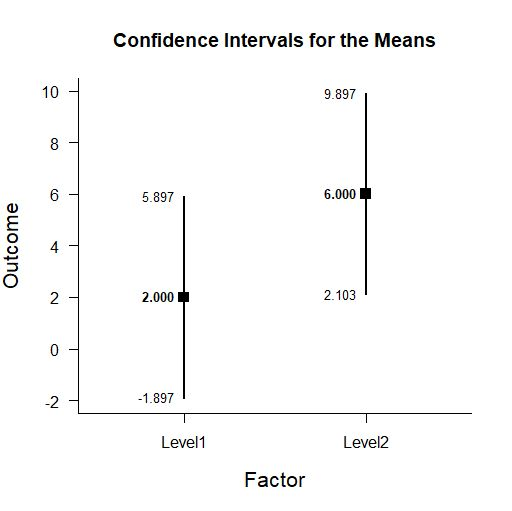
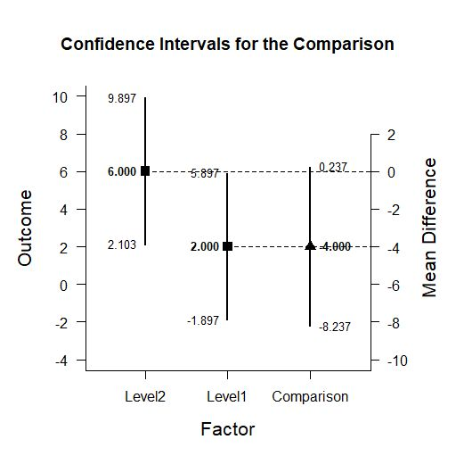

# Estimation Approach to Statistical Inference (EASI)

[**Home**](https://github.com/cwendorf/EASI/) | 
[**Functions**](https://github.com/cwendorf/EASI/tree/master/A-Functions) | 
[**Tutorial Examples**](https://github.com/cwendorf/EASI/tree/master/B-TutorialExamples) | 
[**ITNS Examples**](https://github.com/cwendorf/EASI/tree/master/C-ITNSExamples) | 
[**Other Examples**](https://github.com/cwendorf/EASI/tree/master/D-OtherExamples)

---

## Independent Groups Summary Statistics Example

### Source the EASI Functions

```r
source("http://raw.githubusercontent.com/cwendorf/EASI/master/A-Functions/ALL-EASI-FUNCTIONS.R")
```

### Independent Groups Summary Statistics

This code inputs the variable summaries and creates a single summary table.
```r
Group1 <- c(N=4,M=2.000,SD=2.449)
Group2 <- c(N=4,M=6.000,SD=2.449)
BetweenSummary <- rbind(Group1,Group2)
class(BetweenSummary) <- "bss"
BetweenSummary
```
```
       N M    SD
Group1 4 2 2.449
Group2 4 6 2.449
attr(,"class")
[1] "bss"
```

### Analyses of Multiple Groups

This section produces analyses that are equivalent to one-sample analyses separately for each level of a factor.

#### Confidence Intervals for the Means

This code will provide a table of descriptive statistics and confidence intervals for each level of the factor.
```r
estimateMeans(BetweenSummary)
```
```
CONFIDENCE INTERVALS FOR THE MEANS

           N     M    SD    SE     LL    UL
Group1 4.000 2.000 2.449 1.224 -1.897 5.897
Group2 4.000 6.000 2.449 1.224  2.103 9.897
```

The code defaults to 95% confidence intervals. This can be changed if desired.
```r
estimateMeans(BetweenSummary,conf.level=.99)
```

#### Plots of the Confidence Intervals for the Means

This code will produce a graph of the confidence intervals for each level of the factor.
```r
plotMeans(BetweenSummary)
```
<kbd></kbd>

Of course, it is possible to change from the default confidence level. Additionally, it is possible to add a comparison line to represent a population (or test) value.
```r
plotMeans(BetweenSummary,conf.level=.99,mu=5)
```
<kbd></kbd>


#### Significance Tests for the Means

This code will produce a table of NHST separately for each level of the factor. In this case, all the means are tested against a value of zero.
```r
testMeans(BetweenSummary)
```
```
HYPOTHESIS TESTS FOR THE MEANS

        Diff    SE     t    df     p
Group1 2.000 1.224 1.633 3.000 0.201
Group2 6.000 1.224 4.900 3.000 0.016
```

Often, the default test value of zero is not meaningful or plausible. This too can be altered (often in conjunction with what is presented in the plot).
```r
testMeans(BetweenSummary,mu=5)
```

#### Effect Sizes for the Means

This code will produce a table of standardized mean differences separately for each level of the factor. In this case, the mean is compared to zero to form the effect size.
```r
standardizeMeans(BetweenSummary)
```
```
CONFIDENCE INTERVALS FOR THE STANDARDIZED MEANS

           d d(unb)    SE     LL    UL
Group1 0.817  0.594 0.616 -0.387 1.934
Group2 2.450  1.782 0.955  0.325 4.532
```

Here too it is possible to alter the width of the confidence intervals and to establish a more plausible comparison value for the effect size.
```r
standardizeMeans(BetweenSummary,mu=5,conf.level=.99)
```
 
### Analyses of a Group Comparison

This section produces analyses that examine differences among the two levels of a factor.

#### Confidence Interval for a Mean Difference

This code estimates the confidence interval of the difference.
```r
estimateDifference(BetweenSummary)
```
```
CONFIDENCE INTERVAL FOR THE COMPARISON

             Diff    SE    df     LL    UL
Comparison -4.000 1.732 6.000 -8.237 0.237
```

Of course, you can change the confidence level from the default 95% if desired.
```r
estimateDifference(BetweenSummary,conf.level=.99)
```

#### Plot of the Confidence Interval for a Mean Difference

This code obtains and plots the confidence intervals for the groups and the mean difference .
```r
plotDifference(BetweenSummary)
```
<kbd></kbd>

Once again, the confidence levels can be changed away from the default if desired.
```r
plotDifference(BetweenSummary,conf.level=.99)
```

#### Significance Test for a Mean Difference

This code produces NHST for the mean difference (using a default test value of zero).
```r
testDifference(BetweenSummary)
```
```
HYPOTHESIS TEST FOR THE COMPARISON

             Diff    SE      t    df     p
Comparison -4.000 1.732 -2.310 6.000 0.060
```

If the default value of zero is not plausible, it too can be changed.
```r
testDifference(BetweenSummary,mu=2)
```

#### Effect Size for the Mean Difference

This code calculates a standardized mean difference and its confidence interval.
```r
standardizeDifference(BetweenSummary)
```
```
CONFIDENCE INTERVAL FOR THE STANDARDIZED COMPARISON

              Est    SE     LL    UL
Comparison -1.633 0.943 -3.481 0.215
```

The width of the confidence interval for the effect size can be altered if desired.
```r
standardizeDifference(BetweenSummary,conf.level=.99)
```
