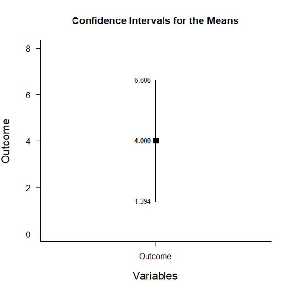
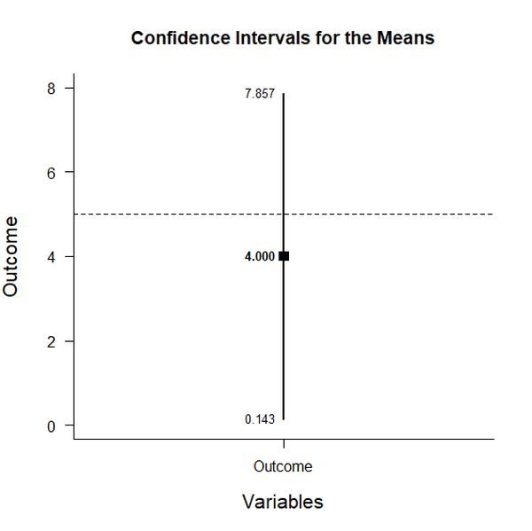

# Estimation Approach to Statistical Inference (EASI)

[**Home**](https://github.com/cwendorf/EASI/) | 
[**Functions**](https://github.com/cwendorf/EASI/tree/master/A-Functions) | 
[**Tutorial Examples**](https://github.com/cwendorf/EASI/tree/master/B-TutorialExamples) | 
[**ITNS Examples**](https://github.com/cwendorf/EASI/tree/master/C-ITNSExamples) | 
[**Other Examples**](https://github.com/cwendorf/EASI/tree/master/D-OtherExamples)

---

## One Sample Example with Tutorial Summary Statistics

### Source the EASI Functions

```r
source("http://raw.githubusercontent.com/cwendorf/EASI/master/A-Functions/ALL-EASI-FUNCTIONS.R")
```

### Enter Summary Statistics

This code inputs the variable and creates a single summary table.
```r
Outcome <- c(N=8,M=4.000,SD=3.117)
WithinSummary <- rbind(Outcome)
class(WithinSummary) <- "wss"
WithinSummary
```
```
        N M    SD
Outcome 8 4 3.117
attr(,"class")
[1] "wss"
```

### Analyses of the Group

This section produces analyses that are equivalent to one-sample analyses for the variable.

#### Confidence Interval for the Mean

This code will provide a table of descriptive statistics and confidence intervals for the variable.
```r
estimateMeans(WithinSummary)
```
```
CONFIDENCE INTERVALS FOR THE MEANS

            N     M    SD    SE    LL    UL
Outcome 8.000 4.000 3.117 1.102 1.394 6.606
```

The code defaults to 95% confidence intervals. This can be changed if desired.
```r
estimateMeans(WithinSummary,conf.level=.99)
```

#### Plots of the Confidence Intervals for the Mean

This code will produce a graph of the confidence interval for the variable.
```r
plotMeans(WithinSummary)
```
<kbd></kbd>

Of course, it is possible to change from the default confidence level. Additionally, it is possible to add a comparison line to represent a population (or test) value.
```r
plotMeans(WithinSummary,conf.level=.99,mu=5)
```
<kbd></kbd>


#### Significance Tests for the Mean

This code will produce a table of NHST sfor the variable. In this case, the mean is tested against a value of zero.
```r
testMeans(WithinSummary)
```
```
HYPOTHESIS TESTS FOR THE MEANS

         Diff    SE     t    df     p
Outcome 4.000 1.102 3.630 7.000 0.008
```

Often, the default test value of zero is not meaningful or plausible. This too can be altered (often in conjunction with what is presented in the plot).
```r
testMeans(WithinSummary,mu=5)
```

#### Effect Sizes for the Mean

This code will produce a table of standardized mean difference for the variable. In this case, the mean is compared to zero to form the effect size.
```r
standardizeMeans(WithinSummary)
```
```
CONFIDENCE INTERVALS FOR THE STANDARDIZED MEANS

            d d(unb)    SE    LL    UL
Outcome 1.283  1.141 0.482 0.304 2.217
```

Here too it is possible to alter the width of the confidence intervals and to establish a more plausible comparison value for the effect size.
```r
standardizeMeans(WithinSummary,mu=5,conf.level=.99)
```
