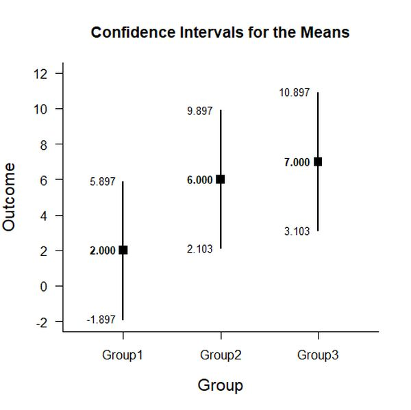
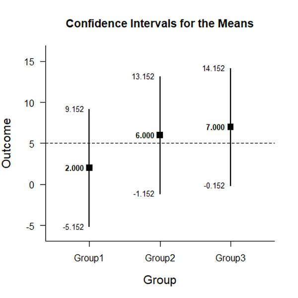
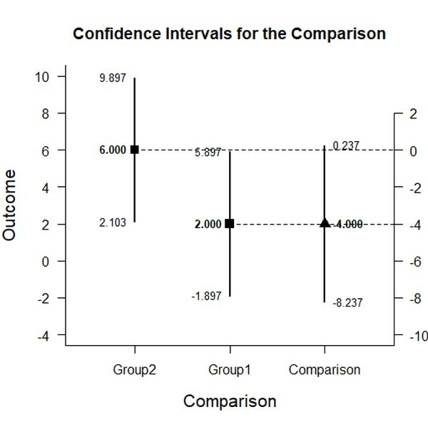
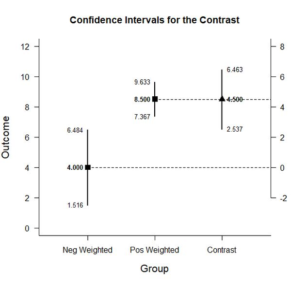

# Estimation Approach to Statistical Inference (EASI)

[**Home**](https://github.com/cwendorf/EASI/) | 
[**Functions**](https://github.com/cwendorf/EASI/tree/master/A-Functions) | 
[**Tutorial Examples**](https://github.com/cwendorf/EASI/tree/master/B-TutorialExamples) | 
[**ITNS Examples**](https://github.com/cwendorf/EASI/tree/master/C-ITNSExamples) | 
[**Other Examples**](https://github.com/cwendorf/EASI/tree/master/D-OtherExamples)

---

## OneWay (Single-Factor Between-Subjects) Data Example

### Source the EASI Functions

```r
source("http://raw.githubusercontent.com/cwendorf/EASI/master/A-Functions/ALL-EASI-FUNCTIONS.R")
```

### Three Group Example Data

This code inputs the variable names and creates a viewable data frame.
```r
Group <- c(rep(1,4),rep(2,4),rep(3,4))
Outcome <- c(0,0,3,5,4,7,4,9,9,6,4,9)
Group <- factor(Group,levels=c(1,2,3),labels=c("Group1","Group2","Group3"))
BetweenData <- data.frame(Group,Outcome)
BetweenData
```
```
    Group Outcome
1  Group1       0
2  Group1       0
3  Group1       3
4  Group1       5
5  Group2       4
6  Group2       7
7  Group2       4
8  Group2       9
9  Group3       9
10 Group3       6
11 Group3       4
12 Group3       9
```

### Analyses of Multiple Groups

This section produces analyses that are equivalent to one-sample analyses separately for each level of a factor.

#### Confidence Intervals for the Means

This code will provide a table of descriptive statistics and confidence intervals for each level of the factor.
```r
estimateMeans(Outcome~Group)
```
```
CONFIDENCE INTERVALS FOR THE MEANS

           N     M    SD    SE     LL     UL
Group1 4.000 2.000 2.449 1.224 -1.897  5.897
Group2 4.000 6.000 2.449 1.224  2.103  9.897
Group3 4.000 7.000 2.449 1.224  3.103 10.897
```

The code defaults to 95% confidence intervals. This can be changed if desired.
```r
estimateMeans(Outcome~Group,conf.level=.99)
```

#### Plots of the Confidence Intervals for the Means

This code will produce a graph of the confidence intervals for each level of the factor.
```r
plotMeans(Outcome~Group)
```
<kbd></kbd>

Of course, it is possible to change from the default confidence level. Additionally, it is possible to add a comparison line to represent a population (or test) value.
```r
plotMeans(Outcome~Group,conf.level=.99,mu=5)
```
<kbd></kbd>


#### Significance Tests for the Means

This code will produce a table of NHST separately for each level of the factor. In this case, all the means are tested against a value of zero.
```r
testMeans(Outcome~Group)
```
```
HYPOTHESIS TESTS FOR THE MEANS

        Diff    SE     t    df     p
Group1 2.000 1.224 1.633 3.000 0.201
Group2 6.000 1.224 4.900 3.000 0.016
Group3 7.000 1.224 5.717 3.000 0.011
```

Often, the default test value of zero is not meaningful or plausible. This too can be altered (often in conjunction with what is presented in the plot).
```r
testMeans(Outcome~Group,mu=5)
```

#### Effect Sizes for the Means

This code will produce a table of standardized mean differences separately for each level of the factor. In this case, the mean is compared to zero to form the effect size.
```r
standardizeMeans(Outcome~Group)
```
```
CONFIDENCE INTERVALS FOR THE STANDARDIZED MEANS

           d d(unb)    SE     LL    UL
Group1 0.817  0.594 0.616 -0.387 1.934
Group2 2.450  1.782 0.955  0.325 4.532
Group3 2.858  2.079 1.063  0.464 5.227
```

Here too it is possible to alter the width of the confidence intervals and to establish a more plausible comparison value for the effect size.
```r
standardizeMeans(Outcome~Group,mu=5,conf.level=.99)
```

### Analyses of a Group Comparison

This section produces analyses that are equivalent to analyses for two levels of a factor.

#### Confidence Interval for a Mean Difference

This code creates a new factor that identifies the two levels for comparison and estimates the confidence interval of the difference.
```r
Comparison=factor(Group,c("Group1","Group2"))
estimateDifference(Outcome~Comparison)
```
```
CONFIDENCE INTERVAL FOR THE COMPARISON

             Diff    SE    df     LL    UL
Comparison -4.000 1.732 6.000 -8.237 0.237
```

Of course, you can change the confidence level from the default 95% if desired.
```r
estimateDifference(Outcome~Comparison,conf.level=.99)
```

It is also possible to alter the comparison by changing (or even reversing the order) of the groups.
```r
Comparison=factor(Group,c("Group3","Group1"))
estimateDifference(Outcome~Comparison)
```

#### Plot of the Confidence Interval for a Mean Difference

This code obtains and plots the confidence intervals for the groups and the mean difference in the identified comparison.
```r
plotDifference(Outcome~Comparison)
```
<kbd></kbd>

Once again, the confidence levels can be changed away from the default if desired.
```r
plotDifference(Outcome~Comparison,conf.level=.99)
```

#### Significance Test for a Mean Difference

This code produces NHST for the identified comparison (using a default test value of zero).
```r
testDifference(Outcome~Comparison)
```
```
HYPOTHESIS TEST FOR THE COMPARISON

             Diff    SE      t    df     p
Comparison -4.000 1.732 -2.310 6.000 0.060
```

If the default value of zero is not plausible, it too can be changed.
```r
testDifference(Outcome~Comparison,mu=2)
```

#### Effect Size for the Mean Difference

This code calculates a standardized mean difference for the comparison and its confidence interval.
```r
standardizeDifference(Outcome~Comparison)
```
```
CONFIDENCE INTERVAL FOR THE STANDARDIZED COMPARISON

              Est    SE     LL    UL
Comparison -1.633 0.943 -3.481 0.215
```

The width of the confidence interval for the effect size can be altered if desired.
```r
standardizeDifference(Outcome~Comparison,conf.level=.99)
```

### Analyses of a Group Contrast

This section produces analyses that are equivalent to analyses involving multiple levels of a factor.

#### Confidence Interval for Combined Levels

This code creates combinations of groups and produces a confidence interval for those pooled groups.
```r
G1 <- c(1,0,0)
estimateContrast(Outcome~Group,contrast=G1)
```
```
CONFIDENCE INTERVAL FOR THE CONTRAST

           Est    SE    df     LL    UL
Contrast 2.000 1.224 3.000 -1.897 5.897
```
```r
G2nG3 <- c(0,.5,.5)
estimateContrast(Outcome~Group,contrast=G2nG3)
```
```
CONFIDENCE INTERVAL FOR THE CONTRAST

           Est    SE    df    LL    UL
Contrast 6.500 0.866 6.000 4.381 8.619
```

#### Confidence Interval for a Contrast

This code identifies a contrast among the groups and produces a confidence interval for that contrast.
```r
G1vsOthers <- c(-1,.5,.5)
estimateContrast(Outcome~Group,contrast=G1vsOthers)
```
```
CONFIDENCE INTERVAL FOR THE CONTRAST

           Est    SE    df    LL    UL
Contrast 4.500 1.500 6.000 0.830 8.170
```

As in all other cases, the default value of the confidence interval can be changed.
```r
estimateContrast(Outcome~Group,contrast=G1vsOthers,conf.level=.99)
```

#### Plots of Confidence Intervals for a Contrast

This code obtains and plots the confidence intervals for the groups and the mean difference in the identified contrast.
```r
G1vsOthers <- c(-1,.5,.5)
plotContrast(Outcome~Group,contrast=G1vsOthers)
````
<kbd></kbd>

The width of the confidence interval for the contrast can be altered if desired.
```r
plotContrast(Outcome~Group,contrast=G1vsOthers,conf.level=.99)
```

#### Significance Test for a Contrast

This code produces a NHST for the identified contrast. It tests the contrast against a value of zero by default.
```r
testContrast(Outcome~Group,contrast=G1vsOthers)
```
```
HYPOTHESIS TEST FOR THE CONTRAST

           Est    SE     t    df     p
Contrast 4.500 1.500 3.001 6.000 0.024
```

If desired, the contrast can be tested against other values if needed.
```r
testContrast(Outcome~Group,contrast=G1vsOthers,mu=4)
```

#### Effect Size for a Contrast

This code calculates a standardized contrast and its confidence interval.
```r
standardizeContrast(Outcome~Group,contrast=G1vsOthers)
```
```
CONFIDENCE INTERVAL FOR THE STANDARDIZED CONTRAST

           Est    SE    LL    UL
Contrast 1.837 0.829 0.212 3.463
```

The width of the confidence interval for the effect size can be altered if desired.
```r
standardizeContrast(Outcome~Group,contrast=G1vsOthers,conf.level=.99)
```
