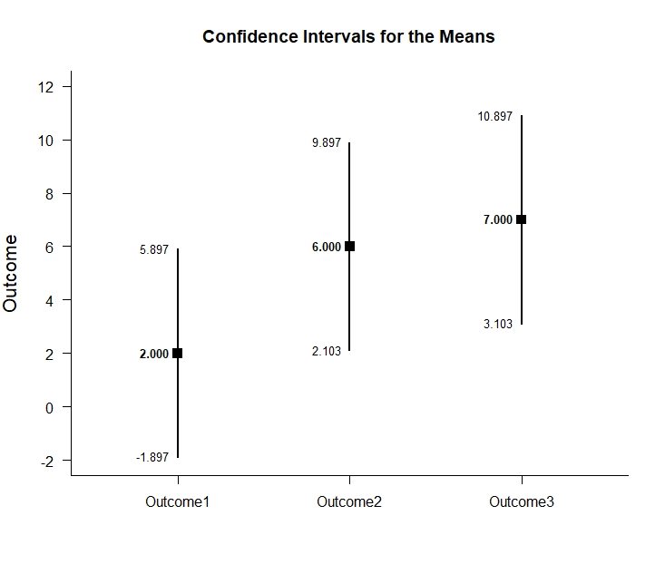
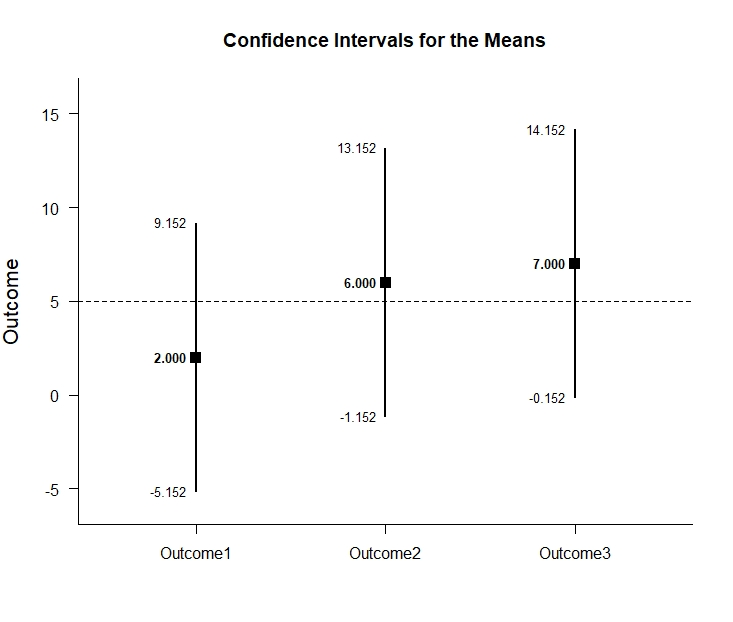
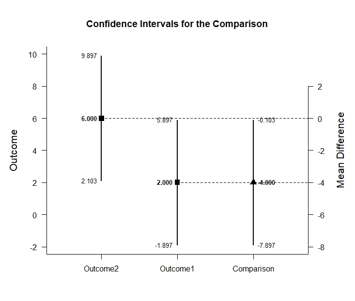
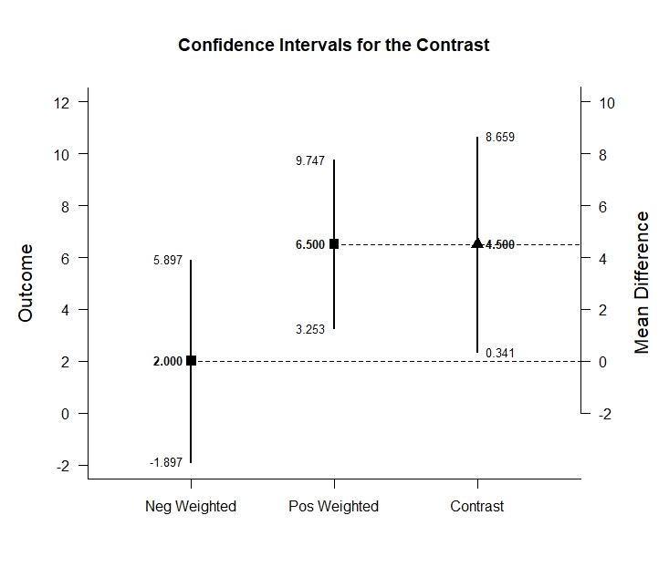
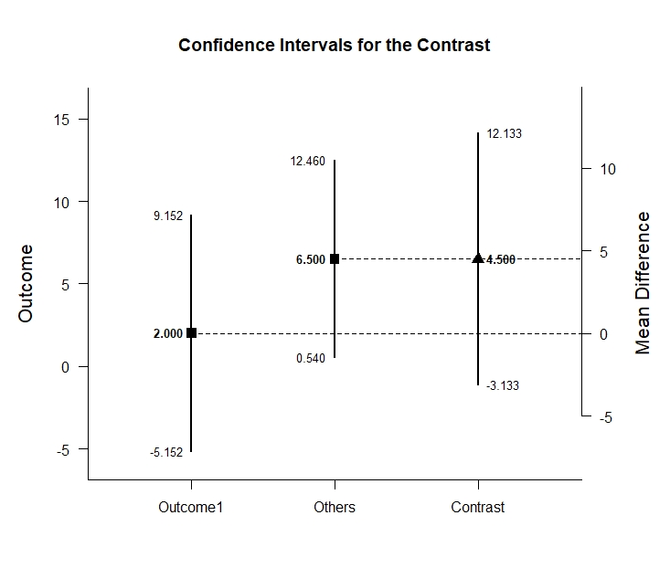

# Estimation Approach to Statistical Inference (EASI)

[**Home**](https://github.com/cwendorf/EASI/) | 
[**Functions**](https://github.com/cwendorf/EASI/tree/master/A-Functions) | 
[**Tutorial Examples**](https://github.com/cwendorf/EASI/tree/master/B-TutorialExamples) | 
[**ITNS Examples**](https://github.com/cwendorf/EASI/tree/master/C-ITNSExamples) | 
[**Extension Examples**](https://github.com/cwendorf/EASI/tree/master/D-ExtensionExamples)

---

## Repeated (Within-Subjects) Tutorial with Summary Statistics

### Source the EASI Functions

```r
source("http://raw.githubusercontent.com/cwendorf/EASI/master/A-Functions/ALL-EASI-FUNCTIONS.R")
```

### Enter Summary Statistics

This code inputs the variable summaries and creates a summary table.
```r
Outcome1 <- c(N=4,M=2.000,SD=2.449)
Outcome2 <- c(N=4,M=6.000,SD=2.449)
Outcome3 <- c(N=4,M=7.000,SD=2.449)
WithinSummary <- rbind(Outcome1,Outcome2,Outcome3)
class(WithinSummary) <- "wss"
WithinSummary
```
```
         N M    SD
Outcome1 4 2 2.449
Outcome2 4 6 2.449
Outcome3 4 7 2.449
attr(,"class")
[1] "wss"
```
This code creates a correlation matrix, enters just the top triangle, and then uses a function to fill in the whole matrix.
```r
WithinCorr <- declareCorrMatrix("Outcome1","Outcome2","Outcome3")
WithinCorr["Outcome1","Outcome2"] <- .500
WithinCorr["Outcome1","Outcome3"] <- .056
WithinCorr["Outcome2","Outcome3"] <- .389
WithinCorr <- fillCorrMatrix(WithinCorr)
WithinCorr
```
```
         Outcome1 Outcome2 Outcome3
Outcome1    1.000    0.500    0.056
Outcome2    0.500    1.000    0.389
Outcome3    0.056    0.389    1.000
```
 
### Analyses of Multiple Variables

This section produces analyses that are equivalent to one-sample analyses separately for each level of a factor.

#### Confidence Intervals for the Means

This code will provide a table of descriptive statistics and confidence intervals for each level of the factor.
```r
estimateMeans(WithinSummary)
```
```
CONFIDENCE INTERVALS FOR THE MEANS

             N     M    SD    SE     LL     UL
Outcome1 4.000 2.000 2.449 1.224 -1.897  5.897
Outcome2 4.000 6.000 2.449 1.224  2.103  9.897
Outcome3 4.000 7.000 2.449 1.224  3.103 10.897
```

The code defaults to 95% confidence intervals. This can be changed if desired.
```r
estimateMeans(WithinSummary,conf.level=.99)
```
```
CONFIDENCE INTERVALS FOR THE MEANS

             N     M    SD    SE     LL     UL
Outcome1 4.000 2.000 2.449 1.224 -5.152  9.152
Outcome2 4.000 6.000 2.449 1.224 -1.152 13.152
Outcome3 4.000 7.000 2.449 1.224 -0.152 14.152
```

#### Plots of Confidence Intervals for the Means

This code will produce a graph of the confidence intervals for each level of the factor.
```r
plotMeans(WithinSummary)
```
<kbd></kbd>

Of course, it is possible to change from the default confidence level. Additionally, it is possible to add a comparison line to represent a population (or test) value.
```r
plotMeans(WithinSummary,conf.level=.99,mu=5)
```
<kbd></kbd>

#### Significance Tests for the Means

This code will produce a table of NHST separately for each level of the factor. In this case, all the means are tested against a value of zero.
```r
testMeans(WithinSummary)
```
```
HYPOTHESIS TESTS FOR THE MEANS

          Diff    SE     t    df     p
Outcome1 2.000 1.224 1.633 3.000 0.201
Outcome2 6.000 1.224 4.900 3.000 0.016
Outcome3 7.000 1.224 5.717 3.000 0.011
```

Often, the default test value of zero is not meaningful or plausible. This too can be altered (often in conjunction with what is presented in the plot).
```r
testMeans(WithinSummary,mu=5)
```
```
HYPOTHESIS TESTS FOR THE MEANS

           Diff    SE      t    df     p
Outcome1 -3.000 1.224 -2.450 3.000 0.092
Outcome2  1.000 1.224  0.817 3.000 0.474
Outcome3  2.000 1.224  1.633 3.000 0.201
```

#### Effect Sizes for the Means

This code will produce a table of standardized mean differences separately for each level of the factor. In this case, the mean is compared to zero to form the effect size.
```r
standardizeMeans(WithinSummary)
```
```
CONFIDENCE INTERVALS FOR THE STANDARDIZED MEANS

             d d(unb)    SE     LL    UL
Outcome1 0.817  0.594 0.616 -0.387 1.934
Outcome2 2.450  1.782 0.955  0.325 4.532
Outcome3 2.858  2.079 1.063  0.464 5.227
```

Here too it is possible to alter the width of the confidence intervals and to establish a more plausible comparison value for the effect size.
```r
standardizeMeans(WithinSummary,mu=5,conf.level=.99)
```
```
CONFIDENCE INTERVALS FOR THE STANDARDIZED MEANS

              d d(unb)    SE     LL    UL
Outcome1 -1.225 -0.891 0.680 -3.011 0.547
Outcome2  0.408  0.297 0.574 -0.968 1.734
Outcome3  0.817  0.594 0.616 -0.732 2.320
```

### Analyses of a Variable Comparison

This section produces analyses that are equivalent to comparisons of two levels of a factor.

This code creates a new table that identifies the two levels for comparison.
```r
CompSummary <- WithinSummary[c("Outcome1","Outcome2"),]
class(CompSummary) <- "wss"
```

#### Confidence Interval for the Mean Difference

This code estimates the confidence interval of the difference.
```r
estimateDifference(CompSummary,WithinCorr)
```
```
CONFIDENCE INTERVAL FOR THE COMPARISON

             Diff    SE    df     LL     UL
Comparison -4.000 1.224 3.000 -7.897 -0.103
```

Of course, you can change the confidence level from the default 95% if desired.
```r
estimateDifference(CompSummary,WithinCorr,conf.level=.99)
```
```
CONFIDENCE INTERVAL FOR THE COMPARISON

             Diff    SE    df      LL    UL
Comparison -4.000 1.224 3.000 -11.152 3.152
```

#### Plots of Confidence Intervals for the Mean Difference

This code obtains and plots the confidence intervals for the levels and the mean difference in the identified comparison.
```r
plotDifference(CompSummary,WithinCorr)
```
<kbd></kbd>

Once again, the confidence levels can be changed away from the default if desired.
```r
plotDifference(CompSummary,WithinCorr,conf.level=.99)
```
<kbd></kbd>

#### Significance Test for the Mean Difference

This code produces NHST for the identified comparison (using a default test value of zero).
```r
testDifference(CompSummary,WithinCorr)
```
```
HYPOTHESIS TEST FOR THE COMPARISON

             Diff    SE      t    df     p
Comparison -4.000 1.224 -3.267 3.000 0.047
```

If the default value of zero is not plausible, it too can be changed.
```r
testDifference(CompSummary,WithinCorr,mu=2)
```
HYPOTHESIS TEST FOR THE COMPARISON

             Diff    SE      t    df     p
Comparison -6.000 1.224 -4.900 3.000 0.016
```

#### Effect Size for the Mean Difference

This code calculates a standardized mean difference for the comparison and its confidence interval.
```r
standardizeDifference(CompSummary,WithinCorr)
```
```
CONFIDENCE INTERVAL FOR THE STANDARDIZED COMPARISON

              Est    SE     LL     UL
Comparison -1.633 0.782 -3.166 -0.101
```

The width of the confidence interval for the effect size can be altered if desired.
```r
standardizeDifference(CompSummary,WithinCorr,conf.level=.99)
```
```
CONFIDENCE INTERVAL FOR THE STANDARDIZED COMPARISON

              Est    SE     LL    UL
Comparison -1.633 0.782 -3.647 0.380
```

### Analyses of a Variable Contrast

This section produces analyses that are equivalent to analyses involving multiple levels of a factor.

This code identifies a contrast among the levels.
```r
O1vsOthers <- c(-1,.5,.5)
```

#### Confidence Interval for the Contrast

This code produces a confidence interval for that contrast.
```r
estimateContrast(WithinSummary,WithinCorr,contrast=O1vsOthers)
```
```
CONFIDENCE INTERVAL FOR THE CONTRAST

           Est    SE    df    LL    UL
Contrast 4.500 1.307 3.000 0.342 8.658
```

As in all other cases, the default value of the confidence interval can be changed.
```r
estimateContrast(WithinSummary,WithinCorr,contrast=O1vsOthers,conf.level=.99)
```
```
CONFIDENCE INTERVAL FOR THE CONTRAST

           Est    SE    df     LL     UL
Contrast 4.500 1.307 3.000 -3.131 12.131
```

#### Plots of Confidence Intervals for a Contrast

This code obtains and plots the confidence intervals for the groups and the mean difference in the identified contrast.
```r
plotContrast(WithinSummary,WithinCorr,contrast=O1vsOthers)
> 
````
<kbd></kbd>

The width of the confidence interval for the contrast can be altered if desired.
```r
plotContrast(WithinSummary,WithinCorr,contrast=O1vsOthers,labels=c("Outcome1","Others"),conf.level=.99)
```
<kbd></kbd>

#### Significance Test for the Contrast

This code produces a NHST for the identified contrast. It tests the contrast against a value of zero by default.
```r
testContrast(WithinSummary,WithinCorr,contrast=O1vsOthers)
```
```
HYPOTHESIS TEST FOR THE CONTRAST

           Est    SE     t    df     p
Contrast 4.500 1.307 3.444 3.000 0.041
```

If desired, the contrast can be tested against other values if needed.
```r
testContrast(WithinSummary,WithinCorr,contrast=O1vsOthers,mu=4)
```
```
HYPOTHESIS TEST FOR THE CONTRAST

           Est    SE     t    df     p
Contrast 0.500 1.307 0.383 3.000 0.727
```

#### Effect Size for a Contrast

This code calculates a standardized contrast and its confidence interval.
```r
standardizeContrast(WithinSummary,WithinCorr,contrast=O1vsOthers)
```
```
CONFIDENCE INTERVAL FOR THE STANDARDIZED CONTRAST

           Est    SE    LL    UL
Contrast 1.837 0.741 0.386 3.289
```

The width of the confidence interval for the effect size can be altered if desired.
```r
standardizeContrast(WithinSummary,WithinCorr,contrast=O1vsOthers,conf.level=.99)
```
```
CONFIDENCE INTERVAL FOR THE STANDARDIZED CONTRAST

           Est    SE     LL    UL
Contrast 1.837 0.741 -0.071 3.745
```
