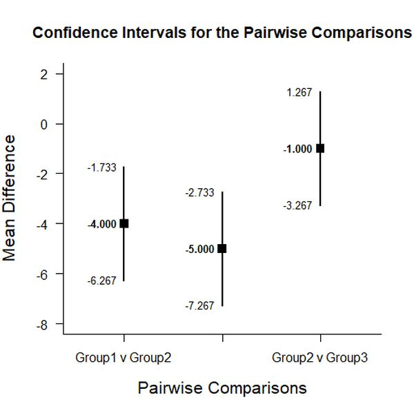
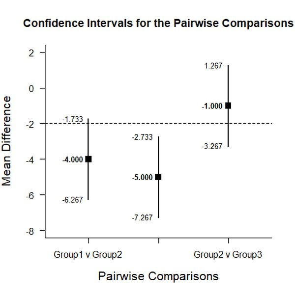

# Estimation Approach to Statistical Inference (EASI)

[**Home**](https://github.com/cwendorf/EASI/) | 
[**Functions**](https://github.com/cwendorf/EASI/tree/master/A-Functions) | 
[**Tutorial Examples**](https://github.com/cwendorf/EASI/tree/master/B-TutorialExamples) | 
[**ITNS Examples**](https://github.com/cwendorf/EASI/tree/master/C-ITNSExamples) | 
[**Other Examples**](https://github.com/cwendorf/EASI/tree/master/D-OtherExamples)

---

## Extended Between-Subjects Example

### Source the EASI Functions and Extensions

```r
source("http://raw.githubusercontent.com/cwendorf/EASI/master/A-Functions/ALL-EASI-FUNCTIONS.R")
source("http://raw.githubusercontent.com/cwendorf/EASI/master/A-Functions/ALL-EASI-EXTENSIONS.R")
```

### Three Group Example Data

```r
Group <- c(rep("Group1",3),rep("Group2",3),rep("Group3",3))
Outcome <- c(3,4,5,7,8,9,8,9,10)
Group <- factor(Group)

mydata <- data.frame(Group,Outcome)
mydata
```
```
   Group Outcome
1 Group1       3
2 Group1       4
3 Group1       5
4 Group2       7
5 Group2       8
6 Group2       9
7 Group3       8
8 Group3       9
9 Group3      10
```

### Analyses of Pairwise Group Comparisons

This section produces analyses that are equivalent to unadjusted t tests.

#### Confidence Intervals for the Pairwise Comparisons

```r
estimatePairwise(Outcome~Group)
```
```
CONFIDENCE INTERVALS FOR THE PAIRWISE COMPARISONS

                  Diff    SE    df     LL     UL
Group1 v Group2 -4.000 0.816 4.000 -6.267 -1.733
Group1 v Group3 -5.000 0.816 4.000 -7.267 -2.733
Group2 v Group3 -1.000 0.816 4.000 -3.267  1.267
```
```r
estimatePairwise(Outcome~Group,conf.level=.99)
```

#### Plots of the Confidence Intervals for the Pairwise Comparisons

```r
plotPairwise(Outcome~Group)
```
<kbd></kbd>
```r
plotPairwise(Outcome~Group,mu=-2,conf.level=.99)
```
<kbd></kbd>

#### Significance Tests of the Pairwise Comparisons

```r
testPairwise(Outcome~Group)
```
```
HYPOTHESIS TESTS FOR THE PAIRWISE COMPARISONS

                  Diff    SE      t    df     p
Group1 v Group2 -4.000 0.816 -4.899 4.000 0.008
Group1 v Group3 -5.000 0.816 -6.124 4.000 0.004
Group2 v Group3 -1.000 0.816 -1.225 4.000 0.288
```
```r
testPairwise(Outcome~Group,mu=-2)
```

#### Effect Sizes for the Pairwise Comparisons

```r
standardizePairwise(Outcome~Group)
```
```
CONFIDENCE INTERVALS FOR THE STANDARDIZED PAIRWISE COMPARISONS

                   Est    SE     LL     UL
Group1 v Group2 -4.000 1.732 -7.395 -0.605
Group1 v Group3 -5.000 2.031 -8.981 -1.019
Group2 v Group3 -1.000 1.061 -3.079  1.079
```
```r
standardizePairwise(Outcome~Group,conf.level=.99)
```
