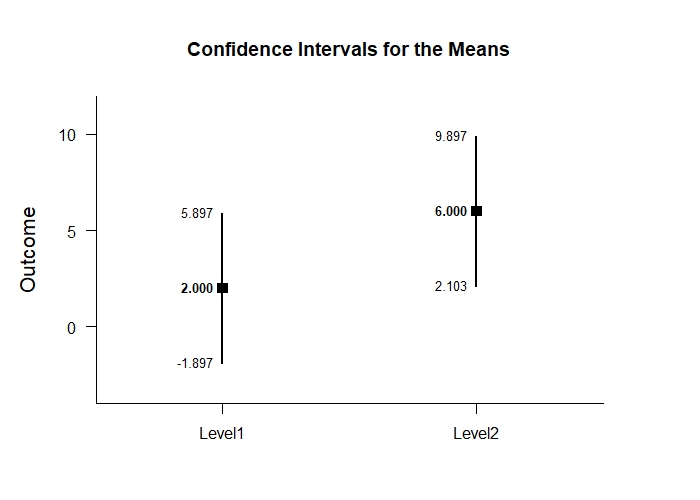
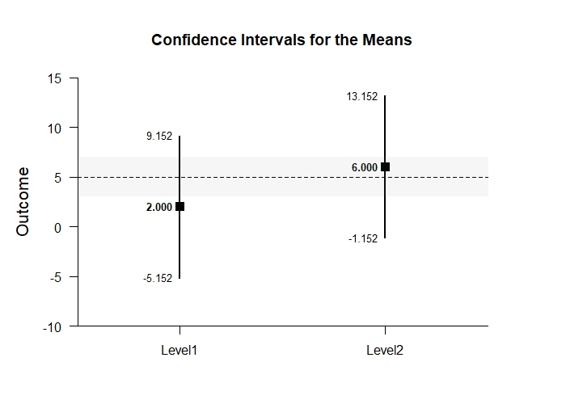
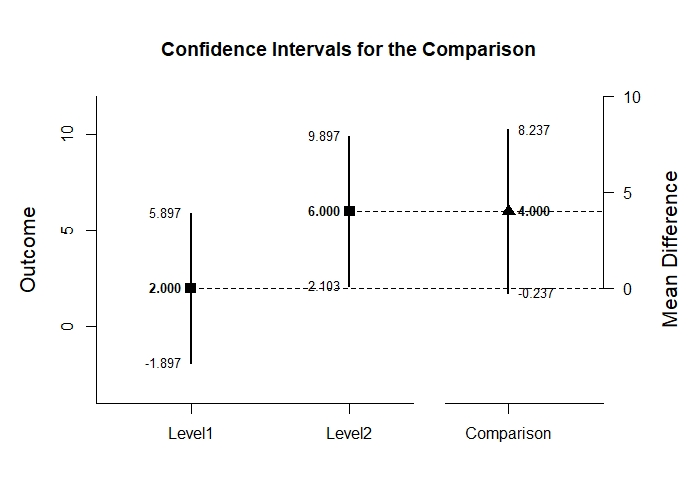
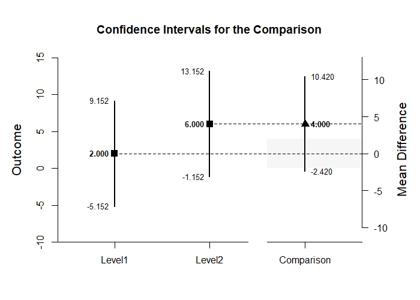

# EASI: Estimation Approach to Statistical Inference

[**Home**](https://github.com/cwendorf/EASI/) | 
[**Functions**](https://github.com/cwendorf/EASI/tree/master/A-Functions) | 
[**Tutorial Examples**](https://github.com/cwendorf/EASI/tree/master/B-TutorialExamples) | 
[**ITNS Examples**](https://github.com/cwendorf/EASI/tree/master/C-ITNSExamples) | 
[**Extension Examples**](https://github.com/cwendorf/EASI/tree/master/D-ExtensionExamples)

---

## Independent Groups Tutorial with Data

### Source the EASI Functions

```r
source("http://raw.githubusercontent.com/cwendorf/EASI/master/A-Functions/ALL-EASI-FUNCTIONS.R")
```

### Enter Data

This code inputs the variable names and creates a viewable data frame.
```r
Factor <- c(rep(1,4),rep(2,4))
Outcome <- c(0,0,3,5,4,7,4,9)
Factor <- factor(Factor,levels=c(1,2),labels=c("Level1","Level2"))
BetweenData <- data.frame(Factor,Outcome)
BetweenData
```
```
  Factor Outcome
1 Level1       0
2 Level1       0
3 Level1       3
4 Level1       5
5 Level2       4
6 Level2       7
7 Level2       4
8 Level2       9
```

### Analyses of Multiple Groups

This section produces analyses that are equivalent to one-sample analyses separately for each level of a factor.

#### Confidence Intervals for the Means

This code will provide a table of descriptive statistics and confidence intervals for each level of the factor.
```r
estimateMeans(Outcome~Factor)
```
```
CONFIDENCE INTERVALS FOR THE MEANS

           N     M    SD    SE     LL    UL
Level1 4.000 2.000 2.449 1.224 -1.897 5.897
Level2 4.000 6.000 2.449 1.224  2.103 9.897
```

The code defaults to 95% confidence intervals. This can be changed if desired.
```r
estimateMeans(Outcome~Factor,conf.level=.99)
```
```
CONFIDENCE INTERVALS FOR THE MEANS

           N     M    SD    SE     LL     UL
Level1 4.000 2.000 2.449 1.224 -5.152  9.152
Level2 4.000 6.000 2.449 1.224 -1.152 13.152
```

#### Plots of the Confidence Intervals for the Means

This code will produce a graph of the confidence intervals for each level of the factor.
```r
plotMeans(Outcome~Factor) # Independent-Figure1.jpeg
```
<kbd></kbd>

Of course, it is possible to change from the default confidence level. Additionally, it is possible to add a comparison line to represent a population (or test) value.
```r
plotMeans(Outcome~Factor,conf.level=.99,mu=5) # Independent-Figure2.jpeg
```
<kbd></kbd>


#### Significance Tests for the Means

This code will produce a table of NHST separately for each level of the factor. In this case, all the means are tested against a value of zero.
```r
testMeans(Outcome~Factor)
```
```
HYPOTHESIS TESTS FOR THE MEANS

        Diff    SE     t    df     p
Level1 2.000 1.224 1.633 3.000 0.201
Level2 6.000 1.224 4.900 3.000 0.016
```

Often, the default test value of zero is not meaningful or plausible. This too can be altered (often in conjunction with what is presented in the plot).
```r
testMeans(Outcome~Factor,mu=5)
```
```
HYPOTHESIS TESTS FOR THE MEANS

         Diff    SE      t    df     p
Level1 -3.000 1.224 -2.450 3.000 0.092
Level2  1.000 1.224  0.817 3.000 0.474
```

#### Effect Sizes for the Means

This code will produce a table of standardized mean differences separately for each level of the factor. In this case, the mean is compared to zero to form the effect size.
```r
standardizeMeans(Outcome~Factor)
```
```
CONFIDENCE INTERVALS FOR THE STANDARDIZED MEANS

           d d(unb)    SE     LL    UL
Level1 0.817  0.594 0.616 -0.387 1.934
Level2 2.450  1.782 0.955  0.325 4.532
```

Here too it is possible to alter the width of the confidence intervals and to establish a more plausible comparison value for the effect size.
```r
standardizeMeans(Outcome~Factor,mu=5,conf.level=.99)
```
```
CONFIDENCE INTERVALS FOR THE STANDARDIZED MEANS

            d d(unb)    SE     LL    UL
Level1 -1.225 -0.891 0.680 -3.011 0.547
Level2  0.408  0.297 0.574 -0.968 1.734
```

### Analyses of a Group Comparison

This section produces analyses that examine differences among the two levels of a factor.

#### Confidence Interval for a Mean Difference

This code estimates the confidence interval of the difference.
```r
estimateDifference(Outcome~Factor)
```
```
CONFIDENCE INTERVAL FOR THE COMPARISON

             Diff    SE    df     LL    UL
Comparison -4.000 1.732 6.000 -8.237 0.237
```

Of course, you can change the confidence level from the default 95% if desired.
```r
estimateDifference(Outcome~Factor,conf.level=.99)
```
```
CONFIDENCE INTERVAL FOR THE COMPARISON

             Diff    SE    df      LL    UL
Comparison -4.000 1.732 6.000 -10.420 2.420
```

#### Plot of the Confidence Interval for a Mean Difference

This code obtains and plots the confidence intervals for the groups and the mean difference.
```r
plotDifference(Outcome~Factor) # Independent-Figure3.jpeg
```
<kbd></kbd>

Once again, the confidence levels can be changed away from the default if desired.
```r
plotDifference(Outcome~Factor,conf.level=.99) # Independent-Figure4.jpeg
```
<kbd></kbd>

#### Significance Test for a Mean Difference

This code produces NHST for the mean difference (using a default test value of zero).
```r
testDifference(Outcome~Factor)
```
```
HYPOTHESIS TEST FOR THE COMPARISON

             Diff    SE      t    df     p
Comparison -4.000 1.732 -2.310 6.000 0.060
```

If the default value of zero is not plausible, it too can be changed.
```r
testDifference(Outcome~Factor,mu=2)
```
```
HYPOTHESIS TEST FOR THE COMPARISON

             Diff    SE      t    df     p
Comparison -6.000 1.732 -3.465 6.000 0.013
```

#### Effect Size for the Mean Difference

This code calculates a standardized mean difference and its confidence interval.
```r
standardizeDifference(Outcome~Factor)
```
```
CONFIDENCE INTERVAL FOR THE STANDARDIZED COMPARISON

              Est    SE     LL    UL
Comparison -1.633 0.943 -3.481 0.215
```

The width of the confidence interval for the effect size can be altered if desired.
```r
standardizeDifference(Outcome~Factor,conf.level=.99)
```
```
CONFIDENCE INTERVAL FOR THE STANDARDIZED COMPARISON

              Est    SE     LL    UL
Comparison -1.633 0.943 -4.062 0.795
```
