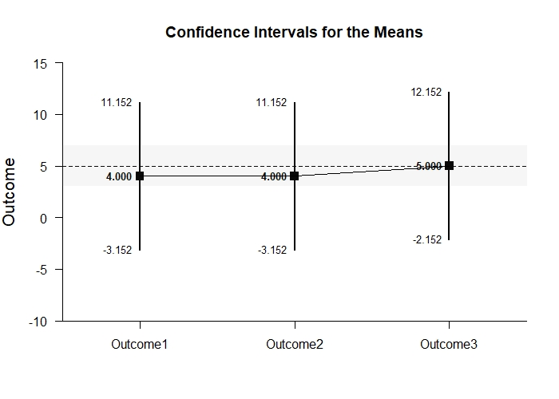
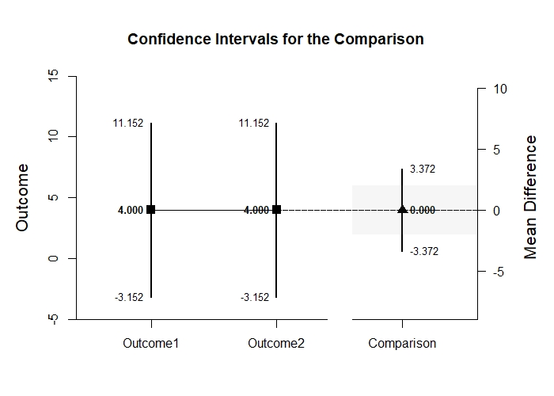
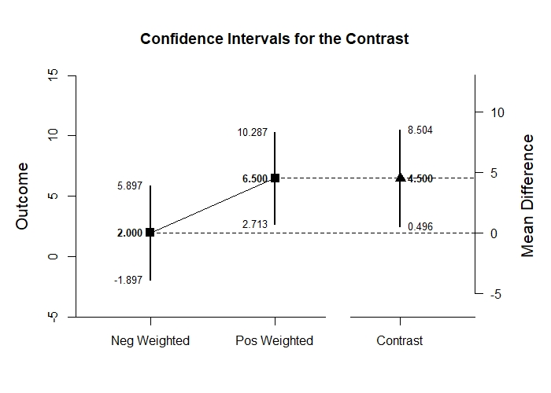
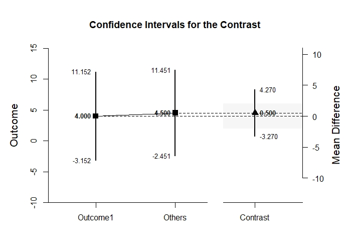

# Estimation Approach to Statistical Inference

[**Functions**](../../A-Functions) | 
[**Tutorials**](../../B-Tutorials) | 
[**Examples**](../../C-Examples) | 
[**Advanced**](../../D-Advanced)

---

## Mixed Design Tutorial with Data

### Source the EASI Functions

This code imports all of the EASI functions, making them available for analyses.
```r
source("http://raw.githubusercontent.com/cwendorf/EASI/master/A-Functions/EASI-Functions.R")
```

### Enter Data

This code inputs the variable names and creates a viewable data frame.
```
Factor <- c(1,1,1,1,2,2,2,2)
Outcome1 <- c(0,0,3,5,3,1,6,6)
Outcome2 <- c(4,7,4,9,2,2,5,7)
Outcome3 <- c(4,9,6,9,2,4,7,7)
Factor <- factor(Factor,levels=c(1,2),labels=c("Level1","Level2"))
MixedData <- data.frame(Factor,Outcome1,Outcome2,Outcome3)
MixedData
```
```
  Factor Outcome1 Outcome2 Outcome3
1 Level1        0        4        4
2 Level1        0        7        9
3 Level1        3        4        6
4 Level1        5        9        9
5 Level2        3        2        2
6 Level2        1        2        4
7 Level2        6        5        7
8 Level2        6        7        7
```

This code subsets the data into two different data frames (for simple effects analysis).
```r
DataSubsetL1 <- subset(MixedData,Factor=="Level1")
DataSubsetL2 <- subset(MixedData,Factor=="Level2")
```

### Analyses of Multiple Variables

This section produces analyses that are equivalent to one-sample analyses separately for each level of a factor.

#### Confidence Intervals for the Means

This code will provide a table of descriptive statistics and confidence intervals for each level of the factor.
```r
with(DataSubsetL1,estimateMeans(Outcome1,Outcome2,Outcome3))
```
```
CONFIDENCE INTERVALS FOR THE MEANS

             N     M    SD    SE     LL     UL
Outcome1 4.000 2.000 2.449 1.224 -1.897  5.897
Outcome2 4.000 6.000 2.449 1.224  2.103  9.897
Outcome3 4.000 7.000 2.449 1.224  3.103 10.897
```

And repeat the analysis for the second subset.
```r
with(DataSubsetL2,estimateMeans(Outcome1,Outcome2,Outcome3))
```
```
CONFIDENCE INTERVALS FOR THE MEANS

             N     M    SD    SE    LL    UL
Outcome1 4.000 4.000 2.449 1.224 0.103 7.897
Outcome2 4.000 4.000 2.449 1.224 0.103 7.897
Outcome3 4.000 5.000 2.449 1.224 1.103 8.897
```

The code defaults to 95% confidence intervals. This can be changed if desired.
```r
with(DataSubsetL1,estimateMeans(Outcome1,Outcome2,Outcome3,conf.level=.99))
```
```
CONFIDENCE INTERVALS FOR THE MEANS

             N     M    SD    SE     LL     UL
Outcome1 4.000 2.000 2.449 1.224 -5.152  9.152
Outcome2 4.000 6.000 2.449 1.224 -1.152 13.152
Outcome3 4.000 7.000 2.449 1.224 -0.152 14.152
```

And repeat the analysis for the second subset.
```r
with(DataSubsetL2,estimateMeans(Outcome1,Outcome2,Outcome3,conf.level=.99))
```
```
CONFIDENCE INTERVALS FOR THE MEANS

             N     M    SD    SE     LL     UL
Outcome1 4.000 4.000 2.449 1.224 -3.152 11.152
Outcome2 4.000 4.000 2.449 1.224 -3.152 11.152
Outcome3 4.000 5.000 2.449 1.224 -2.152 12.152
```

#### Confidence Intervals for the Means

This code will provide a table of descriptive statistics and confidence intervals for each level of the factor.
```r
with(DataSubsetL1,estimateMeans(Outcome1,Outcome2,Outcome3))
```
```
CONFIDENCE INTERVALS FOR THE MEANS

             N     M    SD    SE     LL     UL
Outcome1 4.000 2.000 2.449 1.224 -1.897  5.897
Outcome2 4.000 6.000 2.449 1.224  2.103  9.897
Outcome3 4.000 7.000 2.449 1.224  3.103 10.897
```

And repeat the analysis for the second subset.
```r
with(DataSubsetL2,estimateMeans(Outcome1,Outcome2,Outcome3))
```
```
CONFIDENCE INTERVALS FOR THE MEANS

             N     M    SD    SE    LL    UL
Outcome1 4.000 4.000 2.449 1.224 0.103 7.897
Outcome2 4.000 4.000 2.449 1.224 0.103 7.897
Outcome3 4.000 5.000 2.449 1.224 1.103 8.897
```

The code defaults to 95% confidence intervals. This can be changed if desired.
```r
with(DataSubsetL1,estimateMeans(Outcome1,Outcome2,Outcome3,conf.level=.99))
```
```
CONFIDENCE INTERVALS FOR THE MEANS

             N     M    SD    SE     LL     UL
Outcome1 4.000 2.000 2.449 1.224 -5.152  9.152
Outcome2 4.000 6.000 2.449 1.224 -1.152 13.152
Outcome3 4.000 7.000 2.449 1.224 -0.152 14.152
```

And repeat the analysis for the second subset.
```r
with(DataSubsetL2,estimateMeans(Outcome1,Outcome2,Outcome3,conf.level=.99))
```
```
CONFIDENCE INTERVALS FOR THE MEANS

             N     M    SD    SE     LL     UL
Outcome1 4.000 4.000 2.449 1.224 -3.152 11.152
Outcome2 4.000 4.000 2.449 1.224 -3.152 11.152
Outcome3 4.000 5.000 2.449 1.224 -2.152 12.152
```

#### Plots of Confidence Intervals for the Means

This code will produce a graph of the confidence intervals for each level of the factor.
```r
with(DataSubsetL1,plotMeans(Outcome1,Outcome2,Outcome3)) # Mixed-Figure1.jpeg
```
<kbd></kbd>

And repeat the analysis for the second subset.
```r
with(DataSubsetL2,plotMeans(Outcome1,Outcome2,Outcome3)) # Mixed-Figure2.jpeg
```
<kbd></kbd>

Of course, it is possible to change from the default confidence level. Additionally, it is possible to add a comparison line to represent a population (or test) value.
```r
with(DataSubsetL1,plotMeans(Outcome1,Outcome2,Outcome3,conf.level=.99,mu=5)) # Mixed-Figure3.jpeg
```
<kbd></kbd>

And repeat the analysis for the second subset.
```r
with(DataSubsetL2,plotMeans(Outcome1,Outcome2,Outcome3,conf.level=.99,mu=5)) # Mixed-Figure4.jpeg
```
<kbd></kbd>

#### Significance Tests for the Means

This code will produce a table of NHST separately for each level of the factor. In this case, all the means are tested against a value of zero.
```r
with(DataSubsetL1,testMeans(Outcome1,Outcome2,Outcome3))
```
```
HYPOTHESIS TESTS FOR THE MEANS

          Diff    SE     t    df     p
Outcome1 2.000 1.224 1.633 3.000 0.201
Outcome2 6.000 1.224 4.900 3.000 0.016
Outcome3 7.000 1.224 5.717 3.000 0.011
```

And repeat the analysis for the second subset.
```r
with(DataSubsetL2,testMeans(Outcome1,Outcome2,Outcome3))
```
```
HYPOTHESIS TESTS FOR THE MEANS

          Diff    SE     t    df     p
Outcome1 4.000 1.224 3.267 3.000 0.047
Outcome2 4.000 1.224 3.267 3.000 0.047
Outcome3 5.000 1.224 4.083 3.000 0.027
```

Often, the default test value of zero is not meaningful or plausible. This too can be altered (often in conjunction with what is presented in the plot).
```r
with(DataSubsetL1,testMeans(Outcome1,Outcome2,Outcome3,mu=5))
```
```
HYPOTHESIS TESTS FOR THE MEANS

           Diff    SE      t    df     p
Outcome1 -3.000 1.224 -2.450 3.000 0.092
Outcome2  1.000 1.224  0.817 3.000 0.474
Outcome3  2.000 1.224  1.633 3.000 0.201
```

And repeat the analysis for the second subset.
```r
with(DataSubsetL2,testMeans(Outcome1,Outcome2,Outcome3,mu=5))
```
```
HYPOTHESIS TESTS FOR THE MEANS

           Diff    SE      t    df     p
Outcome1 -1.000 1.224 -0.817 3.000 0.474
Outcome2 -1.000 1.224 -0.817 3.000 0.474
Outcome3  0.000 1.224  0.000 3.000 1.000
```

#### Effect Size for the Means

This code will produce a table of standardized mean differences separately for each level of the factor. In this case, the mean is compared to zero to form the effect size.
```r
with(DataSubsetL1,standardizeMeans(Outcome1,Outcome2,Outcome3))
```
```
CONFIDENCE INTERVALS FOR THE STANDARDIZED MEANS

             d d(unb)    SE     LL    UL
Outcome1 0.817  0.594 0.616 -0.387 1.934
Outcome2 2.450  1.782 0.955  0.325 4.532
Outcome3 2.858  2.079 1.063  0.464 5.227
```

And repeat the analysis for the second subset.
```r
with(DataSubsetL2,standardizeMeans(Outcome1,Outcome2,Outcome3))
```
```
CONFIDENCE INTERVALS FOR THE STANDARDIZED MEANS

             d d(unb)    SE    LL    UL
Outcome1 1.633  1.188 0.761 0.013 3.177
Outcome2 1.633  1.188 0.761 0.013 3.177
Outcome3 2.042  1.485 0.854 0.176 3.847
```

Here too it is possible to alter the width of the confidence intervals and to establish a more plausible comparison value for the effect size.
```r
with(DataSubsetL1,standardizeMeans(Outcome1,Outcome2,Outcome3,mu=5,conf.level=.99))
```
```
CONFIDENCE INTERVALS FOR THE STANDARDIZED MEANS

              d d(unb)    SE     LL    UL
Outcome1 -1.225 -0.891 0.680 -3.011 0.547
Outcome2  0.408  0.297 0.574 -0.968 1.734
Outcome3  0.817  0.594 0.616 -0.732 2.320
```

And repeat the analysis for the second subset.
```r
with(DataSubsetL2,standardizeMeans(Outcome1,Outcome2,Outcome3,mu=5,conf.level=.99))
```
```
CONFIDENCE INTERVALS FOR THE STANDARDIZED MEANS

              d d(unb)    SE     LL    UL
Outcome1 -0.408 -0.297 0.574 -1.734 0.968
Outcome2 -0.408 -0.297 0.574 -1.734 0.968
Outcome3  0.000  0.000 0.559 -1.288 1.288
```

### Analyses of a Variable Comparison

This section produces analyses that are equivalent to comparisons of two levels of a factor.

#### Confidence Interval for the Mean Difference

This code identifies the two levels for comparison and estimates the confidence interval of the difference.
```r
with(DataSubsetL1,estimateDifference(Outcome1,Outcome2))
```
```
CONFIDENCE INTERVAL FOR THE COMPARISON

             Diff    SE    df     LL     UL
Comparison -4.000 1.224 3.000 -7.897 -0.103
```

And repeat the analysis for the second subset.
```r
with(DataSubsetL2,estimateDifference(Outcome1,Outcome2))
```
```
CONFIDENCE INTERVAL FOR THE COMPARISON

            Diff    SE    df     LL    UL
Comparison 0.000 0.577 3.000 -1.837 1.837
```

Of course, you can change the confidence level from the default 95% if desired.
```r
with(DataSubsetL1,estimateDifference(Outcome1,Outcome2,conf.level=.99))
```
```
CONFIDENCE INTERVAL FOR THE COMPARISON

             Diff    SE    df      LL    UL
Comparison -4.000 1.224 3.000 -11.152 3.152
```

And repeat the analysis for the second subset.
```r
with(DataSubsetL2,estimateDifference(Outcome1,Outcome2,conf.level=.99))
```
```
CONFIDENCE INTERVAL FOR THE COMPARISON

            Diff    SE    df     LL    UL
Comparison 0.000 0.577 3.000 -3.372 3.372
```

#### Plots of Confidence Intervals for the Mean Difference

This code obtains and plots the confidence intervals for the levels and the mean difference in the identified comparison.
```r
with(DataSubsetL1,plotDifference(Outcome1,Outcome2)) # Mixed-Figure5.jpeg
```
<kbd></kbd>

And repeat the analysis for the second subset.
```r
with(DataSubsetL2,plotDifference(Outcome1,Outcome2)) # Mixed-Figure6.jpeg
```
<kbd></kbd>

Once again, the confidence levels can be changed away from the default if desired.
```r
with(DataSubsetL1,plotDifference(Outcome1,Outcome2,conf.level=.99)) # Mixed-Figure7.jpeg
```
<kbd></kbd>

And repeat the analysis for the second subset.
```r
with(DataSubsetL2,plotDifference(Outcome1,Outcome2,conf.level=.99)) # Mixed-Figure8.jpeg
```
<kbd></kbd>

#### Significance Test for the Mean Difference

This code produces NHST for the identified comparison (using a default test value of zero).
```r
with(DataSubsetL1,testDifference(Outcome1,Outcome2))
```
```
HYPOTHESIS TEST FOR THE COMPARISON

             Diff    SE      t    df     p
Comparison -4.000 1.224 -3.267 3.000 0.047
```

And repeat the analysis for the second subset.
```r
with(DataSubsetL2,testDifference(Outcome1,Outcome2))
```
```
HYPOTHESIS TEST FOR THE COMPARISON

            Diff    SE     t    df     p
Comparison 0.000 0.577 0.000 3.000 1.000
```

If the default value of zero is not plausible, it too can be changed.
```r
with(DataSubsetL1,testDifference(Outcome1,Outcome2,mu=-2))
```
```
HYPOTHESIS TEST FOR THE COMPARISON

             Diff    SE      t    df     p
Comparison -2.000 1.224 -1.633 3.000 0.201
```

And repeat the analysis for the second subset.
```r
with(DataSubsetL2,testDifference(Outcome1,Outcome2,mu=-2))
```
```
HYPOTHESIS TEST FOR THE COMPARISON

            Diff    SE     t    df     p
Comparison 2.000 0.577 3.465 3.000 0.040
```

#### Effect Size for the Mean Difference

This code calculates a standardized mean difference for the comparison and its confidence interval.
```r
with(DataSubsetL1,standardizeDifference(Outcome1,Outcome2))
```
```
CONFIDENCE INTERVAL FOR THE STANDARDIZED COMPARISON

              Est    SE     LL     UL
Comparison -1.633 0.782 -3.166 -0.101
```

And repeat the analysis for the second subset.
```r
with(DataSubsetL2,standardizeDifference(Outcome1,Outcome2))
```
```
CONFIDENCE INTERVAL FOR THE STANDARDIZED COMPARISON

             Est    SE     LL    UL
Comparison 0.000 0.272 -0.533 0.533
```

The width of the confidence interval for the effect size can be altered if desired.
```r
with(DataSubsetL1,standardizeDifference(Outcome1,Outcome2,conf.level=.99))
```
```
CONFIDENCE INTERVAL FOR THE STANDARDIZED COMPARISON

              Est    SE     LL    UL
Comparison -1.633 0.782 -3.647 0.380
```

And repeat the analysis for the second subset.
```r
with(DataSubsetL2,standardizeDifference(Outcome1,Outcome2,conf.level=.99))
```
```
CONFIDENCE INTERVAL FOR THE STANDARDIZED COMPARISON

             Est    SE     LL    UL
Comparison 0.000 0.272 -0.701 0.701
```

### Analyses of a Variable Contrast

This section produces analyses that are equivalent to analyses involving multiple levels of a factor.

This code identifies a contrast among the levels.
```r
O1vsOthers <- c(-1,.5,.5)
```

#### Confidence Interval for the Contrast

This code produces a confidence interval for that contrast.
```r
with(DataSubsetL1,estimateContrast(Outcome1,Outcome2,Outcome3,contrast=O1vsOthers))
```
```
CONFIDENCE INTERVAL FOR THE CONTRAST

           Est    SE    df    LL    UL
Contrast 4.500 1.258 3.000 0.496 8.504
```

And repeat the analysis for the second subset.
```r
with(DataSubsetL2,estimateContrast(Outcome1,Outcome2,Outcome3,contrast=O1vsOthers))
```
```
CONFIDENCE INTERVAL FOR THE CONTRAST

           Est    SE    df     LL    UL
Contrast 0.500 0.645 3.000 -1.554 2.554
```

As in all other cases, the default value of the confidence interval can be changed.
```r
with(DataSubsetL1,estimateContrast(Outcome1,Outcome2,Outcome3,contrast=O1vsOthers,conf.level=.99))
```
```
CONFIDENCE INTERVAL FOR THE CONTRAST

           Est    SE    df     LL     UL
Contrast 4.500 1.258 3.000 -2.848 11.848
```

And repeat the analysis for the second subset.
```r
with(DataSubsetL2,estimateContrast(Outcome1,Outcome2,Outcome3,contrast=O1vsOthers,conf.level=.99))
```
```
CONFIDENCE INTERVAL FOR THE CONTRAST

           Est    SE    df     LL    UL
Contrast 0.500 0.645 3.000 -3.270 4.270
```

#### Plots of Confidence Intervals for a Contrast

This code obtains and plots the confidence intervals for the groups and the mean difference in the identified contrast.
```r
with(DataSubsetL1,plotContrast(Outcome1,Outcome2,Outcome3,contrast=O1vsOthers)) # Mixed-Figure9.jpeg
```
<kbd></kbd>

And repeat the analysis for the second subset.
```r
with(DataSubsetL2,plotContrast(Outcome1,Outcome2,Outcome3,contrast=O1vsOthers)) # Mixed-Figure10.jpeg
```
<kbd></kbd>

The width of the confidence interval for the contrast can be altered if desired.
```r
with(DataSubsetL1,plotContrast(Outcome1,Outcome2,Outcome3,contrast=O1vsOthers,labels=c("Outcome1","Others"),conf.level=.99)) # Mixed-Figure11.jpeg
```
<kbd></kbd>

And repeat the analysis for the second subset.
```r
with(DataSubsetL2,plotContrast(Outcome1,Outcome2,Outcome3,contrast=O1vsOthers,labels=c("Outcome1","Others"),conf.level=.99)) # Mixed-Figure12.jpeg
```
<kbd></kbd>

#### Significance Test for the Contrast

This code produces a NHST for the identified contrast. It tests the contrast against a value of zero by default.
```r
with(DataSubsetL1,testContrast(Outcome1,Outcome2,Outcome3,contrast=O1vsOthers))
```
```
HYPOTHESIS TEST FOR THE CONTRAST

           Est    SE     t    df     p
Contrast 4.500 1.258 3.577 3.000 0.037
```

And repeat the analysis for the second subset.
```r
with(DataSubsetL2,testContrast(Outcome1,Outcome2,Outcome3,contrast=O1vsOthers))
```
```
HYPOTHESIS TEST FOR THE CONTRAST

           Est    SE     t    df     p
Contrast 0.500 0.645 0.775 3.000 0.495
```

If desired, the contrast can be tested against other values.
```r
with(DataSubsetL1,testContrast(Outcome1,Outcome2,Outcome3,contrast=O1vsOthers,mu=4))
```
HYPOTHESIS TEST FOR THE CONTRAST

           Est    SE     t    df     p
Contrast 0.500 1.258 0.397 3.000 0.718
```

And repeat the analysis for the second subset.
```r
with(DataSubsetL2,testContrast(Outcome1,Outcome2,Outcome3,contrast=O1vsOthers,mu=4))
```
```
HYPOTHESIS TEST FOR THE CONTRAST

            Est    SE      t    df     p
Contrast -3.500 0.645 -5.423 3.000 0.012
```

#### Effect Size for the Contrast

This code calculates a standardized contrast and its confidence interval.
```r
with(DataSubsetL1,standardizeContrast(Outcome1,Outcome2,Outcome3,contrast=O1vsOthers))
```
```
CONFIDENCE INTERVAL FOR THE STANDARDIZED CONTRAST

           Est    SE    LL    UL
Contrast 1.837 0.676 0.512 3.163
```

And repeat the analysis for the second subset.
```r
with(DataSubsetL2,standardizeContrast(Outcome1,Outcome2,Outcome3,contrast=O1vsOthers))
```
```
CONFIDENCE INTERVAL FOR THE STANDARDIZED CONTRAST

           Est    SE     LL    UL
Contrast 0.204 0.279 -0.343 0.752
```

The width of the confidence interval for the effect size can be altered if desired.
```r
with(DataSubsetL1,standardizeContrast(Outcome1,Outcome2,Outcome3,contrast=O1vsOthers,conf.level=.99))
```
```
CONFIDENCE INTERVAL FOR THE STANDARDIZED CONTRAST

           Est    SE    LL    UL
Contrast 1.837 0.676 0.096 3.579
```

And repeat the analysis for the second subset.
```r
with(DataSubsetL2,standardizeContrast(Outcome1,Outcome2,Outcome3,contrast=O1vsOthers,conf.level=.99))
```
```
CONFIDENCE INTERVAL FOR THE STANDARDIZED CONTRAST

           Est    SE     LL    UL
Contrast 0.204 0.279 -0.516 0.924
```
