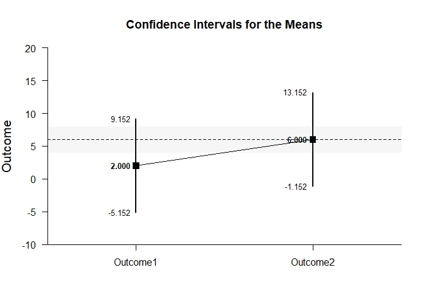
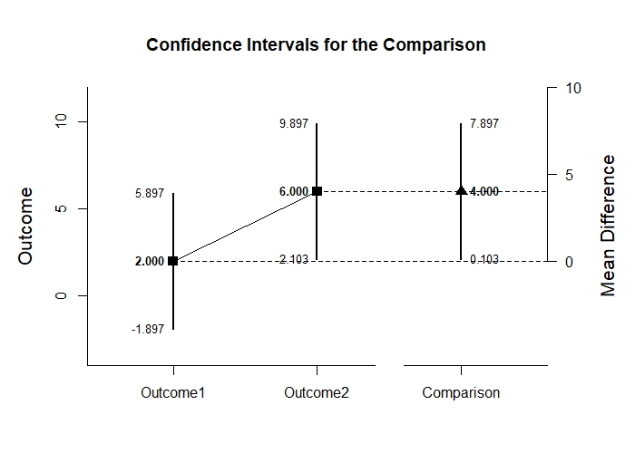

# Estimation Approach to Statistical Inference

[**Functions**](../../A-Functions) | 
[**Tutorials**](../../B-Tutorials) | 
[**Examples**](../../C-Examples) | 
[**Advanced**](../../D-Advanced)

---

## Paired Samples Tutorial with Summary Statistics

### Source the EASI Functions

This code imports all of the EASI functions, making them available for analyses.
```r
source("http://raw.githubusercontent.com/cwendorf/EASI/master/A-Functions/EASI-Functions.R")
```

### Enter Summary Statistics

This code inputs the variable summaries and creates a summary table.
```r
Outcome1 <- c(N=4,M=2.000,SD=2.449)
Outcome2 <- c(N=4,M=6.000,SD=2.449)
PairedSummary <- rbind(Outcome1,Outcome2)
class(PairedSummary) <- "wss"
PairedSummary
```
```
         N M    SD
Outcome1 4 2 2.449
Outcome2 4 6 2.449
attr(,"class")
[1] "wss"
```
This code creates a correlation matrix and enters single correlation.
```r
PairedCorr <- declareCorrMatrix("Outcome1","Outcome2")
PairedCorr["Outcome1","Outcome2"] <- .500
PairedCorr
```
```
         Outcome1 Outcome2
Outcome1       NA      0.5
Outcome2       NA       NA
```
 
### Analyses of Multiple Variables

This section produces analyses that are equivalent to one-sample analyses separately for each level of a factor.

#### Confidence Intervals for the Means

This code will provide a table of descriptive statistics and confidence intervals for each level of the factor.
```r
estimateMeans(PairedSummary)
```
```
CONFIDENCE INTERVALS FOR THE MEANS

             N     M    SD    SE     LL     UL
Outcome1 4.000 2.000 2.449 1.224 -1.897  5.897
Outcome2 4.000 6.000 2.449 1.224  2.103  9.897
```

The code defaults to 95% confidence intervals. This can be changed if desired.
```r
estimateMeans(PairedSummary,conf.level=.99)
```
```
CONFIDENCE INTERVALS FOR THE MEANS

             N     M    SD    SE     LL     UL
Outcome1 4.000 2.000 2.449 1.224 -5.152  9.152
Outcome2 4.000 6.000 2.449 1.224 -1.152 13.152
```

#### Plots of Confidence Intervals for the Means

This code will produce a graph of the confidence intervals for each level of the factor.
```r
plotMeans(PairedSummary) # Paired-Figure1.jpeg
```
<kbd></kbd>

Of course, it is possible to change from the default confidence level. Additionally, it is possible to add a comparison line to represent a population (or test) value and a region of practical equivalence.
```r
plotMeans(PairedSummary,conf.level=.99,mu=6,rope=c(4,8)) # Paired-Figure2.jpeg
```
<kbd></kbd>

#### Significance Tests for the Means

This code will produce a table of NHST separately for each level of the factor. In this case, all the means are tested against a value of zero.
```r
testMeans(PairedSummary)
```
```
HYPOTHESIS TESTS FOR THE MEANS

          Diff    SE     t    df     p
Outcome1 2.000 1.224 1.633 3.000 0.201
Outcome2 6.000 1.224 4.900 3.000 0.016
```

Often, the default test value of zero is not meaningful or plausible. This too can be altered (often in conjunction with what is presented in the plot).
```r
testMeans(PairedSummary,mu=6)
```
```
HYPOTHESIS TESTS FOR THE MEANS

           Diff    SE      t    df     p
Outcome1 -4.000 1.224 -3.267 3.000 0.047
Outcome2  0.000 1.224  0.000 3.000 1.000
```

#### Effect Sizes for the Means

This code will produce a table of standardized mean differences separately for each level of the factor. In this case, the mean is compared to zero to form the effect size.
```r
standardizeMeans(PairedSummary)
```
```
CONFIDENCE INTERVALS FOR THE STANDARDIZED MEANS

             d d(unb)    SE     LL    UL
Outcome1 0.817  0.594 0.616 -0.387 1.934
Outcome2 2.450  1.782 0.955  0.325 4.532
```

Here too it is possible to alter the width of the confidence intervals and to establish a more plausible comparison value for the effect size.
```r
standardizeMeans(PairedSummary,mu=6,conf.level=.99)
```
```
CONFIDENCE INTERVALS FOR THE STANDARDIZED MEANS

              d d(unb)    SE     LL    UL
Outcome1 -1.633 -1.188 0.761 -3.765 0.398
Outcome2  0.000  0.000 0.559 -1.288 1.288
```

### Analyses of a Variable Comparison

This section produces analyses that are equivalent to comparisons of two levels of a factor.

#### Confidence Interval for the Mean Difference

This code estimates the confidence interval of the difference.
```r
estimateDifference(PairedSummary,PairedCorr)
```
```
CONFIDENCE INTERVAL FOR THE COMPARISON

             Diff    SE    df     LL     UL
Comparison -4.000 1.224 3.000 -7.897 -0.103
```

Of course, you can change the confidence level from the default 95% if desired.
```r
estimateDifference(PairedSummary,PairedCorr,conf.level=.99)
```
```
CONFIDENCE INTERVAL FOR THE COMPARISON

             Diff    SE    df      LL    UL
Comparison -4.000 1.224 3.000 -11.152 3.152
```

#### Plots of Confidence Intervals for the Mean Difference

This code obtains and plots the confidence intervals for the levels and the mean difference.
```r
plotDifference(PairedSummary,PairedCorr) # Paired-Figur3.jpeg
```
<kbd></kbd>

Once again, the confidence levels can be changed away from the default and a region of practical equivalence can be added.
```r
plotDifference(PairedSummary,PairedCorr,conf.level=.99,rope=c(-2,2)) # Paired-Figure4.jpeg
```
<kbd></kbd>

#### Significance Test for the Mean Difference

This code produces NHST for the mean difference (using a default test value of zero).
```r
testDifference(PairedSummary,PairedCorr)
```
```
HYPOTHESIS TEST FOR THE COMPARISON

             Diff    SE      t    df     p
Comparison -4.000 1.224 -3.267 3.000 0.047
```

If the default value of zero is not plausible, it too can be changed.
```r
testDifference(PairedSummary,PairedCorr,mu=-2)
```
```
HYPOTHESIS TEST FOR THE COMPARISON

             Diff    SE      t    df     p
Comparison -2.000 1.224 -1.633 3.000 0.201
```

#### Effect Size for the Mean Difference

This code calculates a standardized mean difference and its confidence interval.
```r
standardizeDifference(PairedSummary,PairedCorr)
```
```
CONFIDENCE INTERVAL FOR THE STANDARDIZED COMPARISON

              Est    SE     LL     UL
Comparison -1.633 0.782 -3.166 -0.101
```

The width of the confidence interval for the effect size can be altered if desired.
```r
standardizeDifference(PairedSummary,PairedCorr,conf.level=.99)
```
```
CONFIDENCE INTERVAL FOR THE STANDARDIZED COMPARISON

              Est    SE     LL    UL
Comparison -1.633 0.782 -3.647 0.380
```
