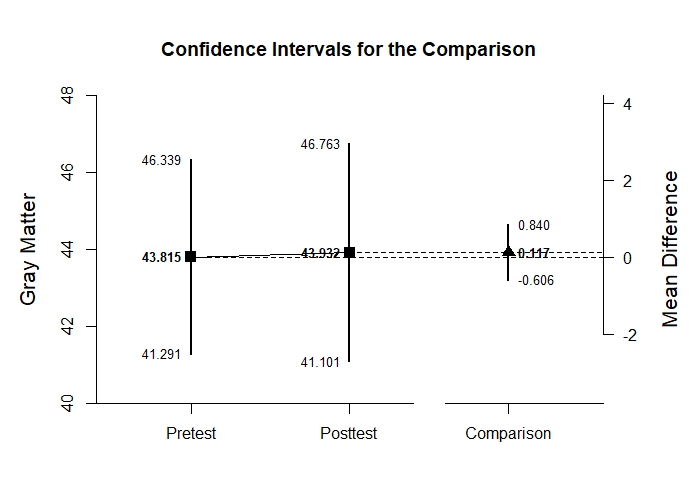
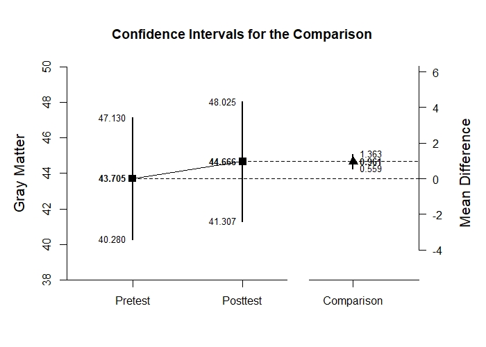

# Estimation Approach to Statistical Inference

[**Functions**](../../A-Functions) | 
[**Tutorials**](../../B-Tutorials) | 
[**Examples**](../../C-Examples) | 
[**Advanced**](../../D-Advanced)

---

## Mixed Design Example with Holzel Data

### Source the EASI Functions

```r
source("http://raw.githubusercontent.com/cwendorf/EASI/master/A-Functions/EASI-Functions.R")
```

### Enter Data

```r
Group <- c("Control","Control","Control","Control","Control","Control","Control","Control","Control","Control","Control","Control","Control","Control","Control","Control","Control","Meditation","Meditation","Meditation","Meditation","Meditation","Meditation","Meditation","Meditation","Meditation","Meditation","Meditation","Meditation","Meditation","Meditation","Meditation","Meditation")
Pretest <- c(48.261,42.745,46.222,46.889,43.752,36.928,52.026,39.739,45.503,45.386,44.745,31.725,40.562,39.216,46.771,48.314,46.065,43.072,41.922,48.366,49.725,40.013,39.673,38.405,52.51,41.281,42.157,41.281,57.843,41.935,45.281,29.673,46.144)
Posttest <- c(50.026,41.137,45.542,48.261,45.242,33.621,53.634,40.275,43.595,46.235,45.621,32.092,40.588,39.987,47.19,47.137,46.654,42.549,41.974,49.882,50.967,41.059,41.569,40.418,54.078,43.046,43.333,41.333,58,42.471,45.83,31.137,47.007)
HolzelData <- data.frame(Group,Pretest,Posttest)
HolzelData
```
```
        Group Pretest Posttest
1     Control  48.261   50.026
2     Control  42.745   41.137
3     Control  46.222   45.542
4     Control  46.889   48.261
5     Control  43.752   45.242
6     Control  36.928   33.621
7     Control  52.026   53.634
8     Control  39.739   40.275
9     Control  45.503   43.595
10    Control  45.386   46.235
11    Control  44.745   45.621
12    Control  31.725   32.092
13    Control  40.562   40.588
14    Control  39.216   39.987
15    Control  46.771   47.190
16    Control  48.314   47.137
17    Control  46.065   46.654
18 Meditation  43.072   42.549
19 Meditation  41.922   41.974
20 Meditation  48.366   49.882
21 Meditation  49.725   50.967
22 Meditation  40.013   41.059
23 Meditation  39.673   41.569
24 Meditation  38.405   40.418
25 Meditation  52.510   54.078
26 Meditation  41.281   43.046
27 Meditation  42.157   43.333
28 Meditation  41.281   41.333
29 Meditation  57.843   58.000
30 Meditation  41.935   42.471
31 Meditation  45.281   45.830
32 Meditation  29.673   31.137
33 Meditation  46.144   47.007
```
```r
HolzelSubsetControl <- subset(HolzelData,Group=="Control")
HolzelSubsetLMeditation <- subset(HolzelData,Group=="Meditation")
```

#### Confidence Intervals for the Means

```r
with(HolzelSubsetControl,plotDifference(Pretest,Posttest)) # Holzel-Figure1.jpeg
```
<kbd></kbd>
```r
with(HolzelSubsetLMeditation,plotDifference(Pretest,Posttest)) # Holzel-Figure2.jpeg
```
<kbd></kbd>
```r
with(HolzelSubsetControl,standardizeDifference(Pretest,Posttest))
```
```
CONFIDENCE INTERVAL FOR THE STANDARDIZED COMPARISON

             Est    SE     LL    UL
Comparison 0.022 0.067 -0.110 0.155
```
```r
with(HolzelSubsetLMeditation,standardizeDifference(Pretest,Posttest))
```
```
CONFIDENCE INTERVAL FOR THE STANDARDIZED COMPARISON

             Est    SE    LL    UL
Comparison 0.151 0.041 0.070 0.232
```
