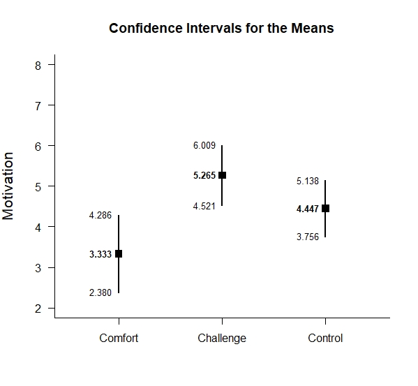
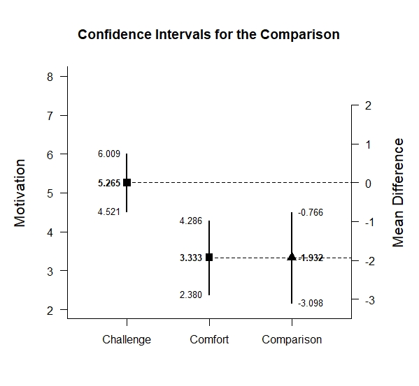
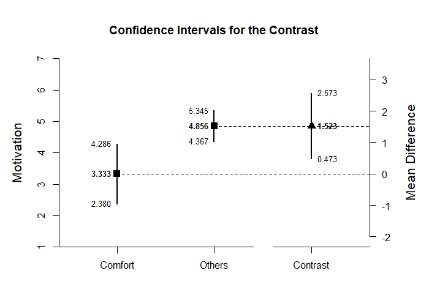

# Estimation Approach to Statistical Inference

[**Functions**](../../A-Functions) | 
[**Tutorials**](../../B-Tutorials) | 
[**Examples**](../../C-Examples) | 
[**Advanced**](../../D-Advanced)

---

## OneWay (Between-Subjects) Example with Rattan Summary Statistics

### Source the EASI Functions

```r
source("http://raw.githubusercontent.com/cwendorf/EASI/master/A-Functions/EASI-Functions.R")
```

### Enter Summary Statistics

```r
Comfort <- c(N=18,M=3.333,SD=1.917)
Challenge <- c(N=17,M=5.265,SD=1.448)
Control <- c(N=19,M=4.447,SD=1.433)
RattanSummary <- rbind(Comfort,Challenge,Control)
class(RattanSummary) <- "bss"
RattanSummary
```
```
           N     M    SD
Comfort   18 3.333 1.917
Challenge 17 5.265 1.448
Control   19 4.447 1.433
attr(,"class")
[1] "bss"
```

### Analyses of the Different Groups

```r
estimateMeans(RattanSummary)
```
```
CONFIDENCE INTERVALS FOR THE MEANS

               N     M    SD    SE    LL    UL
Comfort   18.000 3.333 1.917 0.452 2.380 4.286
Challenge 17.000 5.265 1.448 0.351 4.521 6.009
Control   19.000 4.447 1.433 0.329 3.756 5.138
```
```r
plotMeans(RattanSummary,ylab="Motivation") # Rattan-Figure1.jpeg
```
<kbd></kbd>

### Analysis of a Group Difference

```r
ComfortvsChallenge <- rbind(Comfort,Challenge)
class(ComfortvsChallenge) <- "bss"
estimateDifference(ComfortvsChallenge)
```
```
CONFIDENCE INTERVAL FOR THE COMPARISON

            Diff    SE     df    LL    UL
Comparison 1.932 0.572 31.521 0.766 3.098
```
```r
plotDifference(cComfortvsChallenge,ylab="Motivation") # Rattan-Figure2.jpeg
```
<kbd></kbd>
```r
standardizeDifference(ComfortvsChallenge)
```
```
CONFIDENCE INTERVAL FOR THE STANDARDIZED COMPARISON

             Est    SE    LL    UL
Comparison 1.137 0.376 0.401 1.873
```

### Analysis of a Group Contrast

```r
ComfortvsOthers <- c(-1,.5,.5)
estimateContrast(RattanSummary,contrast=ComfortvsOthers)
```
```
CONFIDENCE INTERVAL FOR THE CONTRAST

           Est    SE     df    LL    UL
Contrast 1.523 0.512 26.903 0.473 2.573
```
```r
plotContrast(RattanSummary,contrast=ComfortvsOthers,labels=c("Comfort","Others"),ylab="Motivation") # Rattan-Figure3.jpeg
```
<kbd></kbd>
```r
testContrast(RattanSummary,contrast=ComfortvsOthers)
```
```
HYPOTHESIS TEST FOR THE CONTRAST

           Est    SE     t     df     p
Contrast 1.523 0.512 2.975 26.903 0.006
```
```r
standardizeContrast(RattanSummary,contrast=ComfortvsOthers)
```
```
CONFIDENCE INTERVAL FOR THE STANDARDIZED CONTRAST

           Est    SE    LL    UL
Contrast 0.943 0.340 0.276 1.610
```
