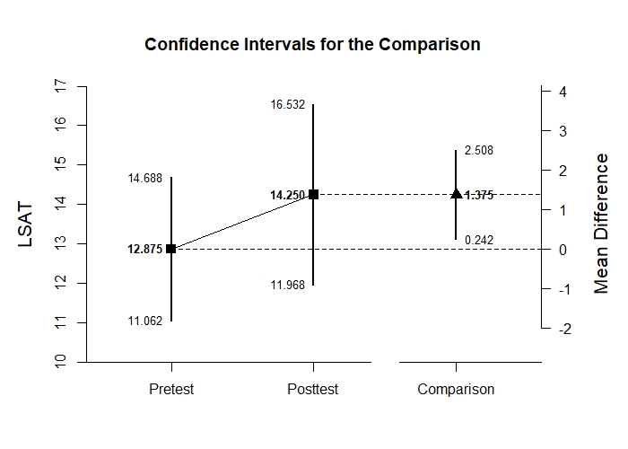
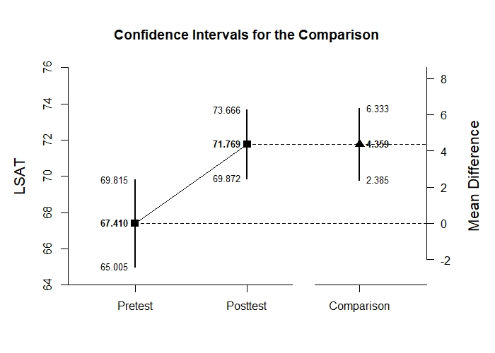

# Estimation Approach to Statistical Inference

[**Functions**](../../A-Functions) | 
[**Tutorials**](../../B-Tutorials) | 
[**Examples**](../../C-Examples) | 
[**Advanced**](../../D-Advanced)

---

## Paired Samples Example with Thomason Data

### Source the EASI Functions

```r
source("http://raw.githubusercontent.com/cwendorf/EASI/master/A-Functions/EASI-Functions.R")
```

### Thomason1 Example

```r
Pretest <- c(13,12,12,9,14,17,14,9,6,7,11,15)
Posttest <- c(14,13,16,12,15,18,13,10,10,8,14,16)
```
```r
plotDifference(Pretest,Posttest) # Thomason-Figure1.jpeg
```
<kbd></kbd>
```r
standardizeDifference(Pretest,Posttest)
```
```
CONFIDENCE INTERVAL FOR THE STANDARDIZED COMPARISON

             Est    SE    LL    UL
Comparison 0.536 0.181 0.180 0.891
```

### Thomason2 Example

```r
Pretest <- c(10,14,7,12,11,11,15,14,9,16,10,11,13,19,19,15)
Posttest <- c(12,19,6,9,15,13,17,14,10,17,9,14,15,22,18,18)
```
```r
plotDifference(Pretest,Posttest) # Thomason-Figure2.jpeg
```
<kbd></kbd>
```r
standardizeDifference(Pretest,Posttest)
```
```
CONFIDENCE INTERVAL FOR THE STANDARDIZED COMPARISON

             Est    SE    LL    UL
Comparison 0.356 0.154 0.053 0.658
```

### Thomason3 Example

```r
Pretest <- c(41,50,71,70,74,75,64,72,77,53,60,73,72,62,68,63,69,71,70,70,75,71,76,64,70,65,75,66,70,70,64,72,63,68,64,61,63,76,71)
Posttest <- c(52,63,69,71,80,80,69,76,78,77,67,76,69,73,73,68,70,81,70,76,77,75,69,77,70,76,65,64,72,71,63,78,71,77,67,66,73,75,75)
```
```r
plotDifference(Pretest,Posttest) # Thomason-Figure3.jpeg
```
<kbd></kbd>
```r
standardizeDifference(Pretest,Posttest)
```
```
CONFIDENCE INTERVAL FOR THE STANDARDIZED COMPARISON

             Est    SE    LL    UL
Comparison 0.652 0.161 0.338 0.967
```
