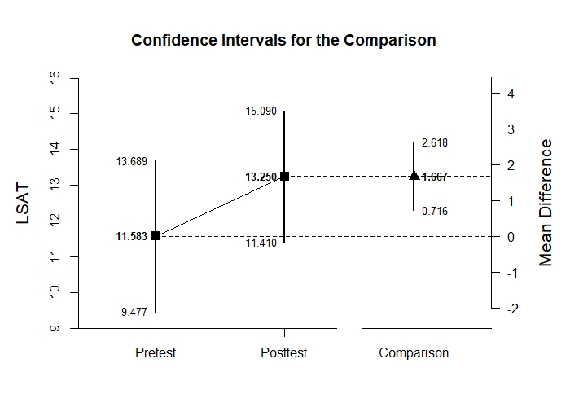

# Estimation Approach to Statistical Inference

[**Functions**](../../A-Functions) | 
[**Tutorials**](../../B-Tutorials) | 
[**Examples**](../../C-Examples) | 
[**Advanced**](../../D-Advanced)

---

## Paired Samples Example with Thomason Summary Statistics

### Source the EASI Functions

```r
source("http://raw.githubusercontent.com/cwendorf/EASI/master/A-Functions/ALL-EASI-FUNCTIONS.R")
```

### Thomason1 Example

```r
Pretest <- c(N=12,M=11.583,SD=3.315)
Posttest <- c(N=12,M=13.250,SD=2.896)
Thomason1Summary <- rbind(Pretest,Posttest)
class(Thomason1Summary) <- "wss"
Thomason1Corr <- data.frame()
Thomason1Corr["Pretest","Posttest"] <- .892
```
```r
plotDifference(Thomason1Summary,Thomason1Corr) # Thomason-Figure1.jpeg
```
<kbd></kbd>
```r
standardizeDifference(Thomason1Summary,Thomason1Corr)
```
```
CONFIDENCE INTERVAL FOR THE STANDARDIZED COMPARISON

              Est    SE     LL    UL
Comparison -0.536 0.181 -0.891 -0.18
```

### Thomason2 Example

```r
Pretest <- c(N=16,M=12.875,SD=3.403)
Posttest <- c(N=16,M=14.250,SD=4.282)
Thomason2Summary <- rbind(Pretest,Posttest)
class(Thomason2Summary) <- "wss"
Thomason2Corr <- data.frame()
Thomason2Corr["Pretest","Posttest"] <- .871
```
```r
plotDifference(Thomason2Summary,Thomason2Corr) # Thomason-Figure2.jpeg
```
<kbd></kbd>
```r
standardizeDifference(Thomason2Summary,Thomason2Corr)
```
```
CONFIDENCE INTERVAL FOR THE STANDARDIZED COMPARISON

              Est    SE     LL     UL
Comparison -0.356 0.155 -0.659 -0.052
```

### Thomason3 Example

```r
Pretest <- c(N=39,M=67.410,SD=7.419)
Posttest <- c(N=39,M=71.769,SD=5.851)
Thomason3Summary <- rbind(Pretest,Posttest)
class(Thomason3Summary) <- "wss"
Thomason3Corr <- data.frame()
Thomason3Corr["Pretest","Posttest"] <- .601
```
```r
plotDifference(Thomason3Summary,Thomason3Corr) # Thomason-Figure3.jpeg
```
<kbd></kbd>
```r
standardizeDifference(Thomason3Summary,Thomason3Corr)
```
```
CONFIDENCE INTERVAL FOR THE STANDARDIZED COMPARISON

              Est    SE     LL     UL
Comparison -0.652 0.161 -0.967 -0.338
```
