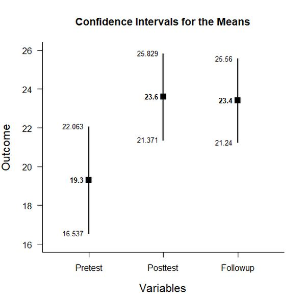
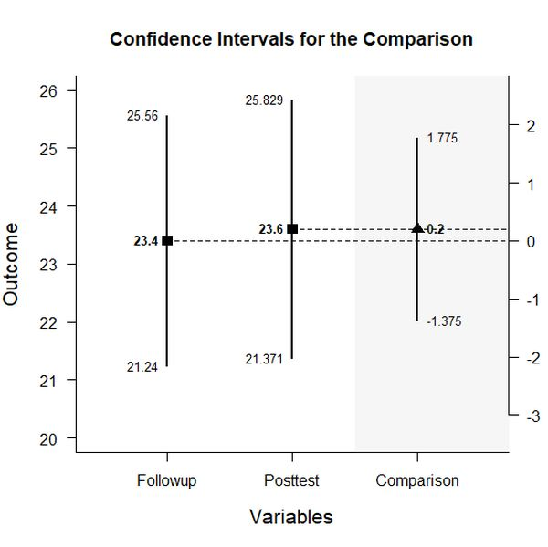
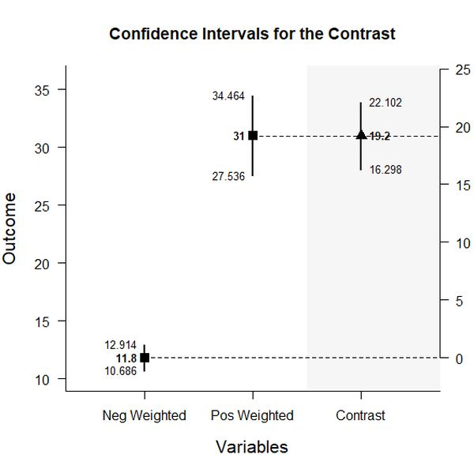

# Estimation Approach to Statistical Inference (EASI)

[**Home**](https://github.com/cwendorf/EASI/) | 
[**Functions**](https://github.com/cwendorf/EASI/tree/master/A-Functions) | 
[**Basic Examples**](https://github.com/cwendorf/EASI/tree/master/B-BasicExamples) | 
[**ITNS Examples**](https://github.com/cwendorf/EASI/tree/master/C-ITNSExamples) | 
[**Extensions**](https://github.com/cwendorf/EASI/tree/master/D-Extensions) | 
[**Extension Examples**](https://github.com/cwendorf/EASI/tree/master/E-ExtensionExamples) 

---

## Within-Subjects Example with Donohue Summary Statistics

### Source the EASI Functions

```r
source("http://raw.githubusercontent.com/cwendorf/EASI/master/A-Functions/ALL_EASI_FUNCTIONS.R")
```

### Enter Summary Statistics

```r
Pretest <- c(N=20,M=19.300,SD=5.904)
Posttest <- c(N=20,M=23.600,SD=4.762)
Followup <- c(N=20,M=23.400,SD=4.616)
DonohueSummary <- rbind(Pretest,Posttest,Followup)
class(DonohueSummary) <- "wss"
DonohueSummary
```
```
          N    M    SD
Pretest  20 19.3 5.904
Posttest 20 23.6 4.762
Followup 20 23.4 4.616
attr(,"class")
[1] "wss"
```
```r
DonohueCorr <- declareCorrMatrix("Pretest","Posttest","Followup")
DonohueCorr["Pretest","Posttest"] <- .493
DonohueCorr["Pretest","Followup"] <- .536
DonohueCorr["Posttest","Followup"] <- .743
DonohueCorr <- fillCorrMatrix(DonohueCorr)
DonohueCorr
```
```
         Pretest Posttest Followup
Pretest    1.000    0.493    0.536
Posttest   0.493    1.000    0.743
Followup   0.536    0.743    1.0``
```

### Analyses of the Different Variables

```r
estimateMeans(DonohueSummary)
```
```
CONFIDENCE INTERVALS FOR THE MEANS

          N    M    SD    SE     LL     UL
Pretest  20 19.3 5.904 1.320 16.537 22.063
Posttest 20 23.6 4.762 1.065 21.371 25.829
Followup 20 23.4 4.616 1.032 21.240 25.560
```
```r
plotMeans(DonohueSummary)
```
<kbd></kbd>
 
### Analysis of a Variable Difference

```r
PostvsFollowup <- DonohueSummary[c(2,3),]
class(PostvsFollowup) <- "wss"
estimateDifference(PostvsFollowup,DonohueCorr)
```
```
CONFIDENCE INTERVAL FOR THE COMPARISON

  Diff     SE     df     LL     UL 
 0.200  0.753 19.000 -1.375  1.775 
```
```r
plotDifference(PostvsFollowup,DonohueCorr)
```
<kbd></kbd>
```r
effectDifference(PostvsFollowup,DonohueCorr)
```
```
STANDARDIZED MEAN DIFFERENCE FOR THE COMPARISON

     d      g     LL     UL 
 0.043  0.042 -0.281  0.369 
```

### Analysis of a Variable Contrast

```r
PrevsPostFollow <- c(1,-.5,.5)
estimateContrast(DonohueSummary,DonohueCorr,contrast=PrevsPostFollow)
```
```
CONFIDENCE INTERVAL FOR THE CONTRAST

          Est    SE df     LL     UL
Contrast 19.2 1.386 19 16.299 22.101
```
```r
plotContrast(DonohueSummary,DonohueCorr,contrast=PrevsPostFollow)
```
<kbd></kbd>
```r
testContrast(DonohueSummary,DonohueCorr,contrast=PrevsPostFollow)
```
```
HYPOTHESIS TEST FOR THE CONTRAST

          Est    SE      t df p
Contrast 19.2 1.386 13.851 19 0
```