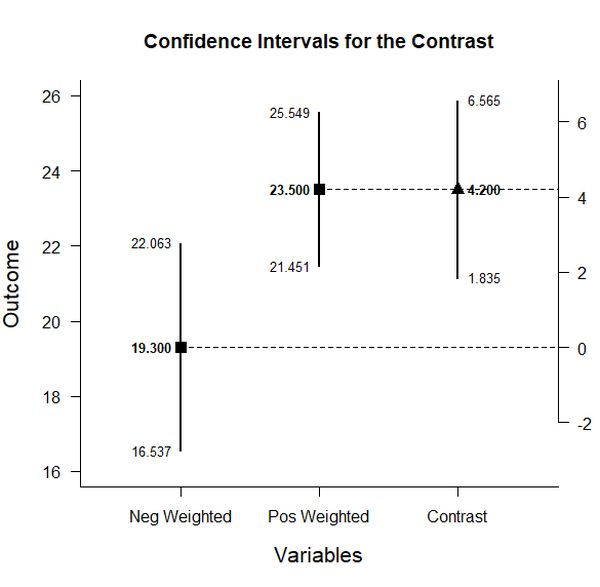

# Estimation Approach to Statistical Inference (EASI)

[**Home**](https://github.com/cwendorf/EASI/) | 
[**Functions**](https://github.com/cwendorf/EASI/tree/master/A-Functions) | 
[**Basic Examples**](https://github.com/cwendorf/EASI/tree/master/B-BasicExamples) | 
[**ITNS Examples**](https://github.com/cwendorf/EASI/tree/master/C-ITNSExamples) | 
[**Extensions**](https://github.com/cwendorf/EASI/tree/master/D-Extensions) | 
[**Extension Examples**](https://github.com/cwendorf/EASI/tree/master/E-ExtensionExamples) 

---

## Within-Subjects Example with Donohue Data

### Source the EASI Functions

```r
source("http://raw.githubusercontent.com/cwendorf/EASI/master/A-Functions/ALL-EASI-FUNCTIONS.R")
```

### Input Data

```r
Pretest <- c(7,11,11,13,15,17,18,18,19,19,19,19,21,22,25,25,25,26,27,29)
Posttest <- c(16,20,25,22,28,12,16,26,21,22,26,30,23,27,23,27,28,24,28,28)
Followup <- c(16,18,23,21,27,21,18,21,24,21,27,28,18,27,23,28,31,18,31,27)
DonohueData <- data.frame(Pretest,Posttest,Followup)
DonohueData
```
```
   Pretest Posttest Followup
1        7       16       16
2       11       20       18
3       11       25       23
4       13       22       21
5       15       28       27
6       17       12       21
7       18       16       18
8       18       26       21
9       19       21       24
10      19       22       21
11      19       26       27
12      19       30       28
13      21       23       18
14      22       27       27
15      25       23       23
16      25       27       28
17      25       28       31
18      26       24       18
19      27       28       31
20      29       28       27
```

### Analyses of the Different Variables

```r
estimateMeans(Pretest,Posttest,Followup)
```
```
CONFIDENCE INTERVALS FOR THE MEANS

              N      M    SD    SE     LL     UL
Pretest  20.000 19.300 5.904 1.320 16.537 22.063
Posttest 20.000 23.600 4.762 1.065 21.371 25.829
Followup 20.000 23.400 4.616 1.032 21.240 25.560
```
```r
plotMeans(Pretest,Posttest,Followup)
```
<kbd></kbd>
 
### Analysis of a Variable Difference

```r
estimateDifference(Posttest,Followup)
```
```
CONFIDENCE INTERVAL FOR THE COMPARISON

            Diff    SE     df     LL    UL
Comparison 0.200 0.753 19.000 -1.375 1.775
```
```r
plotDifference(Posttest,Followup)
```
<kbd></kbd>
```r
standardizeDifference(Posttest,Followup)
```
```
CONFIDENCE INTERVAL FOR THE STANDARDIZED COMPARISON

             Est    SE     LL    UL
Comparison 0.043 0.165 -0.280 0.366
```

### Analysis of a Variable Contrast

```r
PrevsPostFollow <- c(-1,.5,.5)
estimateContrast(Pretest,Posttest,Followup,contrast=PrevsPostFollow)
```
```
CONFIDENCE INTERVAL FOR THE CONTRAST

           Est    SE     df    LL    UL
Contrast 4.200 1.130 19.000 1.835 6.565
```
```r
plotContrast(Pretest,Posttest,Followup,contrast=PrevsPostFollow)
```
<kbd></kbd>
```r
testContrast(Pretest,Posttest,Followup,contrast=PrevsPostFollow)
```
```
HYPOTHESIS TEST FOR THE CONTRAST

           Est    SE     t     df     p
Contrast 4.200 1.130 3.717 19.000 0.001
```
```r
standardizeContrast(Pretest,Posttest,Followup,contrast=PrevsPostFollow)
```
```
CONFIDENCE INTERVAL FOR THE STANDARDIZED CONTRAST

           Est    SE    LL    UL
Contrast 0.819 0.214 0.399 1.239
```
