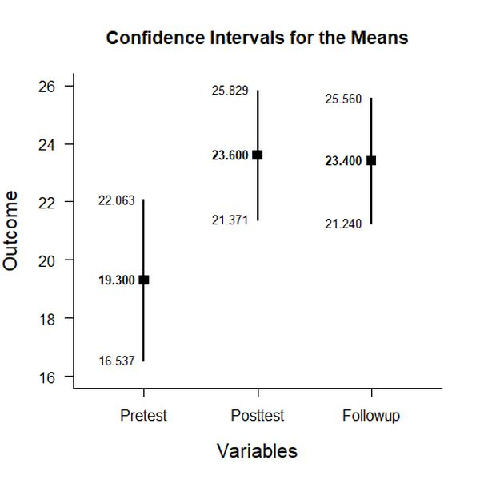
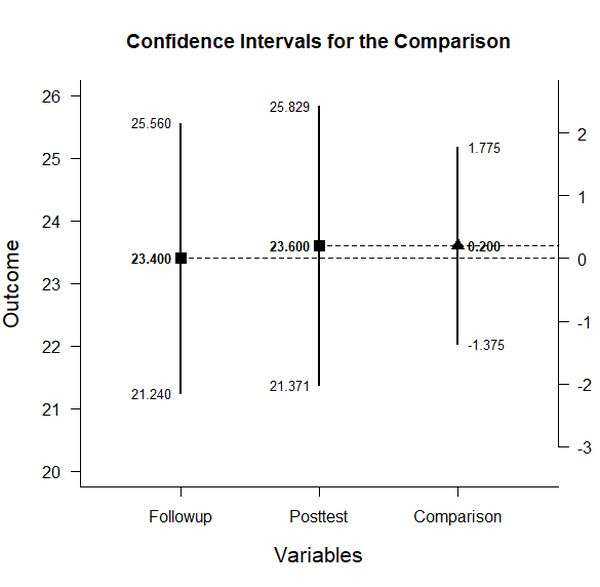

# EASI: Estimation Approach to Statistical Inference

[**Home**](https://github.com/cwendorf/EASI/) | 
[**Functions**](https://github.com/cwendorf/EASI/tree/master/A-Functions) | 
[**Tutorial Examples**](https://github.com/cwendorf/EASI/tree/master/B-TutorialExamples) | 
[**ITNS Examples**](https://github.com/cwendorf/EASI/tree/master/C-ITNSExamples) | 
[**Extension Examples**](https://github.com/cwendorf/EASI/tree/master/D-ExtensionExamples) 

---

## Repeated (Within-Subjects) Example with Donohue Summary Statistics

### Source the EASI Functions

```r
source("http://raw.githubusercontent.com/cwendorf/EASI/master/A-Functions/ALL-EASI-FUNCTIONS.R")
```

### Enter Summary Statistics

```r
Pretest <- c(N=20,M=19.300,SD=5.904)
Posttest <- c(N=20,M=23.600,SD=4.762)
Followup <- c(N=20,M=23.400,SD=4.616)
DonohueSummary <- rbind(Pretest,Posttest,Followup)
class(DonohueSummary) <- "wss"
DonohueSummary
```
```
          N    M    SD
Pretest  20 19.3 5.904
Posttest 20 23.6 4.762
Followup 20 23.4 4.616
attr(,"class")
[1] "wss"
```
```r
DonohueCorr <- declareCorrMatrix("Pretest","Posttest","Followup")
DonohueCorr["Pretest","Posttest"] <- .493
DonohueCorr["Pretest","Followup"] <- .536
DonohueCorr["Posttest","Followup"] <- .743
DonohueCorr <- fillCorrMatrix(DonohueCorr)
DonohueCorr
```
```
         Pretest Posttest Followup
Pretest    1.000    0.493    0.536
Posttest   0.493    1.000    0.743
Followup   0.536    0.743    1.000
```

### Analyses of the Different Variables

```r
estimateMeans(DonohueSummary)
```
```
CONFIDENCE INTERVALS FOR THE MEANS

              N      M    SD    SE     LL     UL
Pretest  20.000 19.300 5.904 1.320 16.537 22.063
Posttest 20.000 23.600 4.762 1.065 21.371 25.829
Followup 20.000 23.400 4.616 1.032 21.240 25.560
```
```r
plotMeans(DonohueSummary) # Donohue-Figure1.jpeg
```
<kbd></kbd>
 
### Analysis of a Variable Difference

```r
PostvsFollowup <- DonohueSummary[c(2,3),]
class(PostvsFollowup) <- "wss"
estimateDifference(PostvsFollowup,DonohueCorr)
```
```
CONFIDENCE INTERVAL FOR THE COMPARISON

            Diff    SE     df     LL    UL
Comparison 0.200 0.752 19.000 -1.375 1.775
```
```r
plotDifference(PostvsFollowup,DonohueCorr) # Donohue-Figure2.jpeg
```
<kbd></kbd>
```r
standardizeDifference(PostvsFollowup,DonohueCorr)
```
```
CONFIDENCE INTERVAL FOR THE STANDARDIZED COMPARISON

             Est    SE     LL    UL
Comparison 0.043 0.165 -0.280 0.365
```

### Analysis of a Variable Contrast

```r
PrevsPostFollow <- c(-1,.5,.5)
estimateContrast(DonohueSummary,DonohueCorr,contrast=PrevsPostFollow)
```
```
CONFIDENCE INTERVAL FOR THE CONTRAST

           Est    SE     df    LL    UL
Contrast 4.200 1.130 19.000 1.834 6.566
```
```r
plotContrast(DonohueSummary,DonohueCorr,contrast=PrevsPostFollow,labels=c("Pretest","Post&Follow")) # Donohue-Figure3.jpeg
```
<kbd></kbd>
```r
testContrast(DonohueSummary,DonohueCorr,contrast=PrevsPostFollow)
```
```
HYPOTHESIS TEST FOR THE CONTRAST

           Est    SE     t     df     p
Contrast 4.200 1.130 3.716 19.000 0.001
```
```r
standardizeContrast(DonohueSummary,DonohueCorr,contrast=PrevsPostFollow)
```
```
CONFIDENCE INTERVAL FOR THE STANDARDIZED CONTRAST

           Est    SE    LL    UL
Contrast 0.819 0.214 0.399 1.239
```