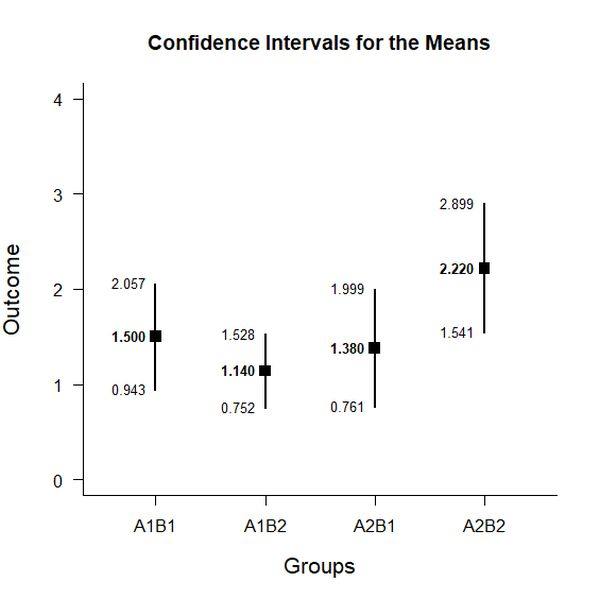
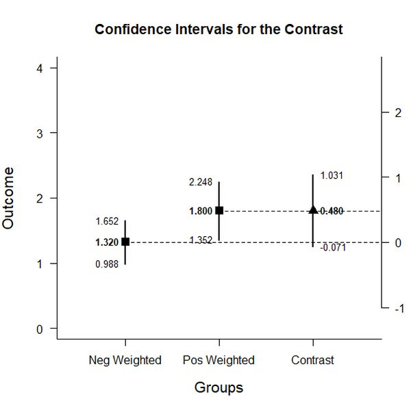
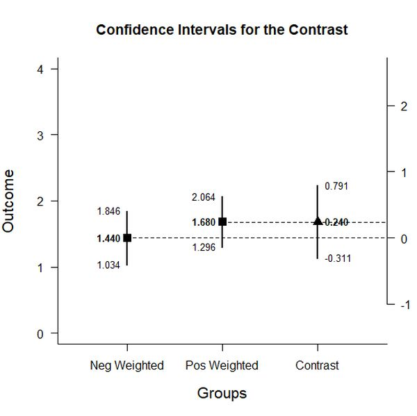
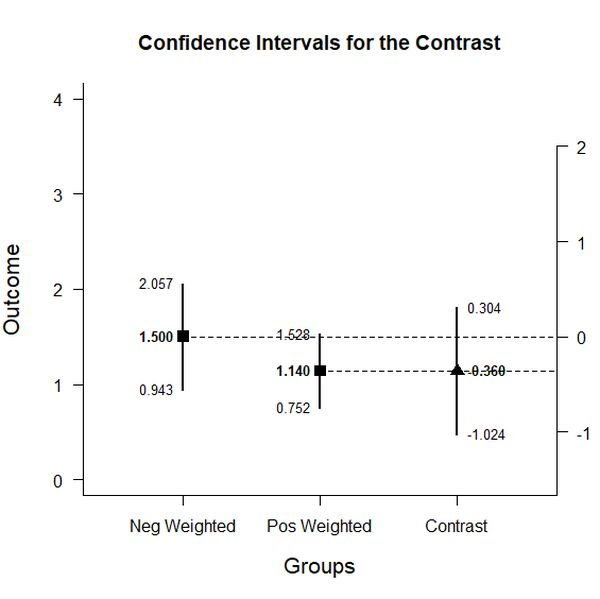
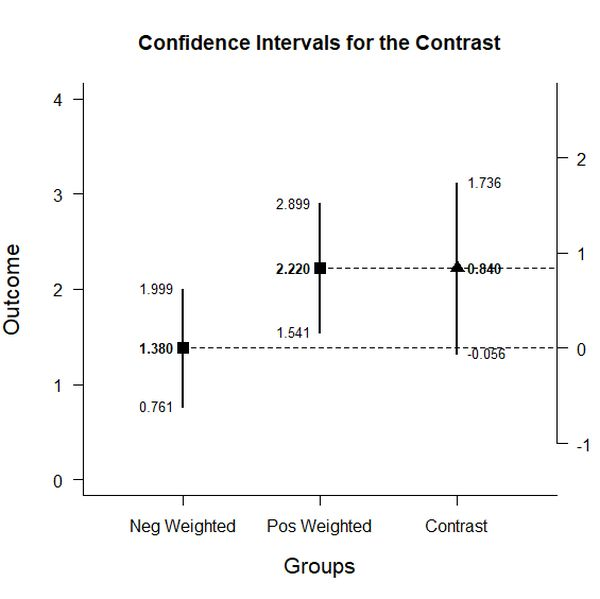

# Estimation Approach to Statistical Inference  (EASI)

[**Home**](https://github.com/cwendorf/EASI/) | 
[**Functions**](https://github.com/cwendorf/EASI/tree/master/A-Functions) | 
[**Tutorial Examples**](https://github.com/cwendorf/EASI/tree/master/B-TutorialExamples) | 
[**ITNS Examples**](https://github.com/cwendorf/EASI/tree/master/C-ITNSExamples) | 
[**Extension Examples**](https://github.com/cwendorf/EASI/tree/master/D-ExtensionExamples)

---

## Between-Subjects Factorial Example with Frenda Summary Statistics

### Source the EASI Functions

```r
source("http://raw.githubusercontent.com/cwendorf/EASI/master/A-Functions/ALL-EASI-FUNCTIONS.R")
```

### Enter Summary Statistics

```r
A1B1 <- c(N=26,M=1.50,SD=1.38)
A1B2 <- c(N=26,M=1.14,SD=0.96)
A2B1 <- c(N=25,M=1.38,SD=1.50)
A2B2 <- c(N=26,M=2.22,SD=1.68)
FrendaSummary <- rbind(A1B1,A1B2,A2B1,A2B2)
class(FrendaSummary) <- "bss"
FrendaSummary
```
```
      N    M   SD
A1B1 26 1.50 1.38
A1B2 26 1.14 0.96
A2B1 25 1.38 1.50
A2B2 26 2.22 1.68
attr(,"class")
[1] "bss"
```

### Analyses of the Different Groups

```r
estimateMeans(FrendaSummary)
```
```
CONFIDENCE INTERVALS FOR THE MEANS

          N     M    SD    SE    LL    UL
A1B1 26.000 1.500 1.380 0.271 0.943 2.057
A1B2 26.000 1.140 0.960 0.188 0.752 1.528
A2B1 25.000 1.380 1.500 0.300 0.761 1.999
A2B2 26.000 2.220 1.680 0.329 1.541 2.899
```
```r
plotMeans(FrendaSummary) # Frenda-Figure1.jpg
```
<kbd></kbd>

### Analyses of the Marginal Means

```r
Evening <- c(.5,.5,0,0)
estimateContrast(FrendaSummary,contrast=Evening)
```
```
CONFIDENCE INTERVAL FOR THE CONTRAST

           Est    SE     df    LL    UL
Contrast 1.320 0.165 44.605 0.988 1.652
```
```r
Morning <- c(0,0,.5,.5)
estimateContrast(FrendaSummary,contrast=Morning)
```
```
CONFIDENCE INTERVAL FOR THE CONTRAST

           Est    SE     df    LL    UL
Contrast 1.800 0.223 48.740 1.352 2.248
```
```r
Sleep <- c(.5,0,.5,0)
estimateContrast(FrendaSummary,contrast=Sleep)
```
```
CONFIDENCE INTERVAL FOR THE CONTRAST

           Est    SE     df    LL    UL
Contrast 1.440 0.202 48.269 1.034 1.846
```
```r
Nosleep <- c(0,.5,0,.5)
estimateContrast(FrendaSummary,contrast=Nosleep)
```
```
CONFIDENCE INTERVAL FOR THE CONTRAST

           Est    SE     df    LL    UL
Contrast 1.680 0.190 39.753 1.296 2.064
```

### Analyses of the Factor A (Evening vs Morning) Main Effect

```r
mainFactorA <- c(-.5,-.5,.5,.5)
estimateContrast(FrendaSummary,contrast=mainFactorA)
```
```
CONFIDENCE INTERVAL FOR THE CONTRAST

           Est    SE     df     LL    UL
Contrast 0.480 0.277 87.919 -0.071 1.031
```
```r
plotContrast(FrendaSummary,contrast=mainFactorA) # Frenda-Figure2.jpg
```
<kbd></kbd>
```r
testContrast(FrendaSummary,contrast=mainFactorA)
```
```
HYPOTHESIS TEST FOR THE CONTRAST

           Est    SE     t     df     p
Contrast 0.480 0.277 1.732 87.919 0.087
```
```r
standardizeContrast(FrendaSummary,contrast=mainFactorA)
```
```
CONFIDENCE INTERVAL FOR THE STANDARDIZED CONTRAST

           Est    SE     LL    UL
Contrast 0.342 0.203 -0.056 0.739
```

### Analyses of the Factor B (Sleep vs NoSleep) Main Effect

```r
mainFactorB <- c(-.5,.5,-.5,.5)
estimateContrast(FrendaSummary,contrast=mainFactorB)
```
```
CONFIDENCE INTERVAL FOR THE CONTRAST

           Est    SE     df     LL    UL
Contrast 0.240 0.277 87.919 -0.311 0.791
```
```r
plotContrast(FrendaSummary,contrast=mainFactorB) # Frenda-Figure3.jpg
```
<kbd></kbd>
```r
testContrast(FrendaSummary,contrast=mainFactorB)
```
```
HYPOTHESIS TEST FOR THE CONTRAST

           Est    SE     t     df     p
Contrast 0.240 0.277 0.866 87.919 0.389
```
```r
standardizeContrast(FrendaSummary,contrast=mainFactorB)
```
```
CONFIDENCE INTERVAL FOR THE STANDARDIZED CONTRAST

           Est    SE     LL    UL
Contrast 0.171 0.202 -0.224 0.566
```

### Analyses of the Factor A x B Interaction

```r
Interaction <- c(1,-1,-1,1)
estimateContrast(FrendaSummary,contrast=Interaction)
```
```
CONFIDENCE INTERVAL FOR THE CONTRAST

           Est    SE     df    LL    UL
Contrast 1.200 0.554 87.919 0.098 2.302
```
```r
testContrast(FrendaSummary,contrast=Interaction)
```
```
HYPOTHESIS TEST FOR THE CONTRAST

           Est    SE     t     df     p
Contrast 1.200 0.554 2.165 87.919 0.033
```
```r
standardizeContrast(FrendaSummary,contrast=Interaction)
```
```
CONFIDENCE INTERVAL FOR THE STANDARDIZED CONTRAST

           Est    SE    LL    UL
Contrast 0.854 0.407 0.055 1.653
```


### Analyses of the Factor B at A1 Simple Effect

```r
simpleAatB1 <- c(-1,1,0,0)
estimateContrast(FrendaSummary,contrast=simpleAatB1)
```
```
CONFIDENCE INTERVAL FOR THE CONTRAST

            Est    SE     df     LL    UL
Contrast -0.360 0.330 44.605 -1.024 0.304
```
```r
plotContrast(FrendaSummary,contrast=simpleAatB1) # Frenda-Figure4.jpg
```
<kbd></kbd>
```r
testContrast(FrendaSummary,contrast=simpleAatB1)
```
```
HYPOTHESIS TEST FOR THE CONTRAST

            Est    SE      t     df     p
Contrast -0.360 0.330 -1.092 44.605 0.281
```
```r
standardizeContrast(FrendaSummary,contrast=simpleAatB1)
```
```
CONFIDENCE INTERVAL FOR THE STANDARDIZED CONTRAST

            Est    SE     LL    UL
Contrast -0.256 0.240 -0.727 0.214
```

### Analyses of the Factor B at A2 Simple Effect

```r
simpleAatB2 <- c(0,0,-1,1)
estimateContrast(FrendaSummary,contrast=simpleAatB2)
```
```
CONFIDENCE INTERVAL FOR THE CONTRAST

           Est    SE     df     LL    UL
Contrast 0.840 0.446 48.740 -0.056 1.736
```
```r
plotContrast(FrendaSummary,contrast=simpleAatB2) # Frenda-Figure5.jpg
```
<kbd></kbd>
```r
testContrast(FrendaSummary,contrast=simpleAatB2)
```
```
HYPOTHESIS TEST FOR THE CONTRAST

           Est    SE     t     df     p
Contrast 0.840 0.446 1.885 48.740 0.065
```
```r
standardizeContrast(FrendaSummary,contrast=simpleAatB2)
```
```
CONFIDENCE INTERVAL FOR THE STANDARDIZED CONTRAST

           Est    SE     LL    UL
Contrast 0.598 0.327 -0.042 1.238
```
