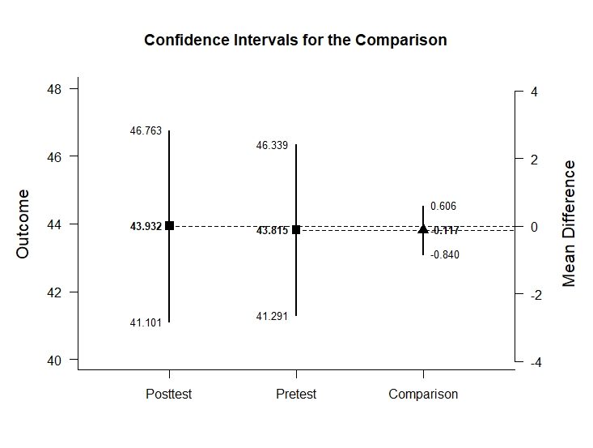

# EASI: Estimation Approach to Statistical Inference

[**Home**](https://github.com/cwendorf/EASI/) | 
[**Functions**](https://github.com/cwendorf/EASI/tree/master/A-Functions) | 
[**Tutorial Examples**](https://github.com/cwendorf/EASI/tree/master/B-TutorialExamples) | 
[**ITNS Examples**](https://github.com/cwendorf/EASI/tree/master/C-ITNSExamples) | 
[**Extension Examples**](https://github.com/cwendorf/EASI/tree/master/D-ExtensionExamples)

---

## Mixed Design Example with Holzel Summary Statistics

### Source the EASI Functions

```r
source("http://raw.githubusercontent.com/cwendorf/EASI/master/A-Functions/ALL-EASI-FUNCTIONS.R")
```

### Enter Summary Statistics

```r
PretestControl <- c(N=17,M=43.815,SD=4.910)
PosttestControl <- c(N=17,M=43.932,SD=5.507)
HolzelSummaryControl <- rbind(PretestControl,PosttestControl)
class(HolzelSummaryControl) <- "wss"
HolzelSummaryControl
```
```
                 N      M    SD
PretestControl  17 43.815 4.910
PosttestControl 17 43.932 5.507
attr(,"class")
[1] "wss"
```
```r
HolzelCorrControl <- declareCorrMatrix("PretestControl","PosttestControl")
HolzelCorrControl["PretestControl","PosttestControl"] <- .970
HolzelCorrControl <- fillCorrMatrix(HolzelCorrControl)
HolzelCorrControl
```
```
                PretestControl PosttestControl
PretestControl            1.00            0.97
PosttestControl           0.97            1.00
```
```r
PretestMeditation <- c(N=16,M=43.705,SD=6.427)
PosttestMeditation <- c(N=16,M=44.666,SD=6.303)
HolzelSummaryMeditation <- rbind(PretestMeditation,PosttestMeditation)
class(HolzelSummaryMeditation) <- "wss"
HolzelSummaryMeditation
```
```
                    N      M    SD
PretestMeditation  16 43.705 6.427
PosttestMeditation 16 44.666 6.303
attr(,"class")
[1] "wss"
```
```r
HolzelCorrMeditation <- declareCorrMatrix("PretestMeditation","PosttestMeditation")
HolzelCorrMeditation["PretestMeditation","PosttestMeditation"] <- .993
HolzelCorrMeditation <- fillCorrMatrix(HolzelCorrMeditation)
HolzelCorrMeditation
```
```
                   PretestMeditation PosttestMeditation
PretestMeditation              1.000              0.993
PosttestMeditation             0.993              1.000
```

#### Analyses of the Differences within Conditions

```r
plotDifference(HolzelSummaryControl,HolzelCorrControl) # Holzel-Figure1.jpeg
```
<kbd></kbd>
```r
plotDifference(HolzelSummaryMeditation,HolzelCorrMeditation) # Holzel-Figure2.jpeg
```
<kbd></kbd>
```r
standardizeDifference(HolzelSummaryControl,HolzelCorrControl)
```
```
CONFIDENCE INTERVAL FOR THE STANDARDIZED COMPARISON

              Est    SE     LL    UL
Comparison -0.022 0.068 -0.155 0.110
```
```r
standardizeDifference(HolzelSummaryMeditation,HolzelCorrMeditation)
```
```
CONFIDENCE INTERVAL FOR THE STANDARDIZED COMPARISON

              Est    SE     LL     UL
Comparison -0.151 0.041 -0.232 -0.070
```
