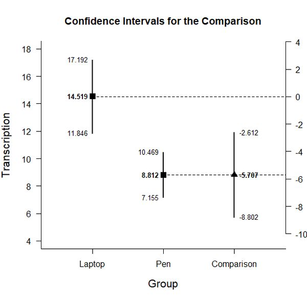
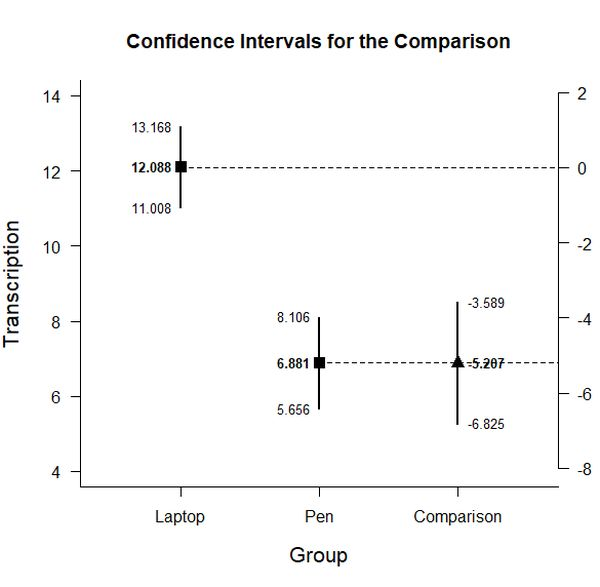

# Estimation Approach to Statistical Inference  (EASI)

[**Home**](https://github.com/cwendorf/EASI/) | 
[**Functions**](https://github.com/cwendorf/EASI/tree/master/A-Functions) | 
[**Basic Examples**](https://github.com/cwendorf/EASI/tree/master/B-BasicExamples) | 
[**ITNS Examples**](https://github.com/cwendorf/EASI/tree/master/C-ITNSExamples) | 
[**Extensions**](https://github.com/cwendorf/EASI/tree/master/D-Extensions) | 
[**Extension Examples**](https://github.com/cwendorf/EASI/tree/master/E-ExtensionExamples) 

---

## Between-Subjects Example with PenLaptop Summary Statistics

### Source the EASI Functions

```r
source("http://raw.githubusercontent.com/cwendorf/EASI/master/A-Functions/ALL_EASI_FUNCTIONS.R")
```

### PenLaptop1 Example

```r
Pen <- c(N=34,M=8.812,SD=4.749)
Laptop <- c(N=31,M=14.519,SD=7.286)
PenLaptop1Summary <- rbind(Pen,Laptop)
class(PenLaptop1Summary) <- "bss"
```
```r
plotDifference(PenLaptop1Summary)
```
<kbd></kbd>
```r
standardizeDifference(PenLaptop1Summary)
```
```
CONFIDENCE INTERVAL FOR THE STANDARDIZED COMPARISON

              Est   SE     LL     UL
Comparison -0.928 0.27 -1.458 -0.398
```

### PenLaptop2 Example

```r
Pen <- c(N=48,M=6.881,SD=4.219)
Laptop <- c(N=103,M=12.088,SD=5.525)
PenLaptop2Summary <- rbind(Pen,Laptop)
class(PenLaptop2Summary) <- "bss"
```
```r
plotDifference(PenLaptop2Summary)
```
<kbd></kbd>
```r
standardizeDifference(PenLaptop2Summary)
```
```
CONFIDENCE INTERVAL FOR THE STANDARDIZED COMPARISON

              Est    SE     LL     UL
Comparison -1.059 0.179 -1.409 -0.709
```

### PenLaptop3 Example

```r
Pen <- c(N=54,M=4.178,SD=2.549)
Laptop <- c(N=55,M=11.622,SD=5.681)
PenLaptop3Summary <- rbind(Pen,Laptop)
class(PenLaptop3Summary) <- "bss"
```
```r
plotDifference(PenLaptop3Summary)
```
<kbd></kbd>
```r
standardizeDifference(PenLaptop3Summary)
```
```
CONFIDENCE INTERVAL FOR THE STANDARDIZED COMPARISON

              Est    SE     LL     UL
Comparison -1.691 0.237 -2.156 -1.226
```
