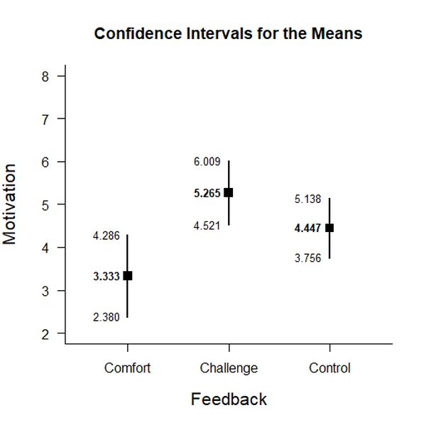
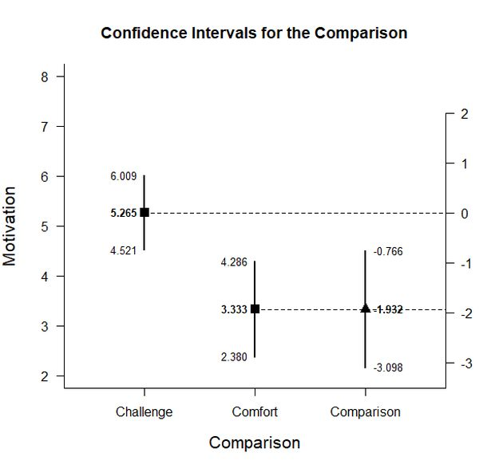
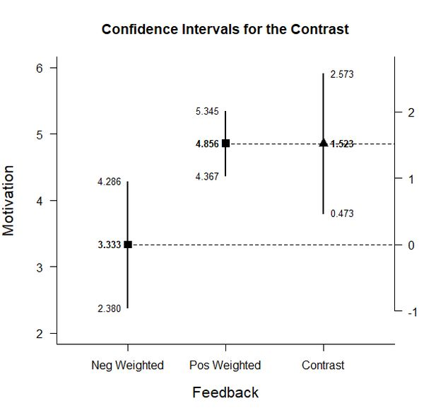

# Estimation Approach to Statistical Inference  (EASI)

[**Home**](https://github.com/cwendorf/EASI/) | 
[**Functions**](https://github.com/cwendorf/EASI/tree/master/A-Functions) | 
[**Basic Examples**](https://github.com/cwendorf/EASI/tree/master/B-BasicExamples) | 
[**ITNS Examples**](https://github.com/cwendorf/EASI/tree/master/C-ITNSExamples) | 
[**Extensions**](https://github.com/cwendorf/EASI/tree/master/D-Extensions) | 
[**Extension Examples**](https://github.com/cwendorf/EASI/tree/master/E-ExtensionExamples) 

---

## Between-Subjects Example with Rattan Summary Statistics

### Source the EASI Functions

```r
source("http://raw.githubusercontent.com/cwendorf/EASI/master/A-Functions/ALL-EASI-FUNCTIONS.R")
```

### Enter Summary Statistics

```r
Comfort <- c(N=18,M=3.333,SD=1.917)
Challenge <- c(N=17,M=5.265,SD=1.448)
Control <- c(N=19,M=4.447,SD=1.433)
RattanSummary <- rbind(Comfort,Challenge,Control)
class(RattanSummary) <- "bss"
RattanSummary
```
```
           N     M    SD
Comfort   18 3.333 1.917
Challenge 17 5.265 1.448
Control   19 4.447 1.433
attr(,"class")
[1] "bss"
```

### Analyses of the Different Groups

```r
estimateMeans(RattanSummary)
```
```
CONFIDENCE INTERVALS FOR THE MEANS

           N     M    SD    SE    LL    UL
Comfort   18 3.333 1.917 0.452 2.380 4.287
Challenge 17 5.265 1.448 0.351 4.520 6.009
Control   19 4.447 1.433 0.329 3.757 5.138
```
```r
plotMeans(RattanSummary)
```
<kbd></kbd>

### Analysis of a Group Difference

```r
ComfortvsChallenge <- rbind(Comfort,Challenge)
class(ComfortvsChallenge) <- "bss"
estimateDifference(ComfortvsChallenge)
```
```
CONFIDENCE INTERVAL FOR THE COMPARISON

  Diff     SE     df     LL     UL 
-1.931  0.572 31.521 -3.098 -0.765 
```
```r
plotDifference(cComfortvsChallenge)
```
<kbd></kbd>
```r
standardizeDifference(ComfortvsChallenge)
```
```
CONFIDENCE INTERVAL FOR THE STANDARDIZED COMPARISON

              Est    SE     LL     UL
Difference -1.137 0.376 -1.873 -0.401
```

### Analysis of a Group Contrast

```r
ComfortvsOthers <- c(-1,.5,.5)
estimateContrast(RattanSummary,contrast=ComfortvsOthers)
```
```
CONFIDENCE INTERVAL FOR THE CONTRAST

           Est    SE     df    LL    UL
Contrast 1.523 0.512 26.903 0.473 2.573
```
```r
plotContrast(RattanSummary,contrast=ComfortvsOthers)
```
<kbd></kbd>
```r
testContrast(RattanSummary,contrast=ComfortvsOthers)
```
```
HYPOTHESIS TEST FOR THE CONTRAST

           Est    SE     t     df     p
Contrast 1.523 0.512 2.975 26.903 0.006
```
```r
standardizeContrast(RattanSummary,contrast=ComfortvsOthers)
```
```
CONFIDENCE INTERVAL FOR THE STANDARDIZED CONTRAST

           Est   SE    LL   UL
Contrast 0.943 0.34 0.276 1.61
```
