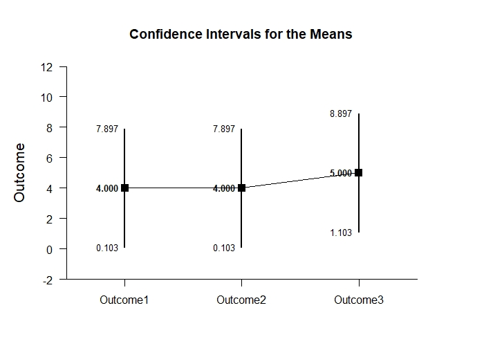
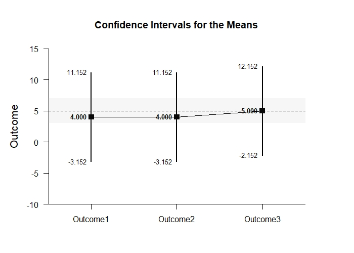
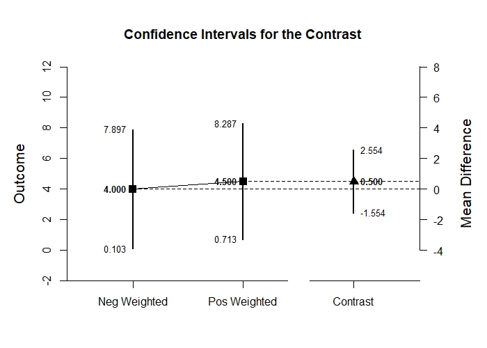

# Estimation Approach to Statistical Inference

[**Functions**](../../A-Functions) | 
[**Tutorials**](../../B-Tutorials) | 
[**Examples**](../../C-Examples) | 
[**Advanced**](../../D-Advanced)

---

## MixedBy - Mixed Design (Between-Subjects and Within-Subjects) Tutorial with Data

### Source the EASI Functions and the Extension

```r
source("http://raw.githubusercontent.com/cwendorf/EASI/master/A-Functions/ALL-EASI-FUNCTIONS.R")
source("http://raw.githubusercontent.com/cwendorf/EASI/master/A-Functions/byExtension.R")
```

### Enter Data

```r
Factor <- c(1,1,1,1,2,2,2,2)
Outcome1 <- c(0,0,3,5,1,3,6,6)
Outcome2 <- c(4,7,4,9,3,1,6,6)
Outcome3 <- c(4,9,6,9,3,3,6,8)
Factor <- factor(Factor,levels=c(1,2),labels=c("Level1","Level2"))
MixedData <- data.frame(Factor,Outcome1,Outcome2,Outcome3)
MixedData
```
```
  Factor Outcome1 Outcome2 Outcome3
1 Level1        0        4        4
2 Level1        0        7        9
3 Level1        3        4        6
4 Level1        5        9        9
5 Level2        1        3        3
6 Level2        3        1        3
7 Level2        6        6        6
8 Level2        6        6        8
```

### Analyses of Multiple Variables

#### Confidence Intervals for the Means

```r
estimateMeansBy(Outcome1,Outcome2,Outcome3,by=Factor)
```
```
CONFIDENCE INTERVALS FOR THE MEANS

$Level1
         N M    SD    SE     LL     UL
Outcome1 4 2 2.449 1.224 -1.897  5.897
Outcome2 4 6 2.449 1.224  2.103  9.897
Outcome3 4 7 2.449 1.224  3.103 10.897

$Level2
         N M    SD    SE    LL    UL
Outcome1 4 4 2.449 1.224 0.103 7.897
Outcome2 4 4 2.449 1.224 0.103 7.897
Outcome3 4 5 2.449 1.224 1.103 8.897
```

```r
estimateMeansBy(Outcome1,Outcome2,Outcome3,by=Factor,conf.level=.99)
```
```
CONFIDENCE INTERVALS FOR THE MEANS

$Level1
         N M    SD    SE     LL     UL
Outcome1 4 2 2.449 1.224 -5.152  9.152
Outcome2 4 6 2.449 1.224 -1.152 13.152
Outcome3 4 7 2.449 1.224 -0.152 14.152

$Level2
         N M    SD    SE     LL     UL
Outcome1 4 4 2.449 1.224 -3.152 11.152
Outcome2 4 4 2.449 1.224 -3.152 11.152
Outcome3 4 5 2.449 1.224 -2.152 12.152
```

#### Plots of Confidence Intervals for the Means

```r
plotMeansBy(Outcome1,Outcome2,Outcome3,by=Factor) # Includes MixedBy-Figure1.jpeg and MixedBy-Figure2.jpeg
```
<kbd></kbd>
<kbd></kbd>
```r
plotMeansBy(Outcome1,Outcome2,Outcome3,by=Factor,conf.level=.99,mu=6) # Includes MixedBy-Figure3.jpeg and MixedBy-Figure4.jpeg
```
<kbd></kbd>
<kbd></kbd>

#### Significance Tests for the Means

```r
testMeansBy(Outcome1,Outcome2,Outcome3,by=Factor)
```
```
HYPOTHESIS TESTS FOR THE MEANS

$Level1
         Diff    SE     t df     p
Outcome1    2 1.224 1.633  3 0.201
Outcome2    6 1.224 4.900  3 0.016
Outcome3    7 1.224 5.717  3 0.011

$Level2
         Diff    SE     t df     p
Outcome1    4 1.224 3.267  3 0.047
Outcome2    4 1.224 3.267  3 0.047
Outcome3    5 1.224 4.083  3 0.027
```

```r
testMeansBy(Outcome1,Outcome2,Outcome3,by=Factor,mu=6)
```
```
HYPOTHESIS TESTS FOR THE MEANS

$Level1
         Diff    SE      t df     p
Outcome1   -4 1.224 -3.267  3 0.047
Outcome2    0 1.224  0.000  3 1.000
Outcome3    1 1.224  0.817  3 0.474

$Level2
         Diff    SE      t df     p
Outcome1   -2 1.224 -1.633  3 0.201
Outcome2   -2 1.224 -1.633  3 0.201
Outcome3   -1 1.224 -0.817  3 0.474
```

#### Effect Size for the Means

```r
standardizeMeansBy(Outcome1,Outcome2,Outcome3,by=Factor)
```
```
CONFIDENCE INTERVALS FOR THE STANDARDIZED MEANS

$Level1
             d d(unb)    SE     LL    UL
Outcome1 0.817  0.594 0.616 -0.387 1.934
Outcome2 2.450  1.782 0.955  0.325 4.532
Outcome3 2.858  2.079 1.063  0.464 5.227

$Level2
             d d(unb)    SE    LL    UL
Outcome1 1.633  1.188 0.761 0.013 3.177
Outcome2 1.633  1.188 0.761 0.013 3.177
Outcome3 2.042  1.485 0.854 0.176 3.847
```

```r
standardizeMeansBy(Outcome1,Outcome2,Outcome3,by=Factor,mu=6,conf.level=.99)
```
```
CONFIDENCE INTERVALS FOR THE STANDARDIZED MEANS

$Level1
              d d(unb)    SE     LL    UL
Outcome1 -1.633 -1.188 0.761 -3.765 0.398
Outcome2  0.000  0.000 0.559 -1.288 1.288
Outcome3  0.408  0.297 0.574 -0.968 1.734

$Level2
              d d(unb)    SE     LL    UL
Outcome1 -0.817 -0.594 0.616 -2.320 0.732
Outcome2 -0.817 -0.594 0.616 -2.320 0.732
Outcome3 -0.408 -0.297 0.574 -1.734 0.968
```

### Analyses of a Variable Comparison

#### Confidence Interval for the Mean Difference

```r
estimateDifferenceBy(Outcome1,Outcome2,by=Factor)
```
```
CONFIDENCE INTERVALS FOR THE COMPARISONS

$Level1
           Diff    SE df     LL     UL
Comparison   -4 1.224  3 -7.897 -0.103

$Level2
           Diff    SE df     LL    UL
Comparison    0 0.816  3 -2.598 2.598
```

```r
estimateDifferenceBy(Outcome1,Outcome2,by=Factor,conf.level=.99)
```
```
CONFIDENCE INTERVALS FOR THE COMPARISONS

$Level1
           Diff    SE df      LL    UL
Comparison   -4 1.224  3 -11.152 3.152

$Level2
           Diff    SE df     LL    UL
Comparison    0 0.816  3 -4.768 4.768
```

#### Plots of Confidence Intervals for the Mean Difference

```r
plotDifferenceBy(Outcome1,Outcome2,by=Factor) # Includes MixedBy-Figure5.jpeg and MixedBy-Figure6.jpeg
```
<kbd></kbd>
<kbd></kbd>
```r
plotDifferenceBy(Outcome1,Outcome2,by=Factor,conf.level=.99) # Includes MixedBy-Figure7.jpeg and MixedBy-Figure8.jpeg
```
<kbd></kbd>
<kbd></kbd>

#### Significance Test for the Mean Difference

```r
testDifferenceBy(Outcome1,Outcome2,by=Factor)
```
```
HYPOTHESIS TESTS FOR THE COMPARISONS

$Level1
           Diff    SE      t df     p
Comparison   -4 1.224 -3.267  3 0.047

$Level2
           Diff    SE t df p
Comparison    0 0.816 0  3 1
```

```r
testDifferenceBy(Outcome1,Outcome2,by=Factor,mu=-2)
```
```
HYPOTHESIS TESTS FOR THE COMPARISONS

$Level1
           Diff    SE      t df     p
Comparison   -2 1.224 -1.633  3 0.201

$Level2
           Diff    SE    t df     p
Comparison    2 0.816 2.45  3 0.092
```

#### Effect Size for the Mean Difference

```r
standardizeDifferenceBy(Outcome1,Outcome2,by=Factor)
```
```
CONFIDENCE INTERVALS FOR THE STANDARDIZED COMPARISONS

$Level1
              Est    SE     LL     UL
Comparison -1.633 0.782 -3.166 -0.101

$Level2
           Est    SE     LL    UL
Comparison   0 0.385 -0.754 0.754
```

```r
standardizeDifferenceBy(Outcome1,Outcome2,by=Factor,conf.level=.99)
```
```
CONFIDENCE INTERVALS FOR THE STANDARDIZED COMPARISONS

$Level1
              Est    SE     LL   UL
Comparison -1.633 0.782 -3.647 0.38

$Level2
           Est    SE     LL    UL
Comparison   0 0.385 -0.991 0.991
```

### Analyses of a Variable Contrast

#### Confidence Interval for the Contrast

```r
O1vsOthers <- c(-1,.5,.5)
estimateContrastBy(Outcome1,Outcome2,Outcome3,by=Factor,contrast=O1vsOthers)
```
```
CONFIDENCE INTERVALS FOR THE CONTRASTS

$Level1
         Est    SE df    LL    UL
Contrast 4.5 1.258  3 0.496 8.504

$Level2
         Est    SE df     LL    UL
Contrast 0.5 0.645  3 -1.554 2.554
```

```r
estimateContrastBy(Outcome1,Outcome2,Outcome3,by=Factor,contrast=O1vsOthers,conf.level=.99)
```
```
CONFIDENCE INTERVALS FOR THE CONTRASTS

$Level1
         Est    SE df     LL     UL
Contrast 4.5 1.258  3 -2.848 11.848

$Level2
         Est    SE df    LL   UL
Contrast 0.5 0.645  3 -3.27 4.27
```

#### Plots of Confidence Intervals for a Contrast

```r
plotContrastBy(Outcome1,Outcome2,Outcome3,by=Factor,contrast=O1vsOthers) # Includes MixedBy-Figure9.jpeg and MixedBy-Figure10.jpeg
```
<kbd></kbd>
<kbd></kbd>
```r
plotContrastBy(Outcome1,Outcome2,Outcome3,by=Factor,contrast=O1vsOthers,labels=c("Outcome1","Others"),conf.level=.99) # Includes MixedBy-Figure11.jpeg and MixedBy-Figure12.jpeg
```
<kbd></kbd>
<kbd></kbd>

#### Significance Test for the Contrast

```r
testContrastBy(Outcome1,Outcome2,Outcome3,by=Factor,contrast=O1vsOthers)
```
```
HYPOTHESIS TESTS FOR THE CONTRASTS

$Level1
         Est    SE     t df     p
Contrast 4.5 1.258 3.577  3 0.037

$Level2
         Est    SE     t df     p
Contrast 0.5 0.645 0.775  3 0.495
```

```r
testContrastBy(Outcome1,Outcome2,Outcome3,by=Factor,contrast=O1vsOthers,mu=-1)
```
```
HYPOTHESIS TESTS FOR THE CONTRASTS

$Level1
         Est    SE     t df     p
Contrast 4.5 1.258 3.577  3 0.037

$Level2
         Est    SE     t df     p
Contrast 0.5 0.645 0.775  3 0.495
```

#### Effect Size for the Contrast

```r
standardizeContrastBy(Outcome1,Outcome2,Outcome3,by=Factor,contrast=O1vsOthers)
```
```
CONFIDENCE INTERVALS FOR THE STANDARDIZED CONTRASTS

$Level1
           Est    SE    LL    UL
Contrast 1.837 0.676 0.512 3.163

$Level2
           Est    SE     LL    UL
Contrast 0.204 0.279 -0.343 0.752
```

```r
standardizeContrastBy(Outcome1,Outcome2,Outcome3,by=Factor,contrast=O1vsOthers,conf.level=.99)
```
```
CONFIDENCE INTERVALS FOR THE STANDARDIZED CONTRASTS

$Level1
           Est    SE    LL    UL
Contrast 1.837 0.676 0.096 3.579

$Level2
           Est    SE     LL    UL
Contrast 0.204 0.279 -0.516 0.924
```
