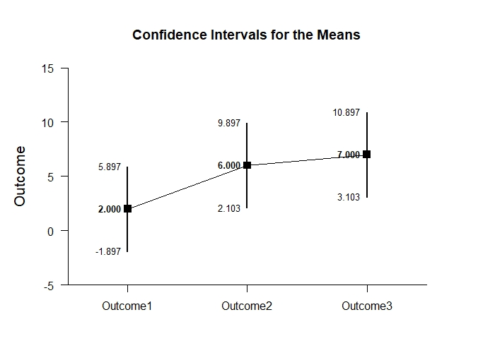
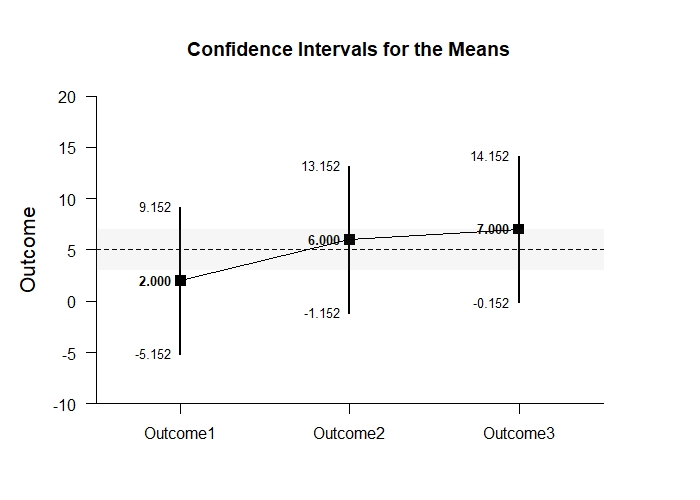
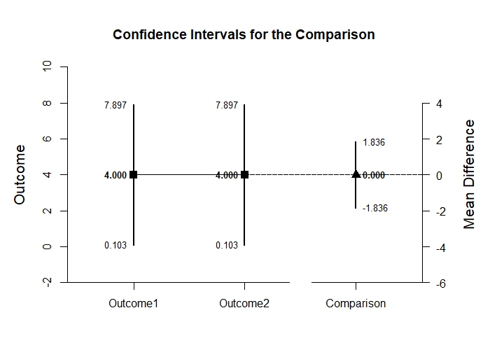
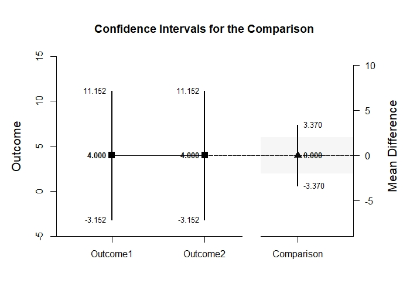
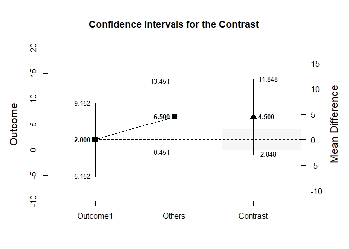

# Estimation Approach to Statistical Inference

[**Functions**](../../A-Functions) | 
[**Tutorials**](../../B-Tutorials) | 
[**Examples**](../../C-Examples) | 
[**Advanced**](../../D-Advanced)

---

## MixedBy - Mixed Design (Between-Subjects and Within-Subjects) Tutorial with Summary Statistics

### Source the EASI Functions and the Extension

```r
source("http://raw.githubusercontent.com/cwendorf/EASI/master/A-Functions/EASI-Functions.R")
source("http://raw.githubusercontent.com/cwendorf/EASI/master/A-Functions/EASI-By-Extension.R")
```

### Enter Summary Statistics

```r
Outcome1 <- c(N=4,M=2.000,SD=2.449)
Outcome2 <- c(N=4,M=6.000,SD=2.449)
Outcome3 <- c(N=4,M=7.000,SD=2.449)
WithinSummaryL1 <- rbind(Outcome1,Outcome2,Outcome3)

Outcome1 <- c(N=4,M=4.000,SD=2.449)
Outcome2 <- c(N=4,M=4.000,SD=2.449)
Outcome3 <- c(N=4,M=5.000,SD=2.449)
WithinSummaryL2 <- rbind(Outcome1,Outcome2,Outcome3)

MixedSummary <- list("Level1"=WithinSummaryL1,"Level2"=WithinSummaryL2)
class(MixedSummary) <- "wss"
MixedSummary
```
```
$Level1
         N M    SD
Outcome1 4 2 2.449
Outcome2 4 6 2.449
Outcome3 4 7 2.449

$Level2
         N M    SD
Outcome1 4 4 2.449
Outcome2 4 4 2.449
Outcome3 4 5 2.449

attr(,"class")
[1] "wss"
```

```r
WithinCorrL1 <- declareCorrMatrix("Outcome1","Outcome2","Outcome3")
WithinCorrL1["Outcome1",] <- c(1.000,.500,.389)
WithinCorrL1["Outcome2",] <- c(.500,1.000,.889)
WithinCorrL1["Outcome3",] <- c(.389,.889,1.000)

WithinCorrL2 <- declareCorrMatrix("Outcome1","Outcome2","Outcome3")
WithinCorrL2["Outcome1",] <- c(1.000,.889,.778)
WithinCorrL2["Outcome2",] <- c(.889,1.000,.889)
WithinCorrL2["Outcome3",] <- c(.778,.889,1.000)

MixedCorr <- list("Level1"=WithinCorrL1,"Level2"=WithinCorrL2)
class(MixedCorr) <- "wss"
MixedCorr
```
```
$Level1
         Outcome1 Outcome2 Outcome3
Outcome1    1.000    0.500    0.389
Outcome2    0.500    1.000    0.889
Outcome3    0.389    0.889    1.000

$Level2
         Outcome1 Outcome2 Outcome3
Outcome1    1.000    0.889    0.778
Outcome2    0.889    1.000    0.889
Outcome3    0.778    0.889    1.000

attr(,"class")
[1] "wss"
```

### Analyses of Multiple Variables

#### Confidence Intervals for the Means

```r
estimateMeansBy(MixedSummary)
```
```
CONFIDENCE INTERVALS FOR THE MEANS

$Level1
         N M    SD    SE     LL     UL
Outcome1 4 2 2.449 1.224 -1.897  5.897
Outcome2 4 6 2.449 1.224  2.103  9.897
Outcome3 4 7 2.449 1.224  3.103 10.897

$Level2
         N M    SD    SE    LL    UL
Outcome1 4 4 2.449 1.224 0.103 7.897
Outcome2 4 4 2.449 1.224 0.103 7.897
Outcome3 4 5 2.449 1.224 1.103 8.897
```

```r
estimateMeansBy(MixedSummary,conf.level=.99)
```
```
CONFIDENCE INTERVALS FOR THE MEANS

$Level1
         N M    SD    SE     LL     UL
Outcome1 4 2 2.449 1.224 -5.152  9.152
Outcome2 4 6 2.449 1.224 -1.152 13.152
Outcome3 4 7 2.449 1.224 -0.152 14.152

$Level2
         N M    SD    SE     LL     UL
Outcome1 4 4 2.449 1.224 -3.152 11.152
Outcome2 4 4 2.449 1.224 -3.152 11.152
Outcome3 4 5 2.449 1.224 -2.152 12.152
```

#### Plots of Confidence Intervals for the Means

```r
plotMeansBy(MixedSummary) # Includes MixedBy-Figure1.jpeg and MixedBy-Figure2.jpeg
```
<kbd></kbd>
<kbd></kbd>
```r
plotMeansBy(MixedSummary,conf.level=.99,mu=5,rope=c(3,7)) # Includes MixedBy-Figure3.jpeg and MixedBy-Figure4.jpeg
```
<kbd></kbd>
<kbd></kbd>

#### Significance Tests for the Means

```r
testMeansBy(MixedSummary)
```
```
HYPOTHESIS TESTS FOR THE MEANS

$Level1
         Diff    SE     t df     p
Outcome1    2 1.224 1.633  3 0.201
Outcome2    6 1.224 4.900  3 0.016
Outcome3    7 1.224 5.717  3 0.011

$Level2
         Diff    SE     t df     p
Outcome1    4 1.224 3.267  3 0.047
Outcome2    4 1.224 3.267  3 0.047
Outcome3    5 1.224 4.083  3 0.027
```

```r
testMeansBy(MixedSummary,mu=5)
```
```
HYPOTHESIS TESTS FOR THE MEANS

$Level1
         Diff    SE      t df     p
Outcome1   -3 1.224 -2.450  3 0.092
Outcome2    1 1.224  0.817  3 0.474
Outcome3    2 1.224  1.633  3 0.201

$Level2
         Diff    SE      t df     p
Outcome1   -1 1.224 -0.817  3 0.474
Outcome2   -1 1.224 -0.817  3 0.474
Outcome3    0 1.224  0.000  3 1.000
```

#### Effect Size for the Means

```r
standardizeMeansBy(MixedSummary)
```
```
CONFIDENCE INTERVALS FOR THE STANDARDIZED MEANS

$Level1
             d d(unb)    SE     LL    UL
Outcome1 0.817  0.594 0.616 -0.387 1.934
Outcome2 2.450  1.782 0.955  0.325 4.532
Outcome3 2.858  2.079 1.063  0.464 5.227

$Level2
             d d(unb)    SE    LL    UL
Outcome1 1.633  1.188 0.761 0.013 3.177
Outcome2 1.633  1.188 0.761 0.013 3.177
Outcome3 2.042  1.485 0.854 0.176 3.847
```

```r
standardizeMeansBy(MixedSummary,mu=5,conf.level=.99)
```
```
CONFIDENCE INTERVALS FOR THE STANDARDIZED MEANS

$Level1
              d d(unb)    SE     LL    UL
Outcome1 -1.225 -0.891 0.680 -3.011 0.547
Outcome2  0.408  0.297 0.574 -0.968 1.734
Outcome3  0.817  0.594 0.616 -0.732 2.320

$Level2
              d d(unb)    SE     LL    UL
Outcome1 -0.408 -0.297 0.574 -1.734 0.968
Outcome2 -0.408 -0.297 0.574 -1.734 0.968
Outcome3  0.000  0.000 0.559 -1.288 1.288
```

### Analyses of a Variable Comparison

```r
CompSummaryL1 <- WithinSummaryL1[c("Outcome1","Outcome2"),]
CompSummaryL2 <- WithinSummaryL2[c("Outcome1","Outcome2"),]
CompSummary <- list("Level1"=WithinSummaryL1,"Level2"=WithinSummaryL2)
class(CompSummary) <- "wss"
```

#### Confidence Interval for the Mean Difference

```r
estimateDifferenceBy(CompSummary,MixedCorr)
```
```
CONFIDENCE INTERVALS FOR THE COMPARISONS

$Level1
           Diff    SE df     LL     UL
Comparison   -4 1.224  3 -7.897 -0.103

$Level2
           Diff    SE df     LL    UL
Comparison    0 0.577  3 -1.836 1.836
```

```r
estimateDifferenceBy(CompSummary,MixedCorr,conf.level=.99)
```
```
CONFIDENCE INTERVALS FOR THE COMPARISONS

$Level1
           Diff    SE df      LL    UL
Comparison   -4 1.224  3 -11.152 3.152

$Level2
           Diff    SE df    LL   UL
Comparison    0 0.577  3 -3.37 3.37
```

#### Plots of Confidence Intervals for the Mean Difference

```r
plotDifferenceBy(CompSummary,MixedCorr) # Includes MixedBy-Figure5.jpeg and MixedBy-Figure6.jpeg
```
<kbd></kbd>
<kbd></kbd>
```r
plotDifferenceBy(CompSummary,MixedCorr,conf.level=.99,rope=c(-2,2)) # Includes MixedBy-Figure7.jpeg and MixedBy-Figure8.jpeg
```
<kbd></kbd>
<kbd></kbd>

#### Significance Test for the Mean Difference

```r
testDifferenceBy(CompSummary,MixedCorr)
```
```
HYPOTHESIS TESTS FOR THE COMPARISONS

$Level1
           Diff    SE      t df     p
Comparison   -4 1.224 -3.267  3 0.047

$Level2
           Diff    SE t df p
Comparison    0 0.577 0  3 1
```

```r
testDifferenceBy(CompSummary,MixedCorr,mu=-2)
```
```
HYPOTHESIS TESTS FOR THE COMPARISONS

$Level1
           Diff    SE      t df     p
Comparison   -2 1.224 -1.633  3 0.201

$Level2
           Diff    SE     t df    p
Comparison    2 0.577 3.467  3 0.04
```

#### Effect Size for the Mean Difference

```r
standardizeDifferenceBy(CompSummary,MixedCorr)
```
```
CONFIDENCE INTERVALS FOR THE STANDARDIZED COMPARISONS

$Level1
              Est    SE     LL     UL
Comparison -1.633 0.782 -3.166 -0.101

$Level2
           Est    SE     LL    UL
Comparison   0 0.272 -0.533 0.533
```

```r
standardizeDifferenceBy(CompSummary,MixedCorr,conf.level=.99)
```
```
CONFIDENCE INTERVALS FOR THE STANDARDIZED COMPARISONS

$Level1
              Est    SE     LL   UL
Comparison -1.633 0.782 -3.647 0.38

$Level2
           Est    SE     LL    UL
Comparison   0 0.272 -0.701 0.701
```

### Analyses of a Variable Contrast

```r
O1vsOthers <- c(-1,.5,.5)
```

#### Confidence Interval for the Contrast

```r
estimateContrastBy(MixedSummary,MixedCorr,contrast=O1vsOthers)
```
```
CONFIDENCE INTERVALS FOR THE CONTRASTS

$Level1
         Est    SE df    LL    UL
Contrast 4.5 1.258  3 0.496 8.504

$Level2
         Est    SE df     LL    UL
Contrast 0.5 0.645  3 -1.553 2.553
```

```r
estimateContrastBy(MixedSummary,MixedCorr,contrast=O1vsOthers,conf.level=.99)
```
```
CONFIDENCE INTERVALS FOR THE CONTRASTS

$Level1
         Est    SE df     LL     UL
Contrast 4.5 1.258  3 -2.848 11.848

$Level2
         Est    SE df     LL    UL
Contrast 0.5 0.645  3 -3.268 4.268
```

#### Plots of Confidence Intervals for a Contrast

```r
plotContrastBy(MixedSummary,MixedCorr,contrast=O1vsOthers) # Includes MixedBy-Figure9.jpeg and MixedBy-Figure10.jpeg
```
<kbd></kbd>
<kbd></kbd>
```r
plotContrastBy(MixedSummary,MixedCorr,contrast=O1vsOthers,labels=c("Outcome1","Others"),conf.level=.99,rope=c(-2,2)) # Includes MixedBy-Figure11.jpeg and MixedBy-Figure12.jpeg
```
<kbd></kbd>
<kbd></kbd>

#### Significance Test for the Contrast

```r
testContrastBy(MixedSummary,MixedCorr,contrast=O1vsOthers)
```
```
HYPOTHESIS TESTS FOR THE CONTRASTS

$Level1
         Est    SE     t df     p
Contrast 4.5 1.258 3.577  3 0.037

$Level2
         Est    SE     t df     p
Contrast 0.5 0.645 0.775  3 0.495
```

```r
testContrastBy(MixedSummary,MixedCorr,contrast=O1vsOthers,mu=4)
```
```
HYPOTHESIS TESTS FOR THE CONTRASTS

$Level1
         Est    SE     t df     p
Contrast 0.5 1.258 0.397  3 0.718

$Level2
          Est    SE      t df     p
Contrast -3.5 0.645 -5.426  3 0.012
```

#### Effect Size for the Contrast

```r
standardizeContrastBy(MixedSummary,MixedCorr,contrast=O1vsOthers)
```
```
CONFIDENCE INTERVALS FOR THE STANDARDIZED CONTRASTS

$Level1
           Est    SE    LL    UL
Contrast 1.837 0.676 0.512 3.163

$Level2
           Est    SE     LL    UL
Contrast 0.204 0.279 -0.343 0.752
```

```r
standardizeContrastBy(MixedSummary,MixedCorr,contrast=O1vsOthers,conf.level=.99)
```
```
CONFIDENCE INTERVALS FOR THE STANDARDIZED CONTRASTS

$Level1
           Est    SE    LL    UL
Contrast 1.837 0.676 0.096 3.579

$Level2
           Est    SE     LL    UL
Contrast 0.204 0.279 -0.515 0.924
```
