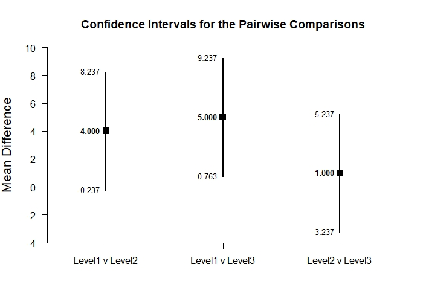
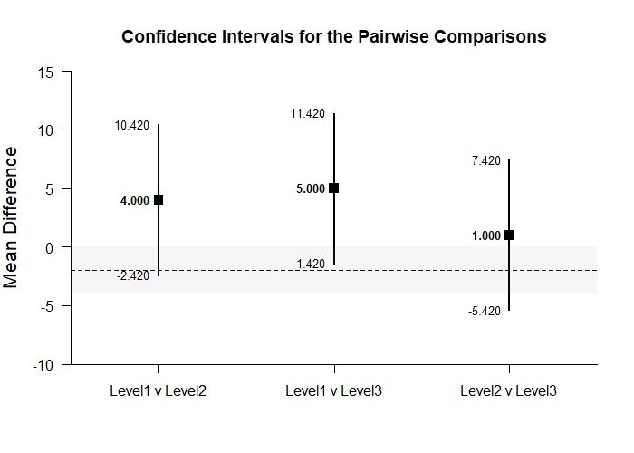

# Estimation Approach to Statistical Inference

[**Functions**](../../A-Functions) | 
[**Tutorials**](../../B-Tutorials) | 
[**Examples**](../../C-Examples) | 
[**Advanced**](../../D-Advanced)

---

## Pairwise Comparisons - OneWay (Between-Subjects) Tutorial with Data

### Source the EASI Functions and the Extension

```r
source("http://raw.githubusercontent.com/cwendorf/EASI/master/A-Functions/EASI-Functions.R")
source("http://raw.githubusercontent.com/cwendorf/EASI/master/A-Functions/EASI-Pairwise-Extension.R")
```

### Enter Data

```r
Factor <- c(rep(1,4),rep(2,4),rep(3,4))
Outcome <- c(0,0,3,5,4,7,4,9,9,6,4,9)
Factor <- factor(Factor,levels=c(1,2,3),labels=c("Level1","Level2","Level3"))
PairwiseOneWayData <- data.frame(Factor,Outcome)
PairwiseOneWayData
```
```
   Factor Outcome
1  Level1       0
2  Level1       0
3  Level1       3
4  Level1       5
5  Level2       4
6  Level2       7
7  Level2       4
8  Level2       9
9  Level3       9
10 Level3       6
11 Level3       4
12 Level3       9
```

### Analyses of Pairwise Comparisons

#### Confidence Intervals for the Pairwise Comparisons

```r
estimatePairwise(Outcome~Factor)
```
```
CONFIDENCE INTERVALS FOR THE PAIRWISE COMPARISONS

                  Diff    SE    df     LL     UL
Level1 v Level2 -4.000 1.732 6.000 -8.237  0.237
Level1 v Level3 -5.000 1.732 6.000 -9.237 -0.763
Level2 v Level3 -1.000 1.732 6.000 -5.237  3.237
```

```r
estimatePairwise(Outcome~Factor,conf.level=.99)
```
```
CONFIDENCE INTERVALS FOR THE PAIRWISE COMPARISONS

                  Diff    SE    df      LL    UL
Level1 v Level2 -4.000 1.732 6.000 -10.420 2.420
Level1 v Level3 -5.000 1.732 6.000 -11.420 1.420
Level2 v Level3 -1.000 1.732 6.000  -7.420 5.420
```

#### Plots of the Confidence Intervals for the Pairwise Comparisons

```r
plotPairwise(Outcome~Factor) # PairwiseOneWay-Figure1.jpeg
```
<kbd></kbd>
```r
plotPairwise(Outcome~Factor,mu=-2,conf.level=.99) # PairwiseOneWay-Figure2.jpeg
```
<kbd></kbd>

#### Significance Tests of the Pairwise Comparisons

```r
testPairwise(Outcome~Factor)
```
```
HYPOTHESIS TESTS FOR THE PAIRWISE COMPARISONS

                  Diff    SE      t    df     p
Level1 v Level2 -4.000 1.732 -2.310 6.000 0.060
Level1 v Level3 -5.000 1.732 -2.887 6.000 0.028
Level2 v Level3 -1.000 1.732 -0.577 6.000 0.585
```

```r
testPairwise(Outcome~Factor,mu=-2)
```
```
HYPOTHESIS TESTS FOR THE PAIRWISE COMPARISONS

                  Diff    SE      t    df     p
Level1 v Level2 -2.000 1.732 -1.155 6.000 0.292
Level1 v Level3 -3.000 1.732 -1.732 6.000 0.134
Level2 v Level3  1.000 1.732  0.577 6.000 0.585
```

#### Effect Sizes for the Pairwise Comparisons

```r
standardizePairwise(Outcome~Factor)
```
```
CONFIDENCE INTERVALS FOR THE STANDARDIZED PAIRWISE COMPARISONS

                   Est    SE     LL     UL
Level1 v Level2 -1.633 0.943 -3.481  0.215
Level1 v Level3 -2.042 1.007 -4.015 -0.068
Level2 v Level3 -0.408 0.825 -2.025  1.209
```

```r
standardizePairwise(Outcome~Factor,conf.level=.99)
```
```
CONFIDENCE INTERVALS FOR THE STANDARDIZED PAIRWISE COMPARISONS

                   Est    SE     LL    UL
Level1 v Level2 -1.633 0.943 -4.062 0.795
Level1 v Level3 -2.042 1.007 -4.635 0.552
Level2 v Level3 -0.408 0.825 -2.533 1.717
```
