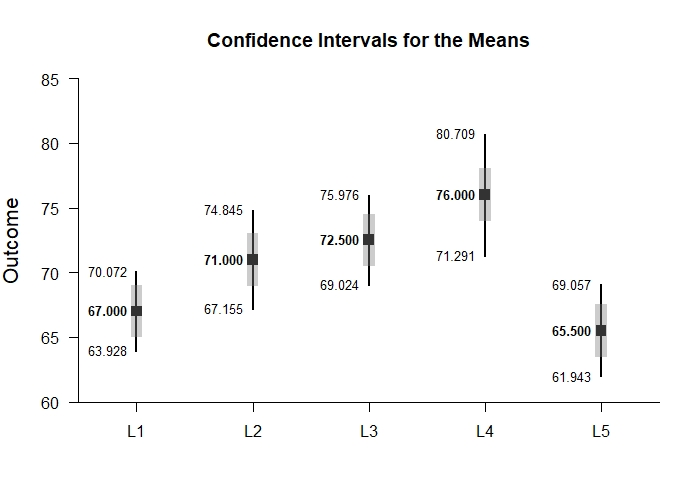
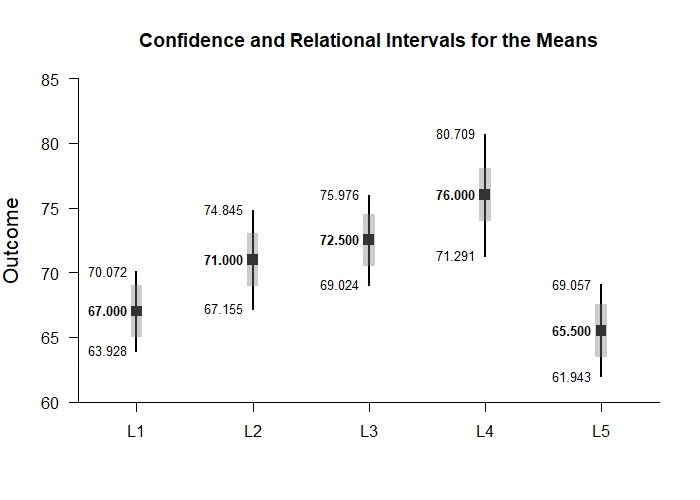
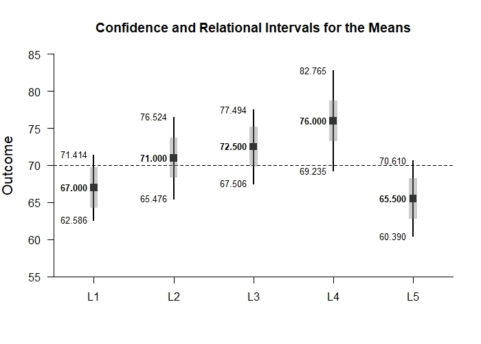

# Estimation Approach to Statistical Inference

[**Functions**](../../A-Functions) | 
[**Tutorials**](../../B-Tutorials) | 
[**Examples**](../../C-Examples) | 
[**Advanced**](../../D-Advanced)

---

## Relational Intervals - Repeated (Within-Subjects) Example with Wendorf Summary Statistics

> From Wendorf, C. A. (2012). Drawing inferences from multiple intervals in the single-factor design: Derivations, clarifications, extensions, and representations. Methodology, 8(4), 125-133.

### Source the EASI Functions

```r
source("http://raw.githubusercontent.com/cwendorf/EASI/master/A-Functions/ALL-EASI-FUNCTIONS.R")
source("http://raw.githubusercontent.com/cwendorf/EASI/master/A-Functions/omnibusExtension.R")
source("http://raw.githubusercontent.com/cwendorf/EASI/master/A-Functions/relationalExtension.R")
```

### Enter Summary Statistics (adapted from Wendorf, 2012)

```r
L1 <- c(N=10,M=67.000,SD=4.295)
L2 <- c(N=10,M=71.000,SD=5.375)
L3 <- c(N=10,M=72.500,SD=4.859)
L4 <- c(N=10,M=76.000,SD=6.583)
L5 <- c(N=10,M=65.500,SD=4.972)
WendorfSummary <- rbind(L1,L2,L3,L4,L5)
class(WendorfSummary) <- "wss"
WendorfSummary
```
```
    N    M    SD
L1 10 67.0 4.295
L2 10 71.0 5.375
L3 10 72.5 4.859
L4 10 76.0 6.583
L5 10 65.5 4.972
attr(,"class")
[1] "wss"
```

```r
WendorfCorr <- declareCorrMatrix("L1","L2","L3","L4","L5")
WendorfCorr["L1",] <- c(1.000,0.362,-0.106,0.216,0.702)
WendorfCorr["L2",] <- c(0.362,1.000,0.425,0.879,0.062)
WendorfCorr["L3",] <- c(-0.106,0.425,1.000,0.521,-0.287)
WendorfCorr["L4",] <- c(0.216,0.879,0.521,1.000,-0.102)
WendorfCorr["L5",] <- c(0.702,0.062,-0.287,-0.102,1.000)
WendorfCorr
```
```
       L1    L2     L3     L4     L5
L1  1.000 0.362 -0.106  0.216  0.702
L2  0.362 1.000  0.425  0.879  0.062
L3 -0.106 0.425  1.000  0.521 -0.287
L4  0.216 0.879  0.521  1.000 -0.102
L5  0.702 0.062 -0.287 -0.102  1.000
```

### Relational Intervals

```r
estimateRelational(WendorfSummary,WendorfCorr)
```
```
CONFIDENCE AND RELATIONAL INTERVALS FOR THE MEANS

      M  CI.LL  CI.UL  RI.LL  RI.UL
L1 67.0 63.928 70.072 64.969 69.031
L2 71.0 67.155 74.845 68.969 73.031
L3 72.5 69.024 75.976 70.469 74.531
L4 76.0 71.291 80.709 73.969 78.031
L5 65.5 61.943 69.057 63.469 67.531
```

```r
plotMeans(WendorfSummary) # RelationalRepeated-Figure1.jpeg
```
<kbd></kbd>
```r
addRelational(WendorfSummary,WendorfCorr)# RelationalRepeated-Figure2.jpeg
```
<kbd></kbd>
```r
plotRelational(WendorfSummary,WendorfCorr) # RelationalRepeated-Figure4.jpeg
```
<kbd></kbd>
```r
plotRelational(WendorfSummary,WendorfCorr,conf.level=.99,mu=70) # RelationalRepeated-Figure5.jpeg
```
<kbd></kbd>
