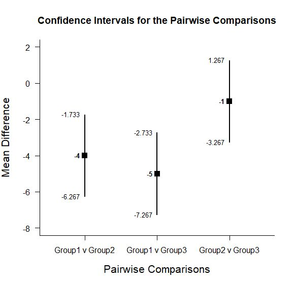
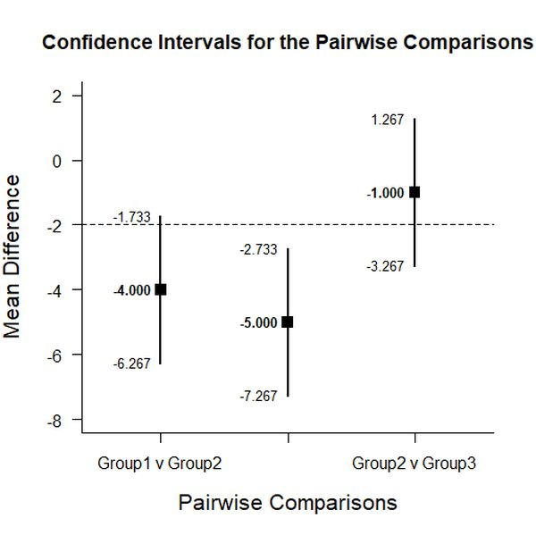

# Estimation Approach to Statistical Inference (EASI)

[**Home**](https://github.com/cwendorf/EASI/) | 
[**Functions**](https://github.com/cwendorf/EASI/tree/master/A-Functions) | 
[**Basic Examples**](https://github.com/cwendorf/EASI/tree/master/B-BasicExamples) | 
[**ITNS Examples**](https://github.com/cwendorf/EASI/tree/master/C-ITNSExamples) | 
[**Extensions**](https://github.com/cwendorf/EASI/tree/master/D-Extensions) | 
[**Extension Examples**](https://github.com/cwendorf/EASI/tree/master/E-ExtensionExamples) 

---

## Extended Between-Subjects Summary Example

### Source the EASI Functions and Extensions

```r
source("http://raw.githubusercontent.com/cwendorf/EASI/master/A-Functions/ALL-EASI-FUNCTIONS.R")
source("http://raw.githubusercontent.com/cwendorf/EASI/master/D-Extensions/ALL-EASI-EXTENSIONS.R")
```

### Three Group Example Summary Statistics

```r
Group1 <- c(N=3,M=4,SD=1)
Group2 <- c(N=3,M=8,SD=1)
Group3 <- c(N=3,M=9,SD=1)
sumstats <- rbind(Group1,Group2,Group3)
class(sumstats) <- "bss"
sumstats
```
```
       N M SD
Group1 3 4  1
Group2 3 8  1
Group3 3 9  1
attr(,"class")
[1] "bss"
```

### Analyses of Pairwise Group Comparisons

This section produces analyses that are equivalent to unadjusted t tests.

#### Confidence Intervals for the Pairwise Comparisons

```r
estimatePairwise(sumstats)
```
```
CONFIDENCE INTERVALS FOR THE PAIRWISE COMPARISONS

                Diff    SE df     LL     UL
Group1 v Group2   -4 0.816  4 -6.267 -1.733
Group1 v Group3   -5 0.816  4 -7.267 -2.733
Group2 v Group3   -1 0.816  4 -3.267  1.267
```
```r
estimatePairwise(sumstats,conf.level=.99)
```

#### Plots of the Confidence Intervals for the Pairwise Comparisons

```r
plotPairwise(sumstats)
```
<kbd></kbd>
```r
plotPairwise(sumstats,mu=-2,conf.level=.99)
```
<kbd></kbd>

#### Significance Tests of the Pairwise Comparisons

```r
testPairwise(sumstats)
```
```
HYPOTHESIS TESTS FOR THE PAIRWISE COMPARISONS

                Diff    SE      t df     p
Group1 v Group2   -4 0.816 -4.899  4 0.008
Group1 v Group3   -5 0.816 -6.124  4 0.004
Group2 v Group3   -1 0.816 -1.225  4 0.288
```
```r
testPairwise(sumstats,mu=-2)
```

#### Effect Sizes for the Pairwise Comparisons

```r
standardizePairwise(sumstats)
```
```
CONFIDENCE INTERVALS FOR THE STANDARDIZED PAIRWISE COMPARISONS

                Est    SE     LL     UL
Group1 v Group2  -4 1.732 -7.395 -0.605
Group1 v Group3  -5 2.031 -8.981 -1.019
Group2 v Group3  -1 1.061 -3.079  1.079
```
```r
standardizePairwise(sumstats,conf.level=.99)
```
