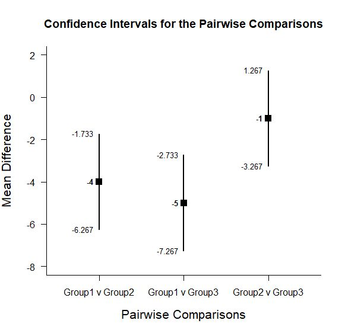
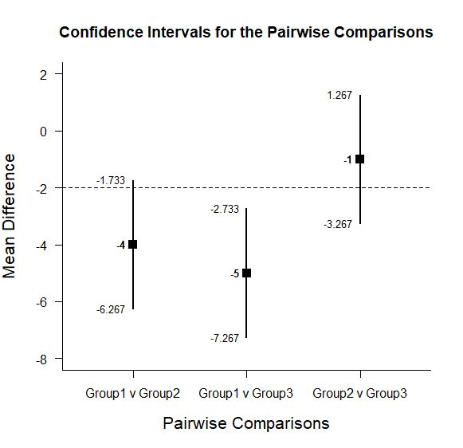
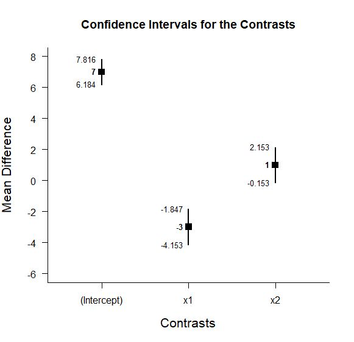

# Estimation Approach to Statistical Inference (EASI)

[**Home**](https://github.com/cwendorf/EASI/) | 
[**Functions**](https://github.com/cwendorf/EASI/tree/master/A-Functions) | 
[**Basic Examples**](https://github.com/cwendorf/EASI/tree/master/B-BasicExamples) | 
[**ITNS Examples**](https://github.com/cwendorf/EASI/tree/master/C-ITNSExamples) | 
[**Extensions**](https://github.com/cwendorf/EASI/tree/master/D-Extensions) | 
[**Extension Examples**](https://github.com/cwendorf/EASI/tree/master/E-ExtensionExamples) 

---

## Extended Between-Subjects Example

### Three Group Example Data

```r
Group <- c(rep("Group1",3),rep("Group2",3),rep("Group3",3))
Outcome <- c(3,4,5,7,8,9,8,9,10)
Group <- factor(Group)

mydata <- data.frame(Group,Outcome)
mydata
```
```
   Group Outcome
1 Group1       3
2 Group1       4
3 Group1       5
4 Group2       7
5 Group2       8
6 Group2       9
7 Group3       8
8 Group3       9
9 Group3      10
```

### Analyses of Pairwise Group Comparisons

This section produces analyses that are equivalent to uncorrected t tests.

#### Confidence Intervals for the Pairwise Comparisons

```r
estimatePairwise(Outcome~Group)
```
```
CONFIDENCE INTERVALS FOR THE PAIRWISE COMPARISONS

                Diff    SE df     LL     UL
Group1 v Group2   -4 0.816  4 -6.267 -1.733
Group1 v Group3   -5 0.816  4 -7.267 -2.733
Group2 v Group3   -1 0.816  4 -3.267  1.267
```
```r
estimatePairwise(Outcome~Group,conf.level=.99)
```

#### Plots of the Confidence Intervals for the Pairwise Comparisons

```r
plotPairwise(Outcome~Group)
```
<kbd></kbd>
```r
plotPairwise(Outcome~Group,mu=-2,conf.level=.99)
```
<kbd></kbd>

#### Significance Tests of the Pairwise Comparisons

```r
testPairwise(Outcome~Group)
```
```
HYPOTHESIS TESTS FOR THE PAIRWISE COMPARISONS

                Diff    SE      t df     p
Group1 v Group2   -4 0.816 -4.899  4 0.008
Group1 v Group3   -5 0.816 -6.124  4 0.004
Group2 v Group3   -1 0.816 -1.225  4 0.288
```
```r
testPairwise(Outcome~Group,mu=-2)
```

#### Effect Sizes for the Pairwise Comparisons

```r
effectPairwise(Outcome~Group)
```
```
STANDARDIZED MEAN DIFFERENCES FOR THE PAIRWISE COMPARISONS

                 d      g      LL     UL
Group1 v Group2 -4 -3.192  -9.861 -1.398
Group1 v Group3 -5 -3.989 -12.033 -1.979
Group2 v Group3 -1 -0.798  -3.872  0.981
```
```r
effectPairwise(Outcome~Group,conf.level=.99)
```

### Analyses of Sets of Group Contrasts

This section produces analyses that are equivalent to dummy, effect, and other sets of codes.

#### Estimate, Plot, and Test a Set of Contrasts

For all sets of contrasts, the default are sum contrasts -- comparisons of levels to grand mean.

```r
estimateContrasts(Outcome~Group)
```
```
CONFIDENCE INTERVALS FOR THE CONTRASTS

            Est    SE     LL     UL
(Intercept)   7 0.333  6.184  7.816
x1           -3 0.471 -4.153 -1.847
x2            1 0.471 -0.153  2.153
```
```r
plotContrasts(Outcome~Group)
```
<kbd></kbd>
```r
testContrasts(Outcome~Group)
```
```
HYPOTHESIS TESTS FOR THE CONTRASTS

            Diff    SE      t     p
(Intercept)    7 0.333 21.000 0.000
x1            -3 0.471 -6.364 0.001
x2             1 0.471  2.121 0.078
```

#### Other Standard Sets of Contrasts can be Specified

```r
estimateContrasts(Outcome~Group,contrasts=contr.sum)
plotContrasts(Outcome~Group,contrasts=contr.sum)
testContrasts(Outcome~Group,contrasts=contr.sum)
```
```r
estimateContrasts(Outcome~Group,contrasts=contr.treatment)
plotContrasts(Outcome~Group,contrasts=contr.treatment)
testContrasts(Outcome~Group,contrasts=contr.treatment)
```
```r
estimateContrasts(Outcome~Group,contrasts=contr.poly)
plotContrasts(Outcome~Group,contrasts=contr.poly)
testContrasts(Outcome~Group,contrasts=contr.poly)
```
```r
estimateContrasts(Outcome~Group,contrasts=contr.helmert)
plotContrasts(Outcome~Group,contrasts=contr.helmert)
testContrasts(Outcome~Group,contrasts=contr.helmert)
```
```r
estimateContrasts(Outcome~Group,contrasts=contr.SAS)
plotContrasts(Outcome~Group,contrasts=contr.SAS)
testContrasts(Outcome~Group,contrasts=contr.SAS)
```
