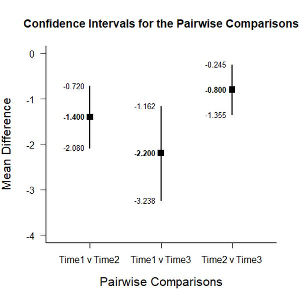

# Estimation Approach to Statistical Inference (EASI)

[**Home**](https://github.com/cwendorf/EASI/) | 
[**Functions**](https://github.com/cwendorf/EASI/tree/master/A-Functions) | 
[**Basic Examples**](https://github.com/cwendorf/EASI/tree/master/B-BasicExamples) | 
[**ITNS Examples**](https://github.com/cwendorf/EASI/tree/master/C-ITNSExamples) | 
[**Extensions**](https://github.com/cwendorf/EASI/tree/master/D-Extensions) | 
[**Extension Examples**](https://github.com/cwendorf/EASI/tree/master/E-ExtensionExamples) 

---

## Extended Within-Subjects Summary Example

### Source the EASI Functions and Extensions

```r
source("http://raw.githubusercontent.com/cwendorf/EASI/master/A-Functions/ALL_EASI_FUNCTIONS.R")
source("http://raw.githubusercontent.com/cwendorf/EASI/master/D-Extensions/ALL_EASI_EXTENSIONS.R")
```

### Three Time Period Example Summary Statistics

```r
Time1 <- c(N=5,M=6.4,SD=1.14)
Time2 <- c(N=5,M=7.8,SD=.837)
Time3 <- c(N=5,M=8.6,SD=.548)
sumstats <- rbind(Time1,Time2,Time3)
class(sumstats) <- "wss"
sumstats
```
```
      N   M    SD
Time1 5 6.4 1.140
Time2 5 7.8 0.837
Time3 5 8.6 0.548
attr(,"class")
[1] "wss"
```
```r
corrstats <- declareCorrMatrix("Time1","Time2","Time3")
corrstats["Time1","Time2"] <- .891
corrstats["Time1","Time3"] <- .721
corrstats["Time2","Time3"] <- .873
corrstats <- fillCorrMatrix(corrstats)
corrstats
```
```
      Time1 Time2 Time3
Time1 1.000 0.891 0.721
Time2 0.891 1.000 0.873
Time3 0.721 0.873 1.000
```

### Analyses of Pairwise Variable Comparisons

This section produces analyses that are equivalent to unadjusted t tests.

#### Confidence Intervals for the Pairwise Comparisons

```r
estimatePairwise(sumstats,corrstats)
```
```
CONFIDENCE INTERVALS FOR THE PAIRWISE COMPARISONS

              Diff    SE df     LL     UL
Time1 v Time2 -1.4 0.245  4 -2.080 -0.720
Time1 v Time3 -2.2 0.374  4 -3.239 -1.161
Time2 v Time3 -0.8 0.200  4 -1.355 -0.245
```
```r
estimatePairwise(sumstats,corrstats,conf.level=.99)
```

#### Plots of the Confidence Intervals for the Pairwise Comparisons

```r
plotPairwise(sumstats,corrstats)
```
<kbd></kbd>
```r
plotPairwise(sumstats,corrstats,mu=-2,conf.level=.99)
```
<kbd></kbd>

#### Significance Tests of the Pairwise Comparisons

```r
testPairwise(sumstats,corrstats)
```
```
HYPOTHESIS TESTS FOR THE PAIRWISE COMPARISONS

              Diff    SE      t df     p
Time1 v Time2 -1.4 0.245 -5.715  4 0.005
Time1 v Time3 -2.2 0.374 -5.880  4 0.004
Time2 v Time3 -0.8 0.200 -4.000  4 0.016
```
```r
testPairwise(sumstats,corrstats,mu=-2)
```

#### Effect Sizes for the Pairwise Comparisons

```r
effectPairwise(sumstats,corrstats)
```
```
STANDARDIZED MEAN DIFFERENCES FOR THE PAIRWISE COMPARISONS

                   d      g     LL     UL
Time1 v Time2 -1.400 -1.264 -2.566 -0.735
Time1 v Time3 -2.460 -2.220 -4.468 -1.326
Time2 v Time3 -1.131 -1.021 -2.153 -0.524
```
```r
effectPairwise(sumstats,corrstats,conf.level=.99)
```
