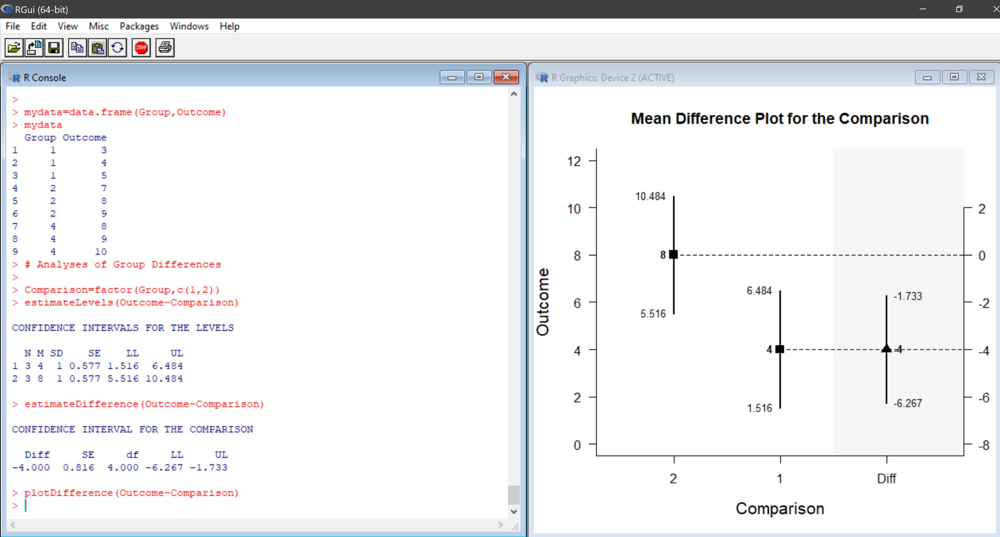

# EASI (Estimation Approach to Statistical Inference)

EASI is a set of fast and simple scripts for R that calculate, test, and plot confidence intervals for means and standardized effect sizes, the later of which are not available in most commercially available statistical software. Functions and examples are available for different designs (between-subjects vs. within-subjects). All scripts and examples are updated frequently.

------

### Overview of EASI

- EASI is designed to provide quick calculation of basic statistics.
- EASI emphasizes effect sizes and confidence intervals (and not NHST).
- EASI calculates statistics not readily available in other statistics packages.

### For Means and Mean Differences

- Confidence intervals are based on the central t distribution.
- Confidence intervals are calculated independent of each other (they are not simultaneous).
- No adjustments for multiple intervals have been made.

### For Standardized Effect Sizes

- Both Cohen's d and Hedge's g are presented.
- Confidence intervals are centered on g.
- Confidence intervals are based on the noncentral t distribution.

------

