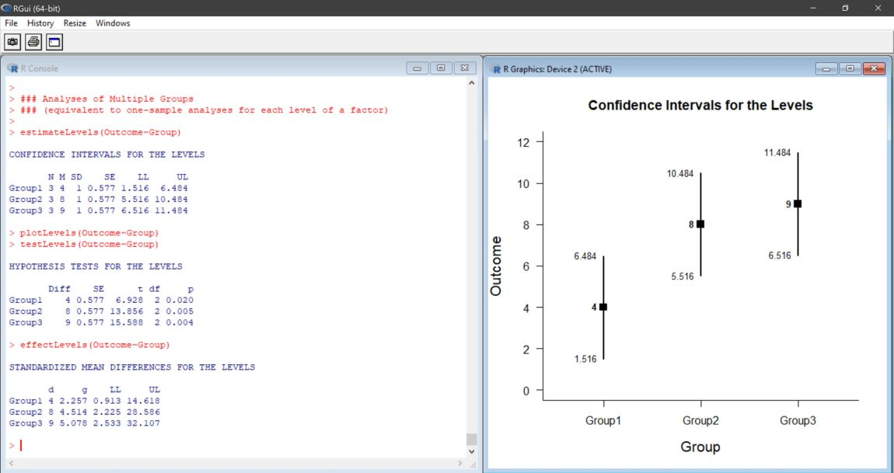
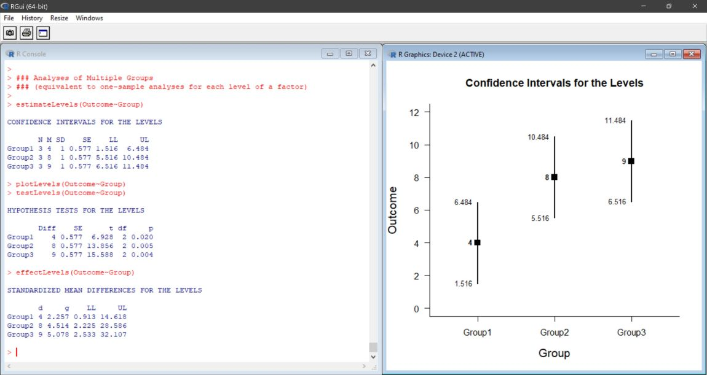

# Estimation Approach to Statistical Inference (EASI)

**[Overview of EASI](#overview-of-easi)** | **[Functions and Examples](#functions-and-examples-on-this-site)** | **[How to Cite](#how-to-cite-easi)**

---

## Overview of EASI

EASI is a set of fast and simple scripts for R that implement basic features of [estimation statistics](https://en.wikipedia.org/wiki/Estimation_statistics "Estimation Stats on Wikipedia"). These scripts calculate, test, and plot confidence intervals for means and standardized effect sizes. All scripts and examples are updated frequently.

### EASI for Individual Groups and Variables

EASI can be used to calculate and plot confidence intervals for the means of groups (in a between-subjects design) or instances of a variable (in a within-subjects design). Additional functions can show the standardized effect sizes and statistical significance tests associated with the groups and variables.

### EASI for Group and Variable Comparisons

EASI can be used to calculate and plot confidence intervals of mean differences and mean contrasts for independent groups (between-subjects design) or paired means (within-subjects designs). Additional functions can show the standardized effect sizes and statistical significance tests for the designated comparison. 

## Functions and Examples on this Site

This site includes the basic function scripts and extensions of EASI, along with numerous example showing how to use the scripts.

- [**A-Functions**](./A-Functions): Contains the basic functions to be "installed" in R in order to run the analyses
- [**B-BasicExamples**](./B-BasicExamples): Contains between-subjects and within-subjects examples that highlight the functions
- [**ITNSExamples**](./C-ITNSExamples): Contains between-subjects and within-subjects examples from the book _Introduction to the New Statistics_
- [**D-Extensions**](./D-Extensions): Contains additional functions that can be "installed" to add options
- [**E-ExtensionExamples**](./E-ExtensionExamples): Contains between-subjects and within-subjects examples of the extensions

## How to Cite EASI

Wendorf, C.A. (2019). _An Estimation Approach to Statistical Inference (EASI)._ Software available GitHub at https://github.com/cwendorf/EASI.
