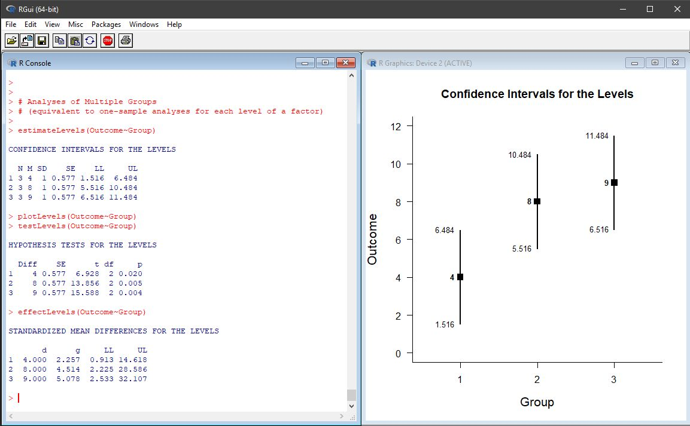
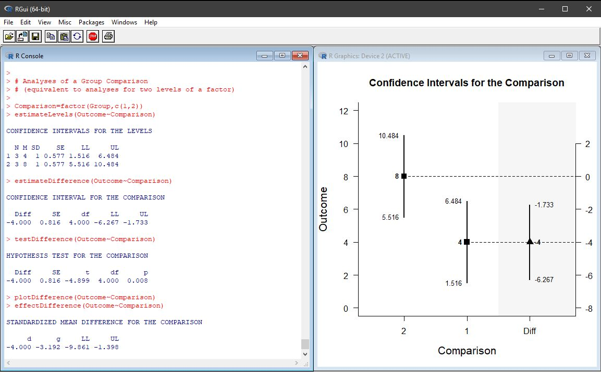

# Estimation Approach to Statistical Inference (EASI)

## Overview of EASI

EASI is a set of fast and simple scripts for R that implement basic features of [estimation statistics](https://en.wikipedia.org/wiki/Estimation_statistics "Estimation Stats on Wikipedia"). These scripts calculate, test, and plot confidence intervals for means and standardized effect sizes. All scripts and examples are updated frequently.

### EASI for Individual Groups and Variables

EASI can be used to calculate and plot confidence intervals for the means of groups (in a between-subjects design) or variables (in a within-subjects design). Additional functions can show the basic descriptive statistics and the standardized effect sizes associated with the groups and variables.

### EASI for Group and Variable Comparisons

EASI can be used to calculate and plot confidence intervals of mean differences for independent groups (between-subjects design) or paired means (within-subjects designs). Additional functions can show the basic desriptive statistics and standardized effect sizes for the designated comparison. 

## How to Cite these Scripts

Wendorf, C.A. (2019). _An Estimation Approach to Statistical Inference (EASI)._ Software available GitHub at https://github.com/cwendorf/EASI.
