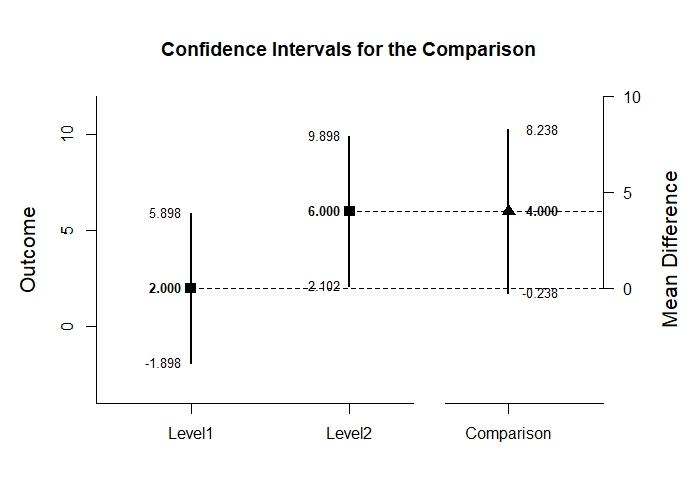

# 

## Estimation Approach to Statistical Inference

---

### Overview

The EASI functions were written to represent four basic categories of analyses:

- _estimate_ (`estimateMeans`,`estimateDifference`, and `estimateContrast` functions that estimate confidence intervals for means, mean differences, and contrasts respectively)
- _plot_ (`plotMeans`, `plotDifference`, and `plotContrast` functions that plot confidence intervals for means, mean differences, and contrasts respectively)
- _test_ (`testMeans`, `testDifference`, and `testContrast` functions that calculate NHST for means, mean differences, and contrasts respectively)
- _standardize_ (`standardizeMeans`, `standardizeDifference`, and `standardizeContrast` functions that calculate confidence intervals for standardized effect sizes for individual means, mean differences, and contrasts respectively)

### Installation

This package is not currently on CRAN, but can be installed directly from this repository.

``` r
install.packages("devtools")
devtools::install_github("cwendorf/EASI",build=FALSE)
library(EASI)
```

### Usage

For a simple two-group study, the four categories of functions can be called as follows:

```r
# Load and Attach Independent Sample Data for Use
data(IndependentData)
attach(IndependentData)
```

```r
# Estimate Means and Confidence Intervals for the Levels of the Factor
estimateMeans(Outcome~Factor)
#> 
#> CONFIDENCE INTERVALS FOR THE MEANS
#> 
#>              N       M      SD      SE      LL      UL
#> Level1   4.000   2.000   2.449   1.225  -1.898   5.898
#> Level2   4.000   6.000   2.449   1.225   2.102   9.898
#> 
# Estimate the Mean Difference and Its Confidence Interval
estimateDifference(Outcome~Factor)
#> 
#> CONFIDENCE INTERVAL FOR THE COMPARISON
#> 
#>               Diff      SE      df      LL      UL
#> Comparison   4.000   1.732   6.000  -0.238   8.238
#> 
```

```r
# Plot the Means, Mean Difference, and Associated Confidence Intervals
plotDifference(Outcome~Factor)
```
<kbd></kbd>

```r
# Conduct NHST on the Mean Difference
testDifference(Outcome~Factor)
#> 
#> HYPOTHESIS TEST FOR THE COMPARISON
#> 
#>               Diff      SE       t      df       p
#> Comparison   4.000   1.732   2.309   6.000   0.060
#> 
```

```r
# Calculate Cohen's d and Its Confidence Interval
standardizeDifference(Outcome~Factor)
#> 
#> CONFIDENCE INTERVAL FOR THE STANDARDIZED COMPARISON
#> 
#>                Est      SE      LL      UL
#> Comparison   1.633   0.943  -0.215   3.481
#> 
```

Complete examples of all functions are available here:  
[https://cwendorf.github.io/EASI/](https://cwendorf.github.io/EASI/)

### Getting Help

If you have any issues, please post a minimal reproducible example here on [github](https://github.com/cwendorf/EASI-R/issues). For other correspondence, contact me at [cwendorf@uwsp.edu](mailto:cwendorf@uwsp.edu).
