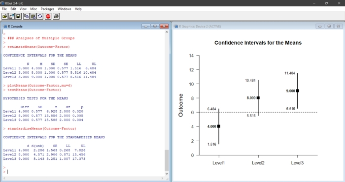
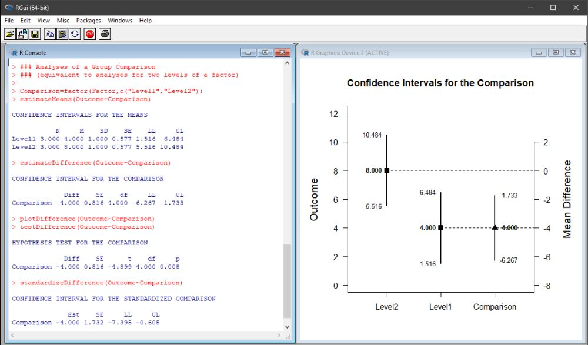

# Estimation Approach to Stastical Inference

[**Home**](EASI/) | 
[**Functions**](./A-Functions) | 
[**Tutorials**](./B-Tutorials) | 
[**Examples**](./C-Examples) | 
[**Advanced**](./D-Advanced)

---

## Overview of EASI

EASI is a set of fast and flexible scripts for R that implement features of [estimation statistics](https://en.wikipedia.org/wiki/Estimation_statistics "Estimation Stats on Wikipedia"). These functions calculate, test, and plot confidence intervals for means, mean comparisons, and standardized effect sizes. Functions and extensions are available for different single-factor between- and within-subjects single-factor, factorial, and mixed designs and can take either raw data or summary statistics as input. Numerous tutorials and other examples from textbooks are available.

### EASI for Individual Groups and Variables

EASI can be used to calculate and plot confidence intervals for the means of groups (in a between-subjects design) or instances of a variable (in a within-subjects design). Additional functions can show the standardized effect sizes and statistical significance tests associated with the groups and variables.

### EASI for Group and Variable Comparisons

EASI can be used to calculate and plot confidence intervals of mean differences and mean contrasts for independent groups (between-subjects design) or paired means (within-subjects designs). Additional functions can show the standardized effect sizes and statistical significance tests for the designated comparison. 

## Materials Available on this Site

This site includes the basic functions and extensions of EASI, along with numerous example showing how to use the functions.

- [**Functions**](./A-Functions): Contains the basic functions and extensions that can be "installed" in R in order to run the analyses
- [**Tutorials**](./B-Tutorials): Contains between-subjects and within-subjects tutorials that highlight the basic functions
- [**Examples**](./C-Examples): Contains between-subjects and within-subjects examples from the book _Introduction to the New Statistics_
- [**Advanced**](./D-Advanced): Contains advanced applications and additional examples of the functions and extensions

## How to Cite

Wendorf, C.A. (2019). _EASI: Estimation Approach to Statistical Inference_ [R Code]. [https://cwendorf.github.io/EASI/](https://cwendorf.github.io/EASI/)
