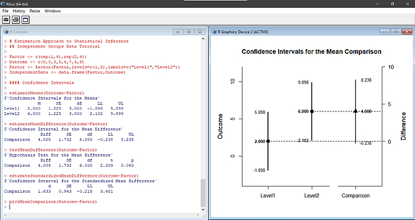

<a href="https://github.com/cwendorf/EASI/">

</a>

## Estimation Approach to Statistical Inference

[](https://cran.r-project.org/)
[](https://opensource.org/licenses/MIT)

### Overview

[**EASI**](https://github.com/cwendorf/EASI) is an R package that implements features of estimation statistics and data visualization. Its primary functions describe, estimate, test, and plot confidence intervals for means, mean comparisons, correlations, and standardized effect sizes in between- and within-subjects single-factor, factorial, and mixed designs. Additional functions offer summaries and plots of data, frequencies, densities, and more. Most functions can take either raw data or summary statistics as input.

<a href="https://github.com/cwendorf/EASI">
<p align="center"><kbd></kbd></p>
</a>

### Installation

This package is not currently on CRAN, but the latest version can be installed from GitHub:

``` r
install.packages("devtools")
devtools::install_github("cwendorf/EASI")
library(EASI)
```

If you do not wish a full install, the latest functions can be sourced directly from GitHub:

```r
source("http://raw.githubusercontent.com/cwendorf/EASI/main/source-EASI.R")
```

### Usage

The package includes a wide variety of documentation, tutorials, and examples that demonstrate its use:

- [Quick Start Guide](./docs) - Overview and summary of the basic functions
- [Tutorials from the Sourcebook](./docs/tutorials) - Vingettes with tutorial data that show the diversity of basic options 
- [Examples from ITNS](./docs/examples) - Reanalyses of published textbook examples highlighting the estimation approach 
- [Advanced Applications](./docs/applications) - Advanced and experimental applications of the package

### Contact Me

- GitHub Issues: [https://github.com/cwendorf/EASI/issues](https://github.com/cwendorf/EASI/issues) 
- Author Email: [cwendorf@uwsp.edu](mailto:cwendorf@uwsp.edu)
- Author Homepage: [https://cwendorf.github.io](https://cwendorf.github.io)

### Citation

Wendorf, C. A. (2019). _EASI: Estimation Approach to Statistical Inference_ [R Package]. [https://github.com/cwendorf/EASI](https://github.com/cwendorf/EASI)
