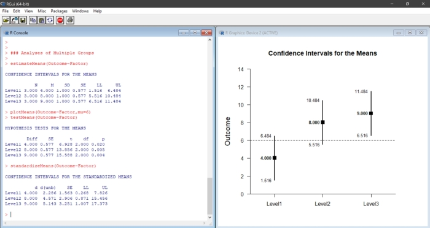
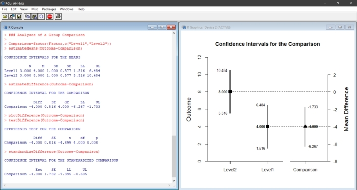

# Estimation Approach to Statistical Inference (EASI)

[**Home**](https://github.com/cwendorf/EASI/) | 
[**Functions**](https://github.com/cwendorf/EASI/tree/master/A-Functions) | 
[**Tutorial Examples**](https://github.com/cwendorf/EASI/tree/master/B-TutorialExamples) | 
[**ITNS Examples**](https://github.com/cwendorf/EASI/tree/master/C-ITNSExamples) | 
[**Extension Examples**](https://github.com/cwendorf/EASI/tree/master/D-ExtensionExamples)

---

## Overview of EASI

EASI is a set of fast and simple functions for R that implement basic features of [estimation statistics](https://en.wikipedia.org/wiki/Estimation_statistics "Estimation Stats on Wikipedia"). These functions calculate, test, and plot confidence intervals for means, mean comparisons, and standardized effect sizes. Functions and examples are available for different single-factor designs (between-subjects vs. within-subjects) and can take either raw data or summary statistics as input.

### EASI for Individual Groups and Variables

EASI can be used to calculate and plot confidence intervals for the means of groups (in a between-subjects design) or instances of a variable (in a within-subjects design). Additional functions can show the standardized effect sizes and statistical significance tests associated with the groups and variables.

### EASI for Group and Variable Comparisons

EASI can be used to calculate and plot confidence intervals of mean differences and mean contrasts for independent groups (between-subjects design) or paired means (within-subjects designs). Additional functions can show the standardized effect sizes and statistical significance tests for the designated comparison. 

## Materials Available on this Site

This site includes the basic functions and extensions of EASI, along with numerous example showing how to use the functions.

- [**Functions**](./A-Functions): Contains the basic functions and extensions that can be "installed" in R in order to run the analyses
- [**Tutorial Examples**](./B-TutorialExamples): Contains between-subjects and within-subjects examples that highlight the functions and examples
- [**ITNS Examples**](./C-ITNSExamples): Contains between-subjects and within-subjects examples from the book _Introduction to the New Statistics_
- [**Extension Examples**](./D-ExtensionExamples): Contains advanced applications and additional examples of the functions and extensions

## How to Cite EASI

Wendorf, C.A. (2019). _An Estimation Approach to Statistical Inference (EASI)._ Software available via GitHub at https://github.com/cwendorf/EASI.
