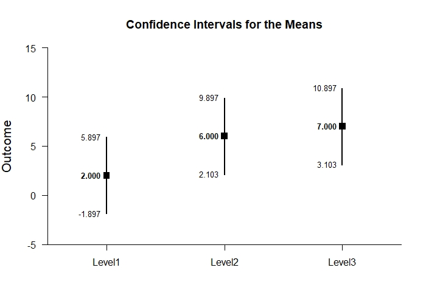
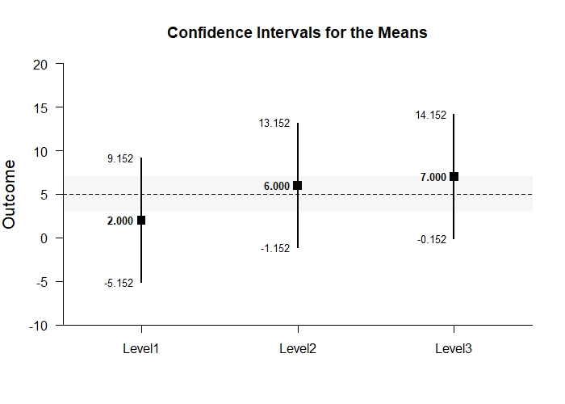
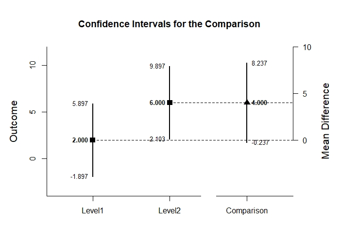
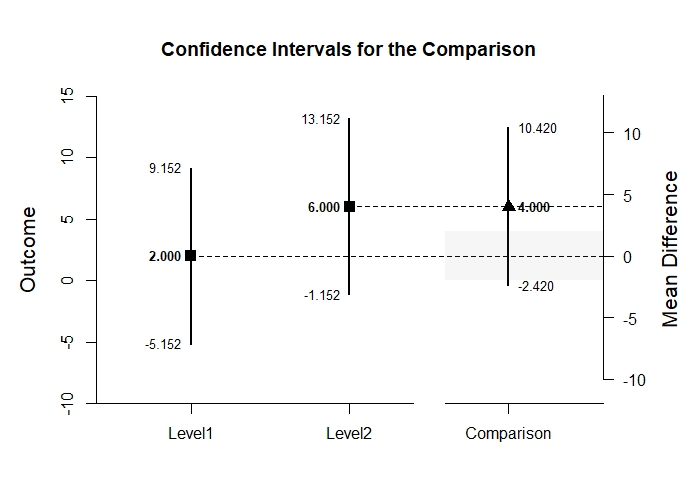
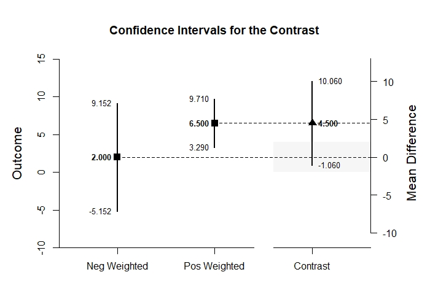

# Estimation Approach to Statistical Inference

[**Functions**](../../Functions) | 
[**Tutorials**](../../Tutorials) | 
[**Examples**](../../Examples) | 
[**Advanced**](../../Advanced)

---

## Analyze - OneWay (Between-Subjects) Tutorial with Data

### Enter Data

```r
Factor <- c(rep(1,4),rep(2,4),rep(3,4))
Outcome <- c(0,0,3,5,4,7,4,9,9,6,4,9)
Factor <- factor(Factor,levels=c(1,2,3),labels=c("Level1","Level2","Level3"))
OneWayData <- data.frame(Factor,Outcome)
OneWayData
```
```
   Factor Outcome
1  Level1       0
2  Level1       0
3  Level1       3
4  Level1       5
5  Level2       4
6  Level2       7
7  Level2       4
8  Level2       9
9  Level3       9
10 Level3       6
11 Level3       4
12 Level3       9
```

### Analyses of Multiple Groups

```r
analyzeMeans(Outcome~Factor)
```
```
$title
[1] "ANALYSIS OF MEANS"

$estimateMeans
           N     M    SD    SE     LL     UL
Level1 4.000 2.000 2.449 1.224 -1.897  5.897
Level2 4.000 6.000 2.449 1.224  2.103  9.897
Level3 4.000 7.000 2.449 1.224  3.103 10.897

$testMeans
        Diff    SE     t    df     p
Level1 2.000 1.224 1.633 3.000 0.201
Level2 6.000 1.224 4.900 3.000 0.016
Level3 7.000 1.224 5.717 3.000 0.011

$standardizeMeans
           d d(unb)    SE     LL    UL
Level1 0.817  0.594 0.616 -0.387 1.934
Level2 2.450  1.782 0.955  0.325 4.532
Level3 2.858  2.079 1.063  0.464 5.227
```
<kbd></kbd>

```r
analyzeMeans(Outcome~Factor,mu=5,conf.level=.99)
```
```
$title
[1] "ANALYSIS OF MEANS"

$estimateMeans
           N     M    SD    SE     LL     UL
Level1 4.000 2.000 2.449 1.224 -5.152  9.152
Level2 4.000 6.000 2.449 1.224 -1.152 13.152
Level3 4.000 7.000 2.449 1.224 -0.152 14.152

$testMeans
         Diff    SE      t    df     p
Level1 -3.000 1.224 -2.450 3.000 0.092
Level2  1.000 1.224  0.817 3.000 0.474
Level3  2.000 1.224  1.633 3.000 0.201

$standardizeMeans
            d d(unb)    SE     LL    UL
Level1 -1.225 -0.891 0.680 -3.011 0.547
Level2  0.408  0.297 0.574 -0.968 1.734
Level3  0.817  0.594 0.616 -0.732 2.320
```
<kbd></kbd>

### Analyses of a Group Comparison

```r
Comparison=factor(Factor,c("Level1","Level2"))
analyzeDifference(Outcome~Comparison)
```
```
$title
[1] "ANALYSIS OF A DIFFERENCE"

$estimateDifference
            Diff    SE    df     LL    UL
Comparison 4.000 1.732 6.000 -0.237 8.237

$testDifference
            Diff    SE     t    df     p
Comparison 4.000 1.732 2.310 6.000 0.060

$standardizeDifference
             Est    SE     LL    UL
Comparison 1.633 0.943 -0.215 3.481
```
<kbd></kbd>

```r
analyzeDifference(Outcome~Comparison,mu=-2,conf.level=.99,rope=c(-2,2))
```
```
$title
[1] "ANALYSIS OF A DIFFERENCE"

$estimateDifference
            Diff    SE    df     LL     UL
Comparison 4.000 1.732 6.000 -2.420 10.420

$testDifference
            Diff    SE     t    df     p
Comparison 6.000 1.732 3.465 6.000 0.013

$standardizeDifference
             Est    SE     LL    UL
Comparison 1.633 0.943 -0.795 4.062
```
<kbd></kbd>

### Analyses of a Group Contrast

```r
L1vsOthers <- c(-1,.5,.5)
analyzeContrast(Outcome~Factor,contrast=L1vsOthers)
```
```
$title
[1] "ANALYSIS OF A CONTRAST"

$estimateContrast
           Est    SE    df    LL    UL
Contrast 4.500 1.500 6.000 0.830 8.170

$testContrast
           Est    SE     t    df     p
Contrast 4.500 1.500 3.001 6.000 0.024

$standardizeContrast
           Est    SE    LL    UL
Contrast 1.837 0.829 0.212 3.463
```
<kbd></kbd>

```r
analyzeContrast(Outcome~Factor,contrast=L1vsOthers,mu=4,conf.level=.99,rope=c(-2,2))
```
```
$title
[1] "ANALYSIS OF A CONTRAST"

$estimateContrast
           Est    SE    df     LL     UL
Contrast 4.500 1.500 6.000 -1.060 10.060

$testContrast
           Est    SE     t    df     p
Contrast 0.500 1.500 0.333 6.000 0.750

$standardizeContrast
           Est    SE     LL    UL
Contrast 1.837 0.829 -0.298 3.973
```
<kbd></kbd>
