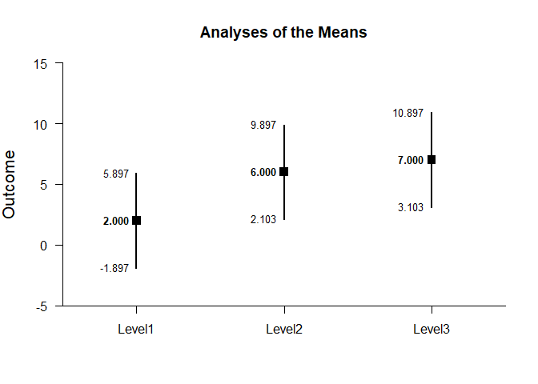
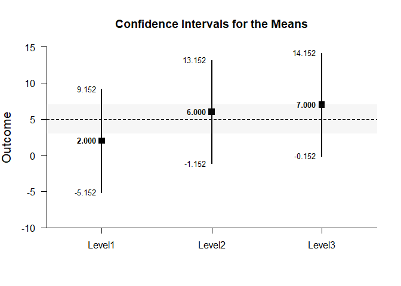
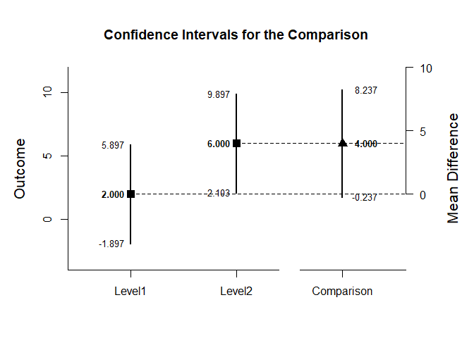
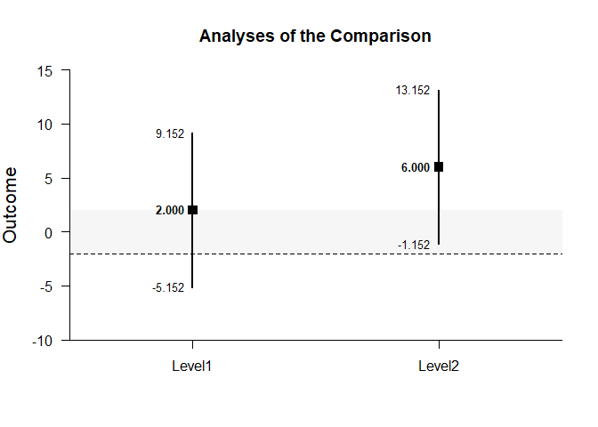
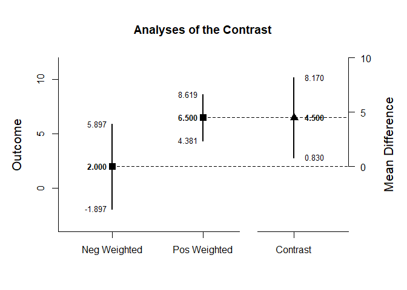
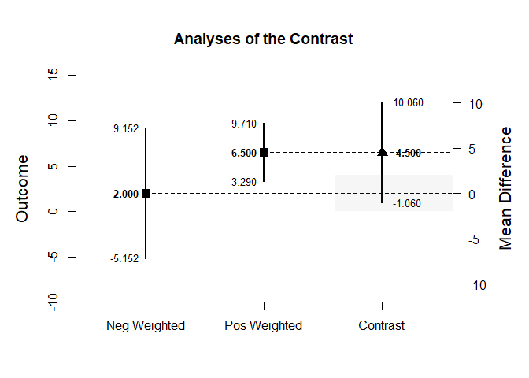

## Analyze - OneWay (Between-Subjects) Tutorial with Data

### Enter Data


```r
Factor <- c(rep(1,4),rep(2,4),rep(3,4))
Outcome <- c(0,0,3,5,4,7,4,9,9,6,4,9)
Factor <- factor(Factor,levels=c(1,2,3),labels=c("Level1","Level2","Level3"))
OneWayData <- data.frame(Factor,Outcome)
```

### Analyses of Multiple Groups


```r
analyzeMeans(Outcome~Factor)
```

```
## Analyses of the Means 
## 
## $`Confidence Intervals for the Means`
##              N       M      SD      SE      LL      UL
## Level1   4.000   2.000   2.449   1.225  -1.898   5.898
## Level2   4.000   6.000   2.449   1.225   2.102   9.898
## Level3   4.000   7.000   2.449   1.225   3.102  10.898
## 
## $`Hypothesis Tests for the Means`
##           Diff      SE       t      df       p
## Level1   2.000   1.225   1.633   3.000   0.201
## Level2   6.000   1.225   4.899   3.000   0.016
## Level3   7.000   1.225   5.715   3.000   0.011
## 
## $`Confidence Intervals for the Standardized Means`
##              d  d.unb.      SE      LL      UL
## Level1   0.816   0.594   0.616  -0.387   1.934
## Level2   2.449   1.781   0.955   0.325   4.531
## Level3   2.858   2.078   1.063   0.464   5.226
```

<!-- -->


```r
analyzeMeans(Outcome~Factor,mu=5,conf.level=.99,rope=c(3,7))
```

```
## Analyses of the Means 
## 
## $`Confidence Intervals for the Means`
##              N       M      SD      SE      LL      UL
## Level1   4.000   2.000   2.449   1.225  -5.154   9.154
## Level2   4.000   6.000   2.449   1.225  -1.154  13.154
## Level3   4.000   7.000   2.449   1.225  -0.154  14.154
## 
## $`Hypothesis Tests for the Means`
##           Diff      SE       t      df       p
## Level1  -3.000   1.225  -2.449   3.000   0.092
## Level2   1.000   1.225   0.816   3.000   0.474
## Level3   2.000   1.225   1.633   3.000   0.201
## 
## $`Confidence Intervals for the Standardized Means`
##              d  d.unb.      SE      LL      UL
## Level1  -1.225  -0.891   0.680  -3.010   0.547
## Level2   0.408   0.297   0.574  -0.969   1.734
## Level3   0.816   0.594   0.616  -0.732   2.319
```

<!-- -->

### Analyses of a Group Comparison


```r
Comparison=factor(Factor,c("Level1","Level2"))
analyzeDifference(Outcome~Comparison)
```

```
## Analyses of the Comparison 
## 
## $`Confidence Interval for the Comparison`
##               Diff      SE      df      LL      UL
## Comparison   4.000   1.732   6.000  -0.238   8.238
## 
## $`Hypothesis Test for the Comparison`
##               Diff      SE       t      df       p
## Comparison   4.000   1.732   2.309   6.000   0.060
## 
## $`Confidence Interval for the Standardized Comparison`
##                Est      SE      LL      UL
## Comparison   1.633   0.943  -0.215   3.481
```

<!-- -->


```r
analyzeDifference(Outcome~Comparison,mu=-2,conf.level=.99,rope=c(-2,2))
```

```
## Analyses of the Comparison 
## 
## $`Confidence Interval for the Comparison`
##               Diff      SE      df      LL      UL
## Comparison   4.000   1.732   6.000  -2.421  10.421
## 
## $`Hypothesis Test for the Comparison`
##               Diff      SE       t      df       p
## Comparison   6.000   1.732   3.464   6.000   0.013
## 
## $`Confidence Interval for the Standardized Comparison`
##                Est      SE      LL      UL
## Comparison   1.633   0.943  -0.796   4.062
```

<!-- -->

### Analyses of a Group Contrast


```r
L1vsOthers <- c(-1,.5,.5)
analyzeContrast(Outcome~Factor,contrast=L1vsOthers)
```

```
## Analyses of the Contrast 
## 
## $`Confidence Interval for the Contrast`
##              Est      SE      df      LL      UL
## Contrast   4.500   1.500   6.000   0.830   8.170
## 
## $`Hypothesis Test for the Contrast`
##              Est      SE       t      df       p
## Contrast   4.500   1.500   3.000   6.000   0.024
## 
## $`Confidence Interval for the Standardized Contrast`
##              Est      SE      LL      UL
## Contrast   1.837   0.829   0.212   3.462
```

<!-- -->


```r
analyzeContrast(Outcome~Factor,contrast=L1vsOthers,mu=4,conf.level=.99,rope=c(-2,2))
```

```
## Analyses of the Contrast 
## 
## $`Confidence Interval for the Contrast`
##              Est      SE      df      LL      UL
## Contrast   4.500   1.500   6.000  -1.061  10.061
## 
## $`Hypothesis Test for the Contrast`
##              Est      SE       t      df       p
## Contrast   0.500   1.500   0.333   6.000   0.750
## 
## $`Confidence Interval for the Standardized Contrast`
##              Est      SE      LL      UL
## Contrast   1.837   0.829  -0.299   3.973
```

<!-- -->
