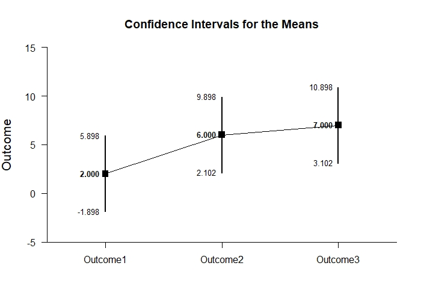
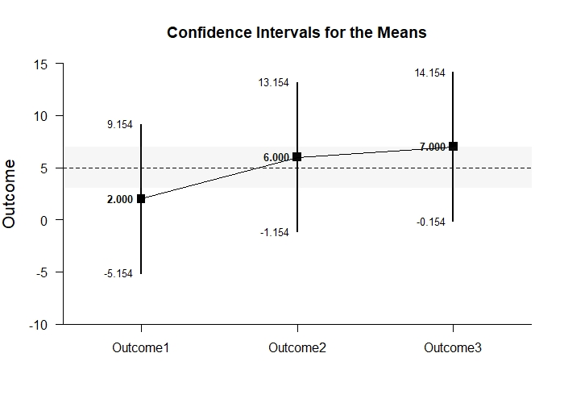
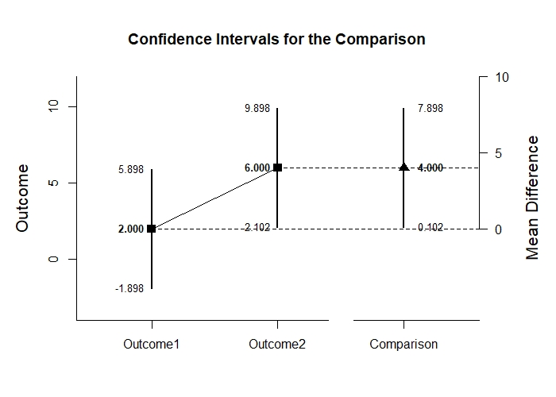
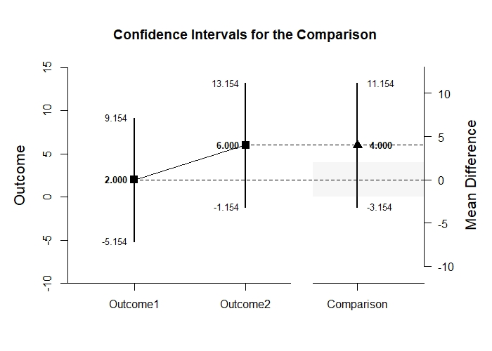
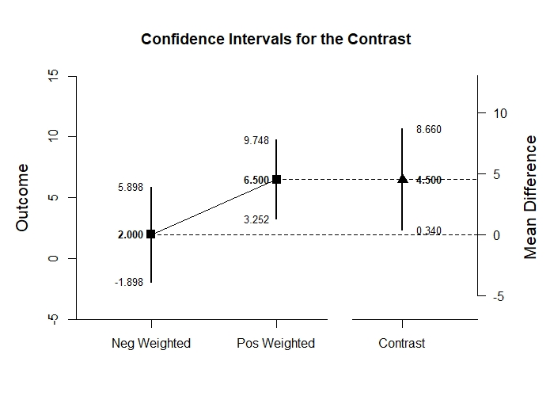
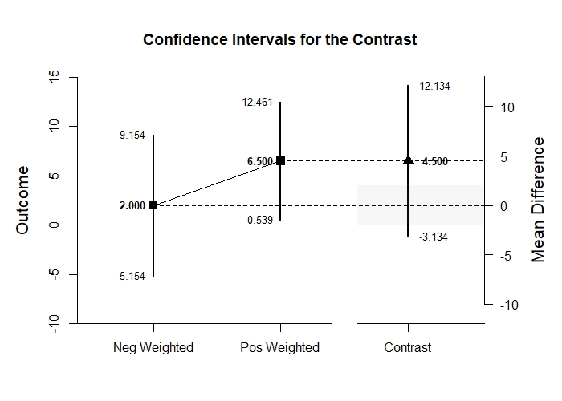

# Estimation Approach to Statistical Inference

[**Functions**](../../Functions) | 
[**Tutorials**](../../Tutorials) | 
[**Examples**](../../Examples) | 
[**Advanced**](../../Advanced)

---

## Analyze - Repeated Measures (Within-Subjects) Tutorial with Summary Statistics

### Enter Summary Statistics

```r
Outcome1 <- c(N=4,M=2.000,SD=2.449)
Outcome2 <- c(N=4,M=6.000,SD=2.449)
Outcome3 <- c(N=4,M=7.000,SD=2.449)
RepeatedSummary <- rbind(Outcome1,Outcome2,Outcome3)
class(RepeatedSummary) <- "wss"
RepeatedSummary
```
```
         N M    SD
Outcome1 4 2 2.449
Outcome2 4 6 2.449
Outcome3 4 7 2.449
attr(,"class")
[1] "wss"
```
```r
RepeatedCorr <- declareCorrMatrix("Outcome1","Outcome2","Outcome3")
RepeatedCorr["Outcome1","Outcome2"] <- .500
RepeatedCorr["Outcome1","Outcome3"] <- .056
RepeatedCorr["Outcome2","Outcome3"] <- .389
RepeatedCorr <- fillCorrMatrix(RepeatedCorr)
RepeatedCorr
```
```
         Outcome1 Outcome2 Outcome3
Outcome1    1.000    0.500    0.056
Outcome2    0.500    1.000    0.389
Outcome3    0.056    0.389    1.000
```

### Analyses of Multiple Variables

```r
analyzeMeans(RepeatedSummary)
```
```
ANALYSES OF THE MEANS

$`CONFIDENCE INTERVALS FOR THE MEANS`
               N       M      SD      SE      LL      UL
Outcome1   4.000   2.000   2.449   1.224  -1.897   5.897
Outcome2   4.000   6.000   2.449   1.224   2.103   9.897
Outcome3   4.000   7.000   2.449   1.224   3.103  10.897

$`HYPOTHESIS TESTS FOR THE MEANS`
            Diff      SE       t      df       p
Outcome1   2.000   1.224   1.633   3.000   0.201
Outcome2   6.000   1.224   4.900   3.000   0.016
Outcome3   7.000   1.224   5.717   3.000   0.011

$`CONFIDENCE INTERVALS FOR THE STANDARDIZED MEANS`
               d  d.unb.      SE      LL      UL
Outcome1   0.817   0.594   0.616  -0.387   1.934
Outcome2   2.450   1.782   0.955   0.325   4.532
Outcome3   2.858   2.079   1.063   0.464   5.227
```
<kbd></kbd>

```r
analyzeMeans(RepeatedSummary,mu=5,conf.level=.99,rope=c(3,7))
```
```
ANALYSES OF THE MEANS

$`CONFIDENCE INTERVALS FOR THE MEANS`
               N       M      SD      SE      LL      UL
Outcome1   4.000   2.000   2.449   1.224  -5.152   9.152
Outcome2   4.000   6.000   2.449   1.224  -1.152  13.152
Outcome3   4.000   7.000   2.449   1.224  -0.152  14.152

$`HYPOTHESIS TESTS FOR THE MEANS`
            Diff      SE       t      df       p
Outcome1  -3.000   1.224  -2.450   3.000   0.092
Outcome2   1.000   1.224   0.817   3.000   0.474
Outcome3   2.000   1.224   1.633   3.000   0.201

$`CONFIDENCE INTERVALS FOR THE STANDARDIZED MEANS`
               d  d.unb.      SE      LL      UL
Outcome1  -1.225  -0.891   0.680  -3.011   0.547
Outcome2   0.408   0.297   0.574  -0.968   1.734
Outcome3   0.817   0.594   0.616  -0.732   2.320
```
<kbd></kbd>

### Analyses of a Variable Comparison

```r
CompSummary <- RepeatedSummary[c("Outcome1","Outcome2"),]
class(CompSummary) <- "wss"
```
```r
analyzeDifference(CompSummary,RepeatedCorr)
```
```
ANALYSES OF THE COMPARISON

$`CONFIDENCE INTERVAL FOR THE COMPARISON`
              Diff      SE      df      LL      UL
Comparison   4.000   1.224   3.000   0.103   7.897

$`HYPOTHESIS TEST FOR THE COMPARISON`
              Diff      SE       t      df       p
Comparison   4.000   1.224   3.267   3.000   0.047

$`CONFIDENCE INTERVAL FOR THE STANDARDIZED COMPARISON`
               Est      SE      LL      UL
Comparison   1.633   0.782   0.101   3.166
```
<kbd></kbd>

```r
analyzeDifference(CompSummary,RepeatedCorr,mu=-2,conf.level=.99,rope=c(-2,2))
```
```
ANALYSES OF THE COMPARISON

$`CONFIDENCE INTERVAL FOR THE COMPARISON`
              Diff      SE      df      LL      UL
Comparison   4.000   1.224   3.000  -3.152  11.152

$`HYPOTHESIS TEST FOR THE COMPARISON`
              Diff      SE       t      df       p
Comparison   6.000   1.224   4.900   3.000   0.016

$`CONFIDENCE INTERVAL FOR THE STANDARDIZED COMPARISON`
               Est      SE      LL      UL
Comparison   1.633   0.782  -0.380   3.647
```
<kbd></kbd>

### Analyses of a Variable Contrast

```r
O1vsOthers <- c(-1,.5,.5)
```
```r
analyzeContrast(RepeatedSummary,RepeatedCorr,contrast=O1vsOthers)
```
```
ANALYSES OF THE CONTRAST

$`CONFIDENCE INTERVAL FOR THE CONTRAST`
             Est      SE      df      LL      UL
Contrast   4.500   1.307   3.000   0.342   8.658

$`HYPOTHESIS TEST FOR THE CONTRAST`
             Est      SE       t      df       p
Contrast   4.500   1.307   3.444   3.000   0.041

$`CONFIDENCE INTERVAL FOR THE STANDARDIZED CONTRAST`
             Est      SE      LL      UL
Contrast   1.837   0.741   0.386   3.289
```
<kbd></kbd>

```r
analyzeContrast(RepeatedSummary,RepeatedCorr,contrast=O1vsOthers,mu=4,conf.level=.99,rope=c(-2,2))
```
```
ANALYSES OF THE CONTRAST

$`CONFIDENCE INTERVAL FOR THE CONTRAST`
             Est      SE      df      LL      UL
Contrast   4.500   1.307   3.000  -3.131  12.131

$`HYPOTHESIS TEST FOR THE CONTRAST`
             Est      SE       t      df       p
Contrast   0.500   1.307   0.383   3.000   0.727

$`CONFIDENCE INTERVAL FOR THE STANDARDIZED CONTRAST`
             Est      SE      LL      UL
Contrast   1.837   0.741  -0.071   3.745
```
<kbd></kbd>
