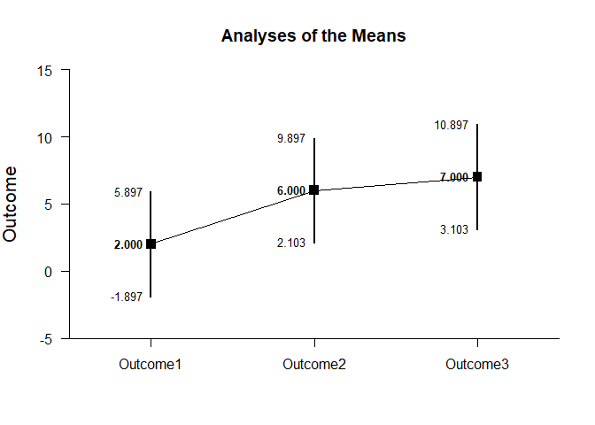
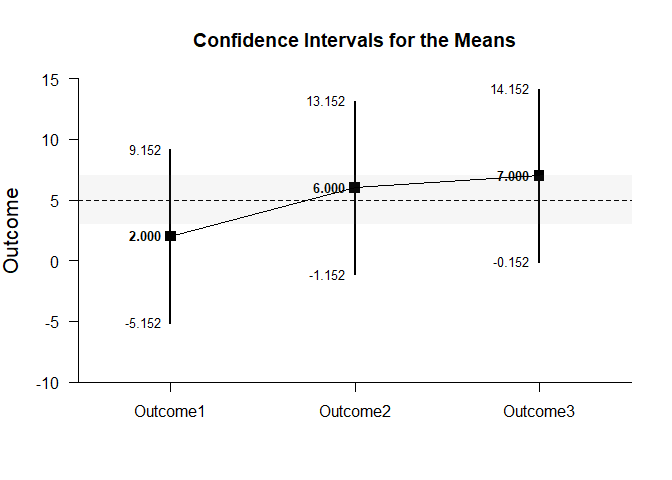
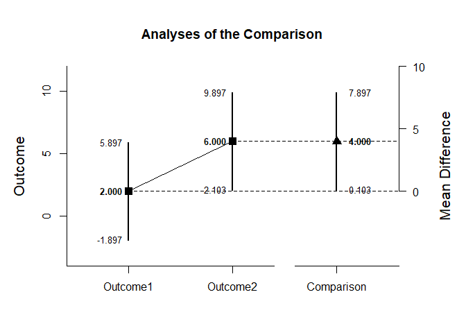
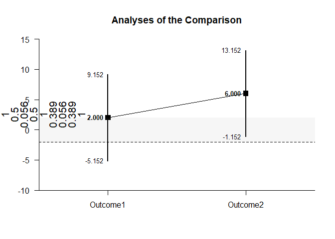
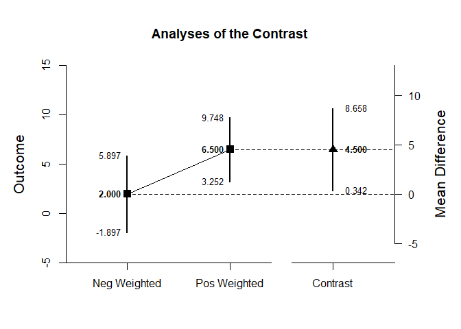
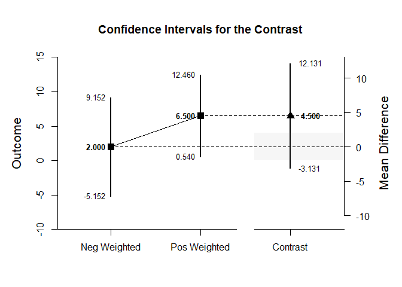

## Analyze - Repeated Measures (Within-Subjects) Tutorial with Data

### Enter Data


```r
Outcome1 <- c(0,0,3,5)
Outcome2 <- c(4,7,4,9)
Outcome3 <- c(9,6,4,9)
RepeatedData <- data.frame(Outcome1,Outcome2,Outcome3)
```

### Analyses of Multiple Variables


```r
analyzeMeans(Outcome1,Outcome2,Outcome3)
```

```
## Analyses of the Means 
## 
## $`Confidence Intervals for the Means`
##                N       M      SD      SE      LL      UL
## Outcome1   4.000   2.000   2.449   1.225  -1.898   5.898
## Outcome2   4.000   6.000   2.449   1.225   2.102   9.898
## Outcome3   4.000   7.000   2.449   1.225   3.102  10.898
## 
## $`Hypothesis Tests for the Means`
##             Diff      SE       t      df       p
## Outcome1   2.000   1.225   1.633   3.000   0.201
## Outcome2   6.000   1.225   4.899   3.000   0.016
## Outcome3   7.000   1.225   5.715   3.000   0.011
## 
## $`Confidence Intervals for the Standardized Means`
##                d  d.unb.      SE      LL      UL
## Outcome1   0.816   0.594   0.616  -0.387   1.934
## Outcome2   2.449   1.781   0.955   0.325   4.531
## Outcome3   2.858   2.078   1.063   0.464   5.226
```

<!-- -->


```r
analyzeMeans(Outcome1,Outcome2,Outcome3,mu=5,conf.level=.99,rope=c(3,7))
```

```
## Analyses of the Means 
## 
## $`Confidence Intervals for the Means`
##                N       M      SD      SE      LL      UL
## Outcome1   4.000   2.000   2.449   1.225  -5.154   9.154
## Outcome2   4.000   6.000   2.449   1.225  -1.154  13.154
## Outcome3   4.000   7.000   2.449   1.225  -0.154  14.154
## 
## $`Hypothesis Tests for the Means`
##             Diff      SE       t      df       p
## Outcome1  -3.000   1.225  -2.449   3.000   0.092
## Outcome2   1.000   1.225   0.816   3.000   0.474
## Outcome3   2.000   1.225   1.633   3.000   0.201
## 
## $`Confidence Intervals for the Standardized Means`
##                d  d.unb.      SE      LL      UL
## Outcome1  -1.225  -0.891   0.680  -3.010   0.547
## Outcome2   0.408   0.297   0.574  -0.969   1.734
## Outcome3   0.816   0.594   0.616  -0.732   2.319
```

<!-- -->

### Analyses of a Variable Comparison


```r
analyzeDifference(Outcome1,Outcome2)
```

```
## Analyses of the Comparison 
## 
## $`Confidence Interval for the Comparison`
##               Diff      SE      df      LL      UL
## Comparison   4.000   1.225   3.000   0.102   7.898
## 
## $`Hypothesis Test for the Comparison`
##               Diff      SE       t      df       p
## Comparison   4.000   1.225   3.266   3.000   0.047
## 
## $`Confidence Interval for the Standardized Comparison`
##                Est      SE      LL      UL
## Comparison   1.633   0.782   0.101   3.165
```

<!-- -->


```r
analyzeDifference(Outcome1,Outcome2,mu=-2,conf.level=.99,rope=c(-2,2))
```

```
## Analyses of the Comparison 
## 
## $`Confidence Interval for the Comparison`
##               Diff      SE      df      LL      UL
## Comparison   4.000   1.225   3.000  -3.154  11.154
## 
## $`Hypothesis Test for the Comparison`
##               Diff      SE       t      df       p
## Comparison   6.000   1.225   4.899   3.000   0.016
## 
## $`Confidence Interval for the Standardized Comparison`
##                Est      SE      LL      UL
## Comparison   1.633   0.782  -0.381   3.647
```

<!-- -->

### Analyses of a Variable Contrast


```r
O1vsOthers <- c(-1,.5,.5)
analyzeContrast(Outcome1,Outcome2,Outcome3,contrast=O1vsOthers)
```

```
## Analyses of the Contrast 
## 
## $`Confidence Interval for the Contrast`
##              Est      SE      df      LL      UL
## Contrast   4.500   1.307   3.000   0.340   8.660
## 
## $`Hypothesis Test for the Contrast`
##              Est      SE       t      df       p
## Contrast   4.500   1.307   3.443   3.000   0.041
## 
## $`Confidence Interval for the Standardized Contrast`
##              Est      SE      LL      UL
## Contrast   1.837   0.741   0.385   3.289
```

<!-- -->


```r
analyzeContrast(Outcome1,Outcome2,Outcome3,contrast=O1vsOthers,mu=4,conf.level=.99,rope=c(-2,2))
```

```
## Analyses of the Contrast 
## 
## $`Confidence Interval for the Contrast`
##              Est      SE      df      LL      UL
## Contrast   4.500   1.307   3.000  -3.134  12.134
## 
## $`Hypothesis Test for the Contrast`
##              Est      SE       t      df       p
## Contrast   0.500   1.307   0.383   3.000   0.728
## 
## $`Confidence Interval for the Standardized Contrast`
##              Est      SE      LL      UL
## Contrast   1.837   0.741  -0.071   3.745
```

<!-- -->
