## FactorialBy - Factorial (Between-Subjects) Tutorial with Data

### Enter Data


```r
FactorA <- c(1,1,1,1,2,2,2,2,3,3,3,3,1,1,1,1,2,2,2,2,3,3,3,3)
FactorB <- c(1,1,1,1,1,1,1,1,1,1,1,1,2,2,2,2,2,2,2,2,2,2,2,2)
Outcome <- c(0,0,3,5,4,7,4,9,4,9,6,9,3,1,6,6,2,2,5,7,2,4,7,7)
FactorA <- factor(FactorA,levels=c(1,2,3),labels=c("A1","A2","A3"))
FactorB <- factor(FactorB,levels=c(1,2),labels=c("B1","B2"))
FactorialData <- data.frame(FactorA,FactorB,Outcome)
```

### Analyses of Multiple Groups

#### Confidence Intervals for the Means


```r
estimateMeansBy(Outcome~FactorA,by=FactorB)
```

```
## $B1
##          N       M      SD      SE      LL      UL
## A1   4.000   2.000   2.449   1.225  -1.898   5.898
## A2   4.000   6.000   2.449   1.225   2.102   9.898
## A3   4.000   7.000   2.449   1.225   3.102  10.898
## 
## $B2
##          N       M      SD      SE      LL      UL
## A1   4.000   4.000   2.449   1.225   0.102   7.898
## A2   4.000   4.000   2.449   1.225   0.102   7.898
## A3   4.000   5.000   2.449   1.225   1.102   8.898
```


```r
estimateMeansBy(Outcome~FactorA,by=FactorB,conf.level=.99)
```

```
## $B1
##          N       M      SD      SE      LL      UL
## A1   4.000   2.000   2.449   1.225  -5.154   9.154
## A2   4.000   6.000   2.449   1.225  -1.154  13.154
## A3   4.000   7.000   2.449   1.225  -0.154  14.154
## 
## $B2
##          N       M      SD      SE      LL      UL
## A1   4.000   4.000   2.449   1.225  -3.154  11.154
## A2   4.000   4.000   2.449   1.225  -3.154  11.154
## A3   4.000   5.000   2.449   1.225  -2.154  12.154
```

#### Plot of the Confidence Intervals for the Means


```r
plotMeansBy(Outcome~FactorA,by=FactorB)
```

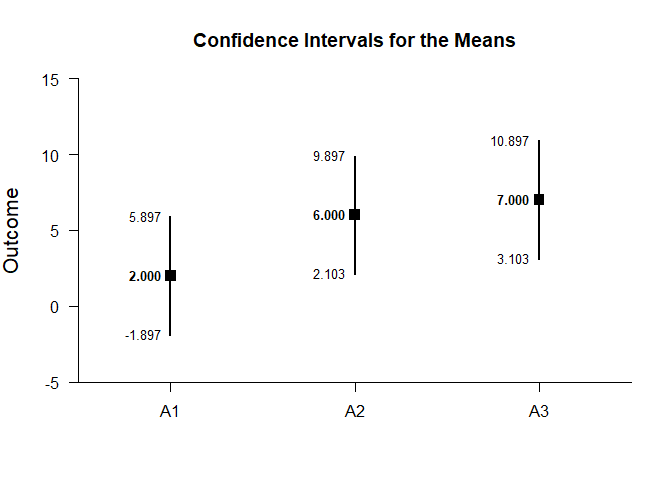<!-- -->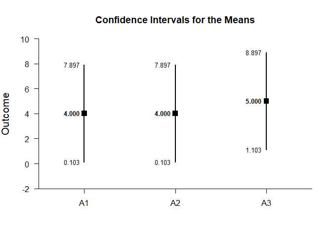<!-- -->


```r
plotMeansBy(Outcome~FactorA,by=FactorB,conf.level=.99,mu=5,rope=c(3,7))
```

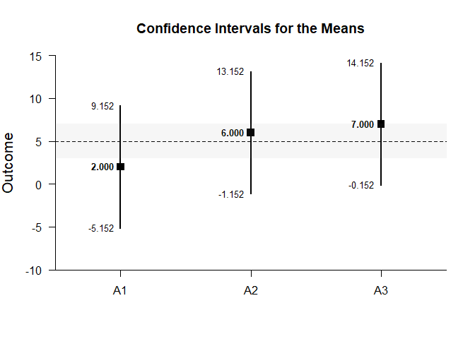<!-- -->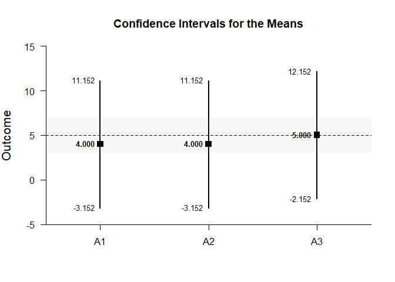<!-- -->

#### Significance Tests for the Means


```r
testMeansBy(Outcome~FactorA,by=FactorB)
```

```
## $B1
##       Diff      SE       t      df       p
## A1   2.000   1.225   1.633   3.000   0.201
## A2   6.000   1.225   4.899   3.000   0.016
## A3   7.000   1.225   5.715   3.000   0.011
## 
## $B2
##       Diff      SE       t      df       p
## A1   4.000   1.225   3.266   3.000   0.047
## A2   4.000   1.225   3.266   3.000   0.047
## A3   5.000   1.225   4.082   3.000   0.027
```


```r
testMeansBy(Outcome~FactorA,by=FactorB,mu=5)
```

```
## $B1
##       Diff      SE       t      df       p
## A1  -3.000   1.225  -2.449   3.000   0.092
## A2   1.000   1.225   0.816   3.000   0.474
## A3   2.000   1.225   1.633   3.000   0.201
## 
## $B2
##       Diff      SE       t      df       p
## A1  -1.000   1.225  -0.816   3.000   0.474
## A2  -1.000   1.225  -0.816   3.000   0.474
## A3   0.000   1.225   0.000   3.000   1.000
```

#### Effect Size for the Means


```r
standardizeMeansBy(Outcome~FactorA,by=FactorB)
```

```
## $B1
##          d  d.unb.      SE      LL      UL
## A1   0.816   0.594   0.616  -0.387   1.934
## A2   2.449   1.781   0.955   0.325   4.531
## A3   2.858   2.078   1.063   0.464   5.226
## 
## $B2
##          d  d.unb.      SE      LL      UL
## A1   1.633   1.188   0.761   0.013   3.177
## A2   1.633   1.188   0.761   0.013   3.177
## A3   2.041   1.485   0.854   0.176   3.846
```


```r
standardizeMeansBy(Outcome~FactorA,by=FactorB,conf.level=.99,mu=5)
```

```
## $B1
##          d  d.unb.      SE      LL      UL
## A1  -1.225  -0.891   0.680  -3.010   0.547
## A2   0.408   0.297   0.574  -0.969   1.734
## A3   0.816   0.594   0.616  -0.732   2.319
## 
## $B2
##          d  d.unb.      SE      LL      UL
## A1  -0.408  -0.297   0.574  -1.734   0.969
## A2  -0.408  -0.297   0.574  -1.734   0.969
## A3   0.000   0.000   0.559  -1.288   1.288
```

### Analyses of a Group Comparison


```r
Comparison=factor(FactorA,c("A1","A2"))
CompData=na.omit(data.frame(Outcome,Comparison,FactorB))
```

#### Confidence Interval for a Mean Difference


```r
with(CompData,estimateDifferenceBy(Outcome~Comparison,by=FactorB))
```

```
## $B1
##               Diff      SE      df      LL      UL
## Comparison   4.000   1.732   6.000  -0.238   8.238
## 
## $B2
##               Diff      SE      df      LL      UL
## Comparison   0.000   1.732   6.000  -4.238   4.238
```


```r
with(CompData,estimateDifferenceBy(Outcome~Comparison,by=FactorB,conf.level=.99))
```

```
## $B1
##               Diff      SE      df      LL      UL
## Comparison   4.000   1.732   6.000  -2.421  10.421
## 
## $B2
##               Diff      SE      df      LL      UL
## Comparison   0.000   1.732   6.000  -6.421   6.421
```

#### Plot of the Confidence Interval for the Mean Difference


```r
with(CompData,plotDifferenceBy(Outcome~Comparison,by=FactorB))
```

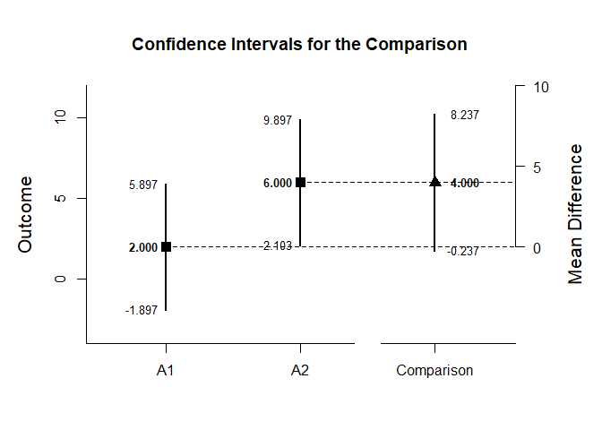<!-- -->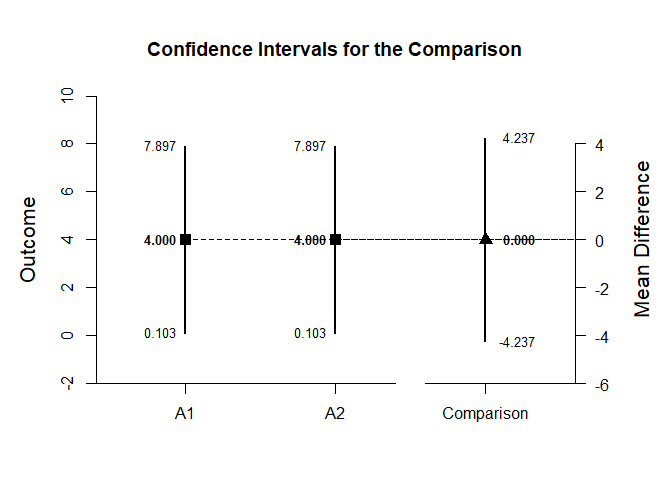<!-- -->


```r
with(CompData,plotDifferenceBy(Outcome~Comparison,by=FactorB,conf.level=.99,rope=c(-2,2)))
```

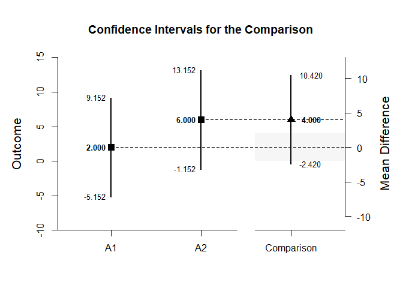<!-- -->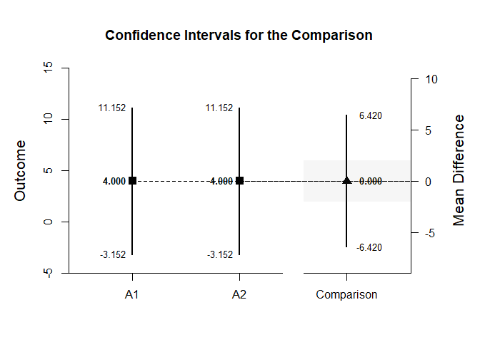<!-- -->

#### Significance Test for the Mean Difference


```r
with(CompData,testDifferenceBy(Outcome~Comparison,by=FactorB))
```

```
## $B1
##               Diff      SE       t      df       p
## Comparison   4.000   1.732   2.309   6.000   0.060
## 
## $B2
##               Diff      SE       t      df       p
## Comparison   0.000   1.732   0.000   6.000   1.000
```


```r
with(CompData,testDifferenceBy(Outcome~Comparison,by=FactorB,mu=2))
```

```
## $B1
##               Diff      SE       t      df       p
## Comparison   2.000   1.732   1.155   6.000   0.292
## 
## $B2
##               Diff      SE       t      df       p
## Comparison  -2.000   1.732  -1.155   6.000   0.292
```

#### Effect Size for the Mean Difference


```r
with(CompData,standardizeDifferenceBy(Outcome~Comparison,by=FactorB))
```

```
## $B1
##                Est      SE      LL      UL
## Comparison   1.633   0.943  -0.215   3.481
## 
## $B2
##                Est      SE      LL      UL
## Comparison   0.000   0.816  -1.600   1.600
```


```r
with(CompData,standardizeDifferenceBy(Outcome~Comparison,by=FactorB,conf.level=.99,mu=2))
```

```
## $B1
##                Est      SE      LL      UL
## Comparison   1.633   0.943  -0.796   4.062
## 
## $B2
##                Est      SE      LL      UL
## Comparison   0.000   0.816  -2.103   2.103
```

### Analyses of a Factor Contrast


```r
A1vsOthers <- c(-1,.5,.5)
```

#### Confidence Interval for a Contrast


```r
estimateContrastBy(Outcome~FactorA,by=FactorB,contrast=A1vsOthers)
```

```
## $B1
##              Est      SE      df      LL      UL
## Contrast   4.500   1.500   6.000   0.830   8.170
## 
## $B2
##              Est      SE      df      LL      UL
## Contrast   0.500   1.500   6.000  -3.170   4.170
```


```r
estimateContrastBy(Outcome~FactorA,by=FactorB,contrast=A1vsOthers,conf.level=.99)
```

```
## $B1
##              Est      SE      df      LL      UL
## Contrast   4.500   1.500   6.000  -1.061  10.061
## 
## $B2
##              Est      SE      df      LL      UL
## Contrast   0.500   1.500   6.000  -5.061   6.061
```

#### Plots of Confidence Intervals for a Contrast


```r
plotContrastBy(Outcome~FactorA,by=FactorB,contrast=A1vsOthers)
```

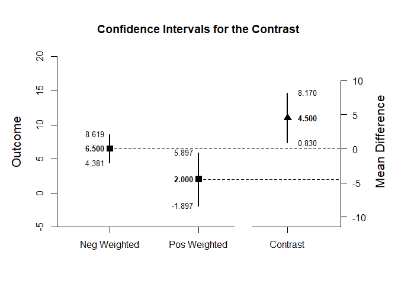<!-- -->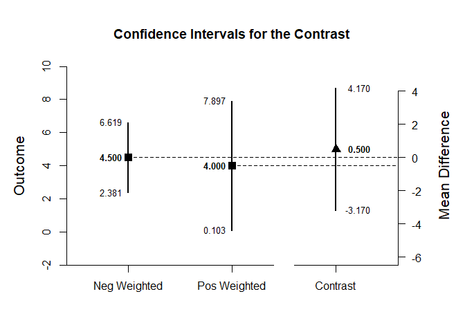<!-- -->


```r
plotContrastBy(Outcome~FactorA,by=FactorB,contrast=A1vsOthers,labels=c("A1","Others"),conf.level=.99,rope=c(-2,2))
```

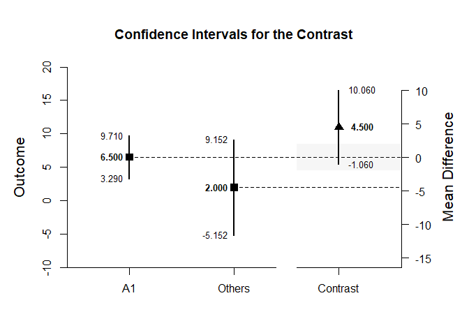<!-- -->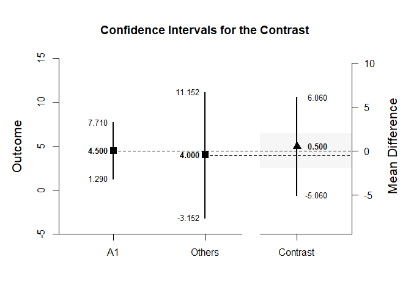<!-- -->

#### Significance Test for a Contrast


```r
testContrastBy(Outcome~FactorA,by=FactorB,contrast=A1vsOthers)
```

```
## $B1
##              Est      SE       t      df       p
## Contrast   4.500   1.500   3.000   6.000   0.024
## 
## $B2
##              Est      SE       t      df       p
## Contrast   0.500   1.500   0.333   6.000   0.750
```


```r
testContrastBy(Outcome~FactorA,by=FactorB,contrast=A1vsOthers,mu=4)
```

```
## $B1
##              Est      SE       t      df       p
## Contrast   0.500   1.500   0.333   6.000   0.750
## 
## $B2
##              Est      SE       t      df       p
## Contrast  -3.500   1.500  -2.333   6.000   0.058
```

#### Effect Size for a Contrast


```r
standardizeContrastBy(Outcome~FactorA,by=FactorB,contrast=A1vsOthers)
```

```
## $B1
##              Est      SE      LL      UL
## Contrast   1.837   0.829   0.212   3.462
## 
## $B2
##              Est      SE      LL      UL
## Contrast   0.204   0.709  -1.185   1.593
```


```r
standardizeContrastBy(Outcome~FactorA,by=FactorB,contrast=A1vsOthers,conf.level=.99)
```

```
## $B1
##              Est      SE      LL      UL
## Contrast   1.837   0.829  -0.299   3.973
## 
## $B2
##              Est      SE      LL      UL
## Contrast   0.204   0.709  -1.621   2.030
```
