## MixedBy - Mixed Design (Between-Subjects and Within-Subjects) Tutorial with Summary Statistics

### Enter Summary Statistics


```r
Outcome1 <- c(N=4,M=2.000,SD=2.449)
Outcome2 <- c(N=4,M=6.000,SD=2.449)
Outcome3 <- c(N=4,M=7.000,SD=2.449)
WithinSummaryL1 <- rbind(Outcome1,Outcome2,Outcome3)

Outcome1 <- c(N=4,M=4.000,SD=2.449)
Outcome2 <- c(N=4,M=4.000,SD=2.449)
Outcome3 <- c(N=4,M=5.000,SD=2.449)
WithinSummaryL2 <- rbind(Outcome1,Outcome2,Outcome3)

MixedSummary <- list("Level1"=WithinSummaryL1,"Level2"=WithinSummaryL2)
class(MixedSummary) <- "wss"

WithinCorrL1 <- declareCorrMatrix("Outcome1","Outcome2","Outcome3")
WithinCorrL1["Outcome1",] <- c(1.000,.500,.389)
WithinCorrL1["Outcome2",] <- c(.500,1.000,.889)
WithinCorrL1["Outcome3",] <- c(.389,.889,1.000)

WithinCorrL2 <- declareCorrMatrix("Outcome1","Outcome2","Outcome3")
WithinCorrL2["Outcome1",] <- c(1.000,.889,.778)
WithinCorrL2["Outcome2",] <- c(.889,1.000,.889)
WithinCorrL2["Outcome3",] <- c(.778,.889,1.000)

MixedCorr <- list("Level1"=WithinCorrL1,"Level2"=WithinCorrL2)
class(MixedCorr) <- "wss"
```

### Analyses of Multiple Variables

#### Confidence Intervals for the Means


```r
estimateMeansBy(MixedSummary)
```

```
## Confidence Intervals for the Means 
## 
## $Level1
##                N       M      SD      SE      LL      UL
## Outcome1   4.000   2.000   2.449   1.224  -1.897   5.897
## Outcome2   4.000   6.000   2.449   1.224   2.103   9.897
## Outcome3   4.000   7.000   2.449   1.224   3.103  10.897
## 
## $Level2
##                N       M      SD      SE      LL      UL
## Outcome1   4.000   4.000   2.449   1.224   0.103   7.897
## Outcome2   4.000   4.000   2.449   1.224   0.103   7.897
## Outcome3   4.000   5.000   2.449   1.224   1.103   8.897
```


```r
estimateMeansBy(MixedSummary,conf.level=.99)
```

```
## Confidence Intervals for the Means 
## 
## $Level1
##                N       M      SD      SE      LL      UL
## Outcome1   4.000   2.000   2.449   1.224  -5.152   9.152
## Outcome2   4.000   6.000   2.449   1.224  -1.152  13.152
## Outcome3   4.000   7.000   2.449   1.224  -0.152  14.152
## 
## $Level2
##                N       M      SD      SE      LL      UL
## Outcome1   4.000   4.000   2.449   1.224  -3.152  11.152
## Outcome2   4.000   4.000   2.449   1.224  -3.152  11.152
## Outcome3   4.000   5.000   2.449   1.224  -2.152  12.152
```

#### Plots of Confidence Intervals for the Means


```r
plotMeansBy(MixedSummary)
```

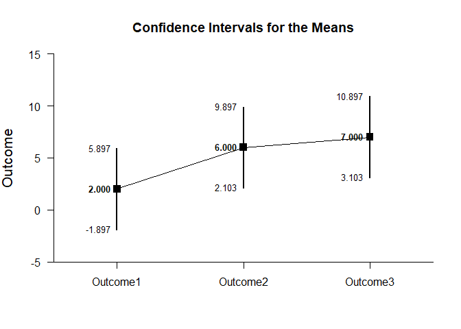<!-- -->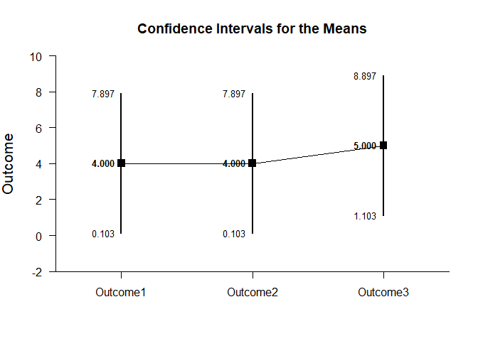<!-- -->


```r
plotMeansBy(MixedSummary,conf.level=.99,mu=5,rope=c(3,7))
```

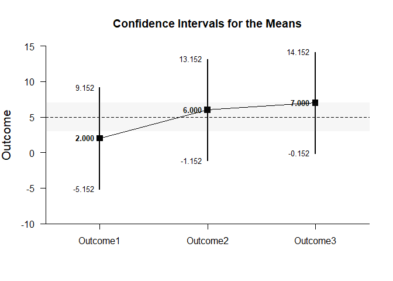<!-- -->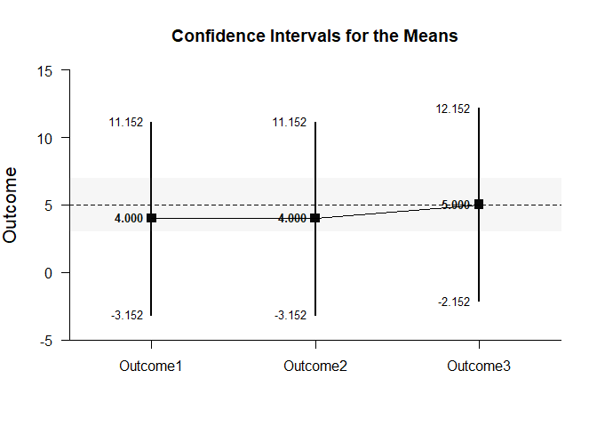<!-- -->

#### Significance Tests for the Means


```r
testMeansBy(MixedSummary)
```

```
## Hypothesis Tests for the Means 
## 
## $Level1
##             Diff      SE       t      df       p
## Outcome1   2.000   1.224   1.633   3.000   0.201
## Outcome2   6.000   1.224   4.900   3.000   0.016
## Outcome3   7.000   1.224   5.717   3.000   0.011
## 
## $Level2
##             Diff      SE       t      df       p
## Outcome1   4.000   1.224   3.267   3.000   0.047
## Outcome2   4.000   1.224   3.267   3.000   0.047
## Outcome3   5.000   1.224   4.083   3.000   0.027
```


```r
testMeansBy(MixedSummary,mu=5)
```

```
## Hypothesis Tests for the Means 
## 
## $Level1
##             Diff      SE       t      df       p
## Outcome1  -3.000   1.224  -2.450   3.000   0.092
## Outcome2   1.000   1.224   0.817   3.000   0.474
## Outcome3   2.000   1.224   1.633   3.000   0.201
## 
## $Level2
##             Diff      SE       t      df       p
## Outcome1  -1.000   1.224  -0.817   3.000   0.474
## Outcome2  -1.000   1.224  -0.817   3.000   0.474
## Outcome3   0.000   1.224   0.000   3.000   1.000
```

#### Effect Size for the Means


```r
standardizeMeansBy(MixedSummary)
```

```
## Confidence Intervals for the Standardized Means 
## 
## $Level1
##                d  d.unb.      SE      LL      UL
## Outcome1   0.817   0.594   0.616  -0.387   1.934
## Outcome2   2.450   1.782   0.955   0.325   4.532
## Outcome3   2.858   2.079   1.063   0.464   5.227
## 
## $Level2
##                d  d.unb.      SE      LL      UL
## Outcome1   1.633   1.188   0.761   0.013   3.177
## Outcome2   1.633   1.188   0.761   0.013   3.177
## Outcome3   2.042   1.485   0.854   0.176   3.847
```


```r
standardizeMeansBy(MixedSummary,mu=5,conf.level=.99)
```

```
## Confidence Intervals for the Standardized Means 
## 
## $Level1
##                d  d.unb.      SE      LL      UL
## Outcome1  -1.225  -0.891   0.680  -3.011   0.547
## Outcome2   0.408   0.297   0.574  -0.968   1.734
## Outcome3   0.817   0.594   0.616  -0.732   2.320
## 
## $Level2
##                d  d.unb.      SE      LL      UL
## Outcome1  -0.408  -0.297   0.574  -1.734   0.968
## Outcome2  -0.408  -0.297   0.574  -1.734   0.968
## Outcome3   0.000   0.000   0.559  -1.288   1.288
```

### Analyses of a Variable Comparison


```r
CompSummaryL1 <- WithinSummaryL1[c("Outcome1","Outcome2"),]
CompSummaryL2 <- WithinSummaryL2[c("Outcome1","Outcome2"),]
CompSummary <- list("Level1"=WithinSummaryL1,"Level2"=WithinSummaryL2)
class(CompSummary) <- "wss"
```

#### Confidence Interval for the Mean Difference


```r
estimateDifferenceBy(CompSummary,MixedCorr)
```

```
## Confidence Intervals for the Comparison 
## 
## $Level1
##               Diff      SE      df      LL      UL
## Comparison   4.000   1.224   3.000   0.103   7.897
## 
## $Level2
##               Diff      SE      df      LL      UL
## Comparison   0.000   0.577   3.000  -1.836   1.836
```


```r
estimateDifferenceBy(CompSummary,MixedCorr,conf.level=.99)
```

```
## Confidence Intervals for the Comparison 
## 
## $Level1
##               Diff      SE      df      LL      UL
## Comparison   4.000   1.224   3.000  -3.152  11.152
## 
## $Level2
##               Diff      SE      df      LL      UL
## Comparison   0.000   0.577   3.000  -3.370   3.370
```

#### Plots of Confidence Intervals for the Mean Difference


```r
plotDifferenceBy(CompSummary,MixedCorr)
```

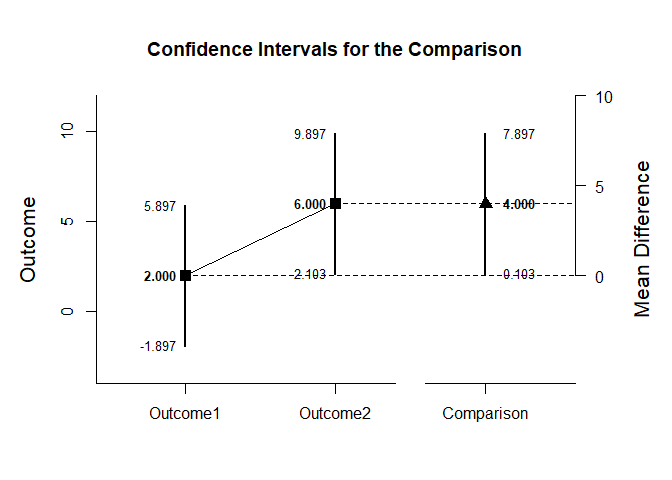<!-- --><!-- -->


```r
plotDifferenceBy(CompSummary,MixedCorr,conf.level=.99,rope=c(-2,2))
```

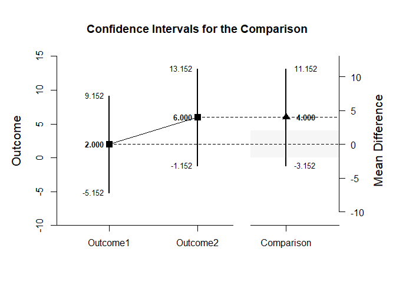<!-- -->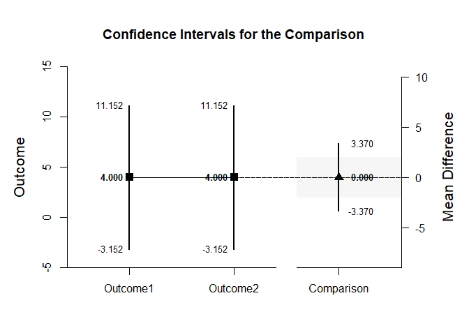<!-- -->

#### Significance Test for the Mean Difference


```r
testDifferenceBy(CompSummary,MixedCorr)
```

```
## Hypothesis Tests for the Comparison 
## 
## $Level1
##               Diff      SE       t      df       p
## Comparison   4.000   1.224   3.267   3.000   0.047
## 
## $Level2
##               Diff      SE       t      df       p
## Comparison   0.000   0.577   0.000   3.000   1.000
```


```r
testDifferenceBy(CompSummary,MixedCorr,mu=-2)
```

```
## Hypothesis Tests for the Comparison 
## 
## $Level1
##               Diff      SE       t      df       p
## Comparison   6.000   1.224   4.900   3.000   0.016
## 
## $Level2
##               Diff      SE       t      df       p
## Comparison   2.000   0.577   3.467   3.000   0.040
```

#### Effect Size for the Mean Difference


```r
standardizeDifferenceBy(CompSummary,MixedCorr)
```

```
## Confidence Intervals for the Standardized Comparison 
## 
## $Level1
##                Est      SE      LL      UL
## Comparison   1.633   0.782   0.101   3.166
## 
## $Level2
##                Est      SE      LL      UL
## Comparison   0.000   0.272  -0.533   0.533
```


```r
standardizeDifferenceBy(CompSummary,MixedCorr,conf.level=.99)
```

```
## Confidence Intervals for the Standardized Comparison 
## 
## $Level1
##                Est      SE      LL      UL
## Comparison   1.633   0.782  -0.380   3.647
## 
## $Level2
##                Est      SE      LL      UL
## Comparison   0.000   0.272  -0.701   0.701
```

### Analyses of a Variable Contrast


```r
O1vsOthers <- c(-1,.5,.5)
```

#### Confidence Interval for the Contrast


```r
estimateContrastBy(MixedSummary,MixedCorr,contrast=O1vsOthers)
```

```
## Confidence Intervals for the Contrast 
## 
## $Level1
##              Est      SE      df      LL      UL
## Contrast   4.500   1.258   3.000   0.496   8.504
## 
## $Level2
##              Est      SE      df      LL      UL
## Contrast   0.500   0.645   3.000  -1.553   2.553
```


```r
estimateContrastBy(MixedSummary,MixedCorr,contrast=O1vsOthers,conf.level=.99)
```

```
## Confidence Intervals for the Contrast 
## 
## $Level1
##              Est      SE      df      LL      UL
## Contrast   4.500   1.258   3.000  -2.848  11.848
## 
## $Level2
##              Est      SE      df      LL      UL
## Contrast   0.500   0.645   3.000  -3.268   4.268
```

#### Plots of Confidence Intervals for a Contrast


```r
plotContrastBy(MixedSummary,MixedCorr,contrast=O1vsOthers)
```

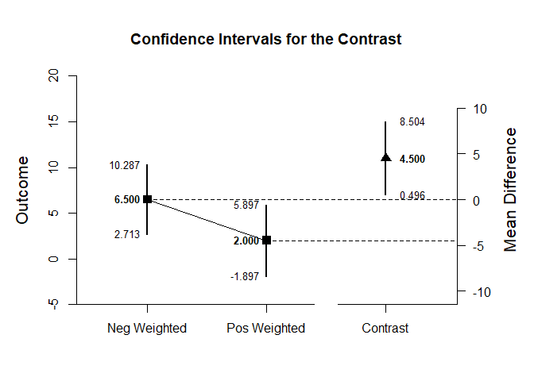<!-- -->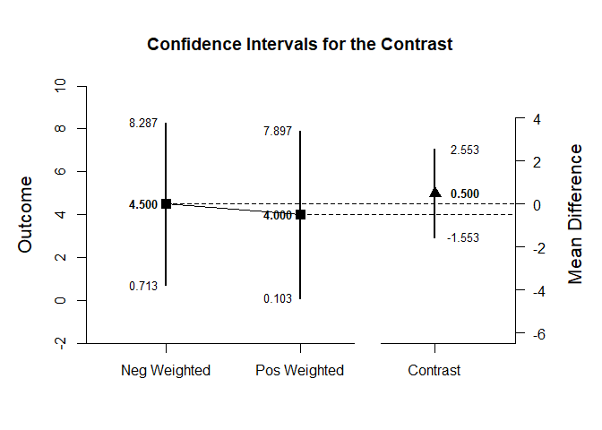<!-- -->


```r
plotContrastBy(MixedSummary,MixedCorr,contrast=O1vsOthers,labels=c("Outcome1","Others"),conf.level=.99,rope=c(-2,2))
```

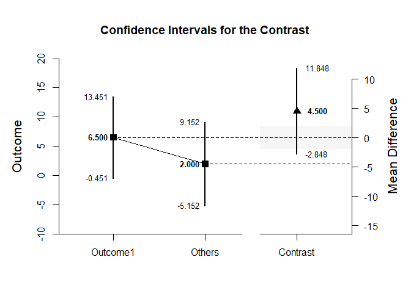<!-- -->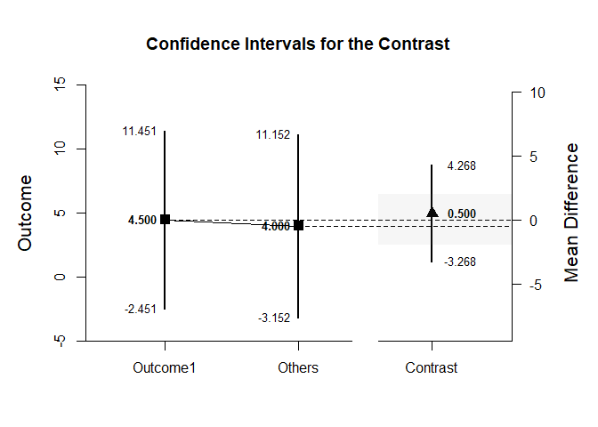<!-- -->

#### Significance Test for the Contrast


```r
testContrastBy(MixedSummary,MixedCorr,contrast=O1vsOthers)
```

```
## Hypothesis Tests for the Contrast 
## 
## $Level1
##              Est      SE       t      df       p
## Contrast   4.500   1.258   3.577   3.000   0.037
## 
## $Level2
##              Est      SE       t      df       p
## Contrast   0.500   0.645   0.775   3.000   0.495
```


```r
testContrastBy(MixedSummary,MixedCorr,contrast=O1vsOthers,mu=4)
```

```
## Hypothesis Tests for the Contrast 
## 
## $Level1
##              Est      SE       t      df       p
## Contrast   0.500   1.258   0.397   3.000   0.718
## 
## $Level2
##              Est      SE       t      df       p
## Contrast  -3.500   0.645  -5.426   3.000   0.012
```

#### Effect Size for the Contrast


```r
standardizeContrastBy(MixedSummary,MixedCorr,contrast=O1vsOthers)
```

```
## Confidence Intervals for the Standardized Contrast 
## 
## $Level1
##              Est      SE      LL      UL
## Contrast   1.837   0.676   0.512   3.163
## 
## $Level2
##              Est      SE      LL      UL
## Contrast   0.204   0.279  -0.343   0.752
```


```r
standardizeContrastBy(MixedSummary,MixedCorr,contrast=O1vsOthers,conf.level=.99)
```

```
## Confidence Intervals for the Standardized Contrast 
## 
## $Level1
##              Est      SE      LL      UL
## Contrast   1.837   0.676   0.096   3.579
## 
## $Level2
##              Est      SE      LL      UL
## Contrast   0.204   0.279  -0.515   0.924
```
