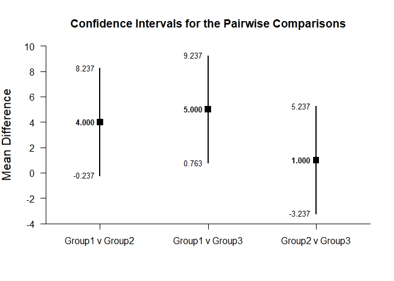
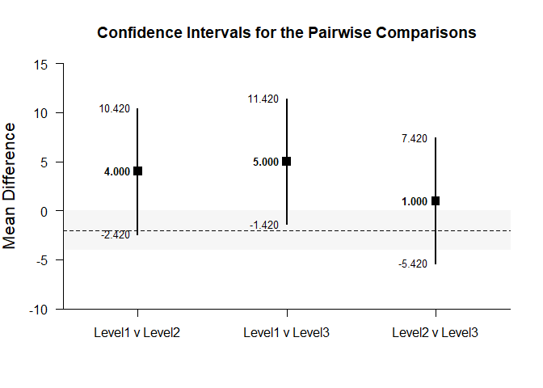

## Pairwise Comparisons - OneWay (Between-Subjects) Tutorial with Data

### Enter Data

This code inputs the variable names and creates a viewable data frame.


```r
Factor <- c(rep(1,4),rep(2,4),rep(3,4))
Outcome <- c(0,0,3,5,4,7,4,9,9,6,4,9)
Factor <- factor(Factor,levels=c(1,2,3),labels=c("Level1","Level2","Level3"))
OneWayData <- data.frame(Factor,Outcome)
```

### Analyses of Pairwise Comparisons

#### Confidence Intervals for the Pairwise Comparisons

This code will provide a table of descriptive statistics and confidence intervals for each pairwise comparison.


```r
estimatePairwise(Outcome~Factor)
```

```
## $`Confidence Intervals for the Pairwise Comparisons`
##                    Diff      SE      df      LL      UL
## Level1 v Level2   4.000   1.732   6.000  -0.238   8.238
## Level1 v Level3   5.000   1.732   6.000   0.762   9.238
## Level2 v Level3   1.000   1.732   6.000  -3.238   5.238
```

The code defaults to 95% confidence intervals. This can be changed if desired.


```r
estimatePairwise(Outcome~Factor,conf.level=.99)
```

```
## $`Confidence Intervals for the Pairwise Comparisons`
##                    Diff      SE      df      LL      UL
## Level1 v Level2   4.000   1.732   6.000  -2.421  10.421
## Level1 v Level3   5.000   1.732   6.000  -1.421  11.421
## Level2 v Level3   1.000   1.732   6.000  -5.421   7.421
```

#### Plots of the Confidence Intervals for the Pairwise Comparisons

This code will produce a graph of the confidence intervals for each of the pairwise comparisons.


```r
plotPairwise(Outcome~Factor)
```

<!-- -->

Of course, it is possible to change from the default confidence level. Additionally, it is possible to add a comparison line to represent a population (or test) value and a region of practical equivalence.


```r
plotPairwise(Outcome~Factor,mu=-2,conf.level=.99,rope=c(-4,0))
```

<!-- -->

#### Significance Tests of the Pairwise Comparisons

This code will produce a table of NHST for each of the pairwise comparisons. In this case, all the comparisons are tested against a value of zero.


```r
testPairwise(Outcome~Factor)
```

```
## $`Hypothesis Tests for the Pairwise Comparisons`
##                    Diff      SE       t      df       p
## Level1 v Level2   4.000   1.732   2.309   6.000   0.060
## Level1 v Level3   5.000   1.732   2.887   6.000   0.028
## Level2 v Level3   1.000   1.732   0.577   6.000   0.585
```

Often, the default test value of zero is not meaningful or plausible. This too can be altered (often in conjunction with what is presented in the plot).


```r
testPairwise(Outcome~Factor,mu=-2)
```

```
## $`Hypothesis Tests for the Pairwise Comparisons`
##                    Diff      SE       t      df       p
## Level1 v Level2   6.000   1.732   3.464   6.000   0.013
## Level1 v Level3   7.000   1.732   4.041   6.000   0.007
## Level2 v Level3   3.000   1.732   1.732   6.000   0.134
```

#### Effect Sizes for the Pairwise Comparisons

This code will produce a table of standardized mean differences for each pairwise comparison. 


```r
standardizePairwise(Outcome~Factor)
```

```
## $`Confidence Intervals for the Standardized Pairwise Comparisons`
##                     Est      SE      LL      UL
## Level1 v Level2   1.633   0.943  -0.215   3.481
## Level1 v Level3   2.041   1.007   0.068   4.015
## Level2 v Level3   0.408   0.825  -1.209   2.025
```

Here too it is possible to alter the width of the confidence intervals.


```r
standardizePairwise(Outcome~Factor,conf.level=.99)
```

```
## $`Confidence Intervals for the Standardized Pairwise Comparisons`
##                     Est      SE      LL      UL
## Level1 v Level2   1.633   0.943  -0.796   4.062
## Level1 v Level3   2.041   1.007  -0.552   4.635
## Level2 v Level3   0.408   0.825  -1.717   2.533
```
