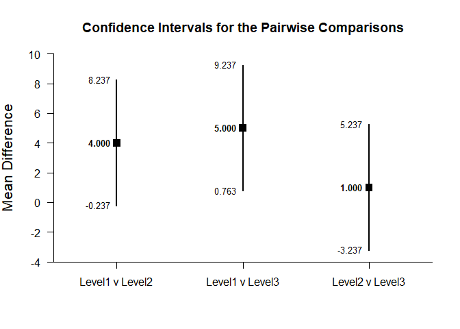

## Pairwise Comparisons - OneWay (Between-Subjects) Tutorial with Summary Statistics

### Enter Summary Statistics


```r
Group1 <- c(N=4,M=2.000,SD=2.449)
Group2 <- c(N=4,M=6.000,SD=2.449)
Group3 <- c(N=4,M=7.000,SD=2.449)
OneWaySummary <- rbind(Group1,Group2,Group3)
class(OneWaySummary) <- "bss"
```

### Analyses of Pairwise Comparisons

#### Confidence Intervals for the Pairwise Comparisons


```r
estimatePairwise(OneWaySummary)
```

```
## $`Confidence Intervals for the Pairwise Comparisons`
##                    Diff      SE      df      LL      UL
## Group1 v Group2   4.000   1.732   6.000  -0.237   8.237
## Group1 v Group3   5.000   1.732   6.000   0.763   9.237
## Group2 v Group3   1.000   1.732   6.000  -3.237   5.237
```


```r
estimatePairwise(OneWaySummary,conf.level=.99)
```

```
## $`Confidence Intervals for the Pairwise Comparisons`
##                    Diff      SE      df      LL      UL
## Group1 v Group2   4.000   1.732   6.000  -2.420  10.420
## Group1 v Group3   5.000   1.732   6.000  -1.420  11.420
## Group2 v Group3   1.000   1.732   6.000  -5.420   7.420
```

#### Plots of the Confidence Intervals for the Pairwise Comparisons


```r
plotPairwise(OneWaySummary)
```

<!-- -->


```r
plotPairwise(OneWaySummary,mu=-2,conf.level=.99,rope=c(-4,0))
```

<!-- -->

#### Significance Tests of the Pairwise Comparisons


```r
testPairwise(OneWaySummary)
```

```
## $`Hypothesis Tests for the Pairwise Comparisons`
##                    Diff      SE       t      df       p
## Group1 v Group2   4.000   1.732   2.310   6.000   0.060
## Group1 v Group3   5.000   1.732   2.887   6.000   0.028
## Group2 v Group3   1.000   1.732   0.577   6.000   0.585
```


```r
testPairwise(OneWaySummary,mu=-2)
```

```
## $`Hypothesis Tests for the Pairwise Comparisons`
##                    Diff      SE       t      df       p
## Group1 v Group2   6.000   1.732   3.465   6.000   0.013
## Group1 v Group3   7.000   1.732   4.042   6.000   0.007
## Group2 v Group3   3.000   1.732   1.732   6.000   0.134
```

#### Effect Sizes for the Pairwise Comparisons


```r
standardizePairwise(OneWaySummary)
```

```
## $`Confidence Intervals for the Standardized Pairwise Comparisons`
##                     Est      SE      LL      UL
## Group1 v Group2   1.633   0.943  -0.215   3.481
## Group1 v Group3   2.042   1.007   0.068   4.015
## Group2 v Group3   0.408   0.825  -1.209   2.025
```


```r
standardizePairwise(OneWaySummary,conf.level=.99)
```

```
## $`Confidence Intervals for the Standardized Pairwise Comparisons`
##                     Est      SE      LL      UL
## Group1 v Group2   1.633   0.943  -0.795   4.062
## Group1 v Group3   2.042   1.007  -0.552   4.635
## Group2 v Group3   0.408   0.825  -1.717   2.533
```
