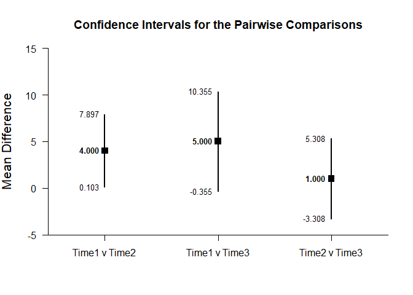
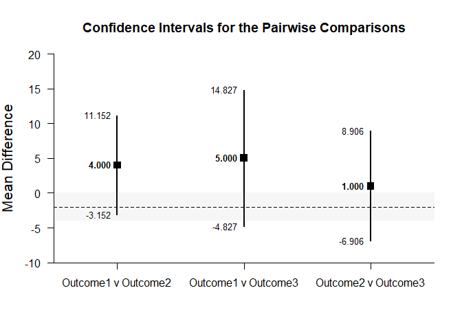

## Pairwise Comparisons - Repeated Measures (Within-Subjects) Tutorial with Data

### Enter Data


```r
Time1 <- c(0,0,3,5)
Time2 <- c(4,7,4,9)
Time3 <- c(9,6,4,9)
PairwiseRepeatedData <- data.frame(Time1,Time2,Time3)
```

### Analyses of Pairwise Variable Comparisons

#### Confidence Intervals for the Pairwise Comparisons


```r
estimatePairwise(Time1,Time2,Time3)
```

```
## $`Confidence Intervals for the Pairwise Comparisons`
##                  Diff      SE      df      LL      UL
## Time1 v Time2   4.000   1.225   3.000   0.102   7.898
## Time1 v Time3   5.000   1.683   3.000  -0.357  10.357
## Time2 v Time3   1.000   1.354   3.000  -3.309   5.309
```


```r
estimatePairwise(Time1,Time2,Time3,conf.level=.99)
```

```
## $`Confidence Intervals for the Pairwise Comparisons`
##                  Diff      SE      df      LL      UL
## Time1 v Time2   4.000   1.225   3.000  -3.154  11.154
## Time1 v Time3   5.000   1.683   3.000  -4.832  14.832
## Time2 v Time3   1.000   1.354   3.000  -6.909   8.909
```

#### Plots of the Confidence Intervals for the Pairwise Comparisons


```r
plotPairwise(Time1,Time2,Time3)
```

<!-- -->


```r
plotPairwise(Time1,Time2,Time3,mu=-2,conf.level=.99,rope=c(-4,0))
```

<!-- -->

#### Significance Tests of the Pairwise Comparisons


```r
testPairwise(Time1,Time2,Time3)
```

```
## $`Hypothesis Tests for the Pairwise Comparisons`
##                  Diff      SE       t      df       p
## Time1 v Time2   4.000   1.225   3.266   3.000   0.047
## Time1 v Time3   5.000   1.683   2.970   3.000   0.059
## Time2 v Time3   1.000   1.354   0.739   3.000   0.514
```


```r
testPairwise(Time1,Time2,Time3,mu=-2)
```

```
## $`Hypothesis Tests for the Pairwise Comparisons`
##                  Diff      SE       t      df       p
## Time1 v Time2   6.000   1.225   4.899   3.000   0.016
## Time1 v Time3   7.000   1.683   4.159   3.000   0.025
## Time2 v Time3   3.000   1.354   2.216   3.000   0.114
```

#### Effect Sizes for the Pairwise Comparisons


```r
standardizePairwise(Time1,Time2,Time3)
```

```
## $`Confidence Intervals for the Standardized Pairwise Comparisons`
##                   Est      SE      LL      UL
## Time1 v Time2   1.633   0.782   0.101   3.165
## Time1 v Time3   2.041   0.876   0.324   3.758
## Time1 v mu     -1.155   0.943  -3.003   0.693
## Time2 v Time3   0.408   0.592  -0.752   1.569
## Time2 v mu     -3.464   1.633  -6.665  -0.263
## Time3 v mu     -4.041   1.841  -7.650  -0.433
```


```r
standardizePairwise(Time1,Time2,Time3,conf.level=.99)
```

```
## $`Confidence Intervals for the Standardized Pairwise Comparisons`
##                   Est      SE      LL      UL
## Time1 v Time2   1.633   0.782  -0.381   3.647
## Time1 v Time3   2.041   0.876  -0.215   4.298
## Time1 v mu     -1.155   0.943  -3.583   1.274
## Time2 v Time3   0.408   0.592  -1.117   1.934
## Time2 v mu     -3.464   1.633  -7.670   0.742
## Time3 v mu     -4.041   1.841  -8.783   0.700
```
