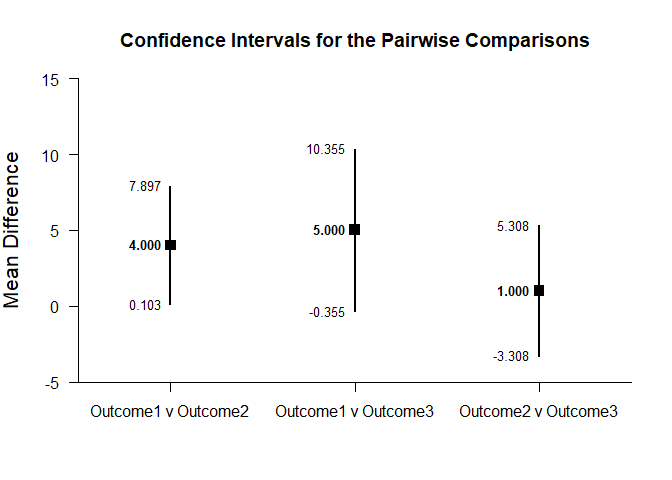

## Pairwise Comparisons - Repeated Measures (Within-Subjects) Tutorial with Summary Statistics

### Enter Summary Statistics


```r
Outcome1 <- c(N=4,M=2.000,SD=2.449)
Outcome2 <- c(N=4,M=6.000,SD=2.449)
Outcome3 <- c(N=4,M=7.000,SD=2.449)
RepeatedSummary <- rbind(Outcome1,Outcome2,Outcome3)
class(RepeatedSummary) <- "wss"

RepeatedCorr <- declareCorrMatrix("Outcome1","Outcome2","Outcome3")
RepeatedCorr["Outcome1","Outcome2"] <- .500
RepeatedCorr["Outcome1","Outcome3"] <- .056
RepeatedCorr["Outcome2","Outcome3"] <- .389
RepeatedCorr <- fillCorrMatrix(RepeatedCorr)
```

### Analyses of Pairwise Variable Comparisons

#### Confidence Intervals for the Pairwise Comparisons


```r
estimatePairwise(RepeatedSummary,RepeatedCorr)
```

```
## $`Confidence Intervals for the Pairwise Comparisons`
##                        Diff      SE      df      LL      UL
## Outcome1 v Outcome2   4.000   1.224   3.000   0.103   7.897
## Outcome1 v Outcome3   5.000   1.683   3.000  -0.355  10.355
## Outcome2 v Outcome3   1.000   1.354   3.000  -3.308   5.308
```


```r
estimatePairwise(RepeatedSummary,RepeatedCorr,conf.level=.99)
```

```
## $`Confidence Intervals for the Pairwise Comparisons`
##                        Diff      SE      df      LL      UL
## Outcome1 v Outcome2   4.000   1.224   3.000  -3.152  11.152
## Outcome1 v Outcome3   5.000   1.683   3.000  -4.827  14.827
## Outcome2 v Outcome3   1.000   1.354   3.000  -6.906   8.906
```

#### Plots of the Confidence Intervals for the Pairwise Comparisons


```r
plotPairwise(RepeatedSummary,RepeatedCorr)
```

<!-- -->


```r
plotPairwise(RepeatedSummary,RepeatedCorr,mu=-2,conf.level=.99,rope=c(-4,0))
```

<!-- -->

#### Significance Tests of the Pairwise Comparisons


```r
testPairwise(RepeatedSummary,RepeatedCorr)
```

```
## $`Hypothesis Tests for the Pairwise Comparisons`
##                        Diff      SE       t      df       p
## Outcome1 v Outcome2   4.000   1.224   3.267   3.000   0.047
## Outcome1 v Outcome3   5.000   1.683   2.972   3.000   0.059
## Outcome2 v Outcome3   1.000   1.354   0.739   3.000   0.514
```


```r
testPairwise(RepeatedSummary,RepeatedCorr,mu=-2)
```

```
## $`Hypothesis Tests for the Pairwise Comparisons`
##                        Diff      SE       t      df       p
## Outcome1 v Outcome2   6.000   1.224   4.900   3.000   0.016
## Outcome1 v Outcome3   7.000   1.683   4.160   3.000   0.025
## Outcome2 v Outcome3   3.000   1.354   2.216   3.000   0.113
```

#### Effect Sizes for the Pairwise Comparisons


```r
standardizePairwise(RepeatedSummary,RepeatedCorr)
```

```
## $`Confidence Intervals for the Standardized Pairwise Comparisons`
##                         Est      SE      LL      UL
## Outcome1 v Outcome2   1.633   0.782   0.101   3.166
## Outcome1 v Outcome3   2.042   0.876   0.325   3.759
## Outcome2 v Outcome3   0.408   0.592  -0.752   1.569
```


```r
standardizePairwise(RepeatedSummary,RepeatedCorr,conf.level=.99)
```

```
## $`Confidence Intervals for the Standardized Pairwise Comparisons`
##                         Est      SE      LL      UL
## Outcome1 v Outcome2   1.633   0.782  -0.380   3.647
## Outcome1 v Outcome3   2.042   0.876  -0.215   4.298
## Outcome2 v Outcome3   0.408   0.592  -1.117   1.934
```
